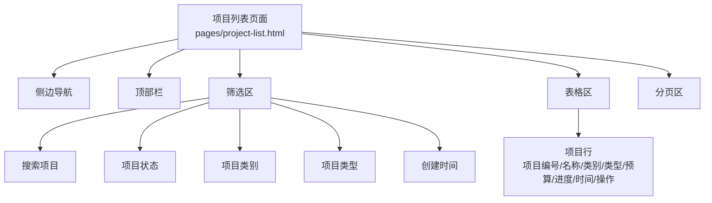
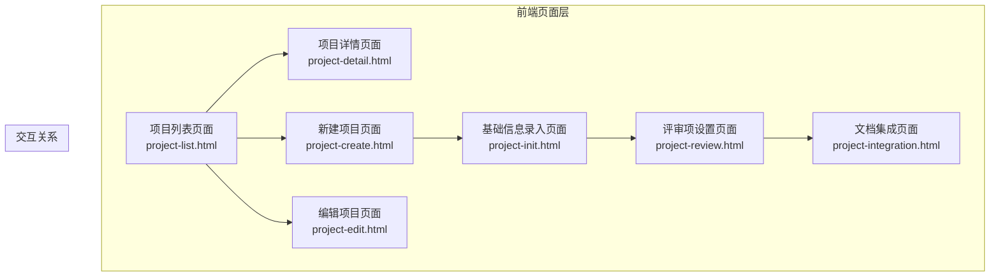
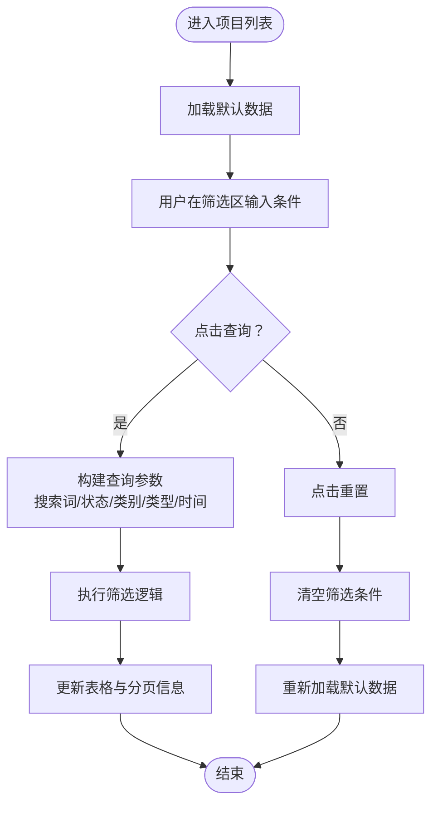
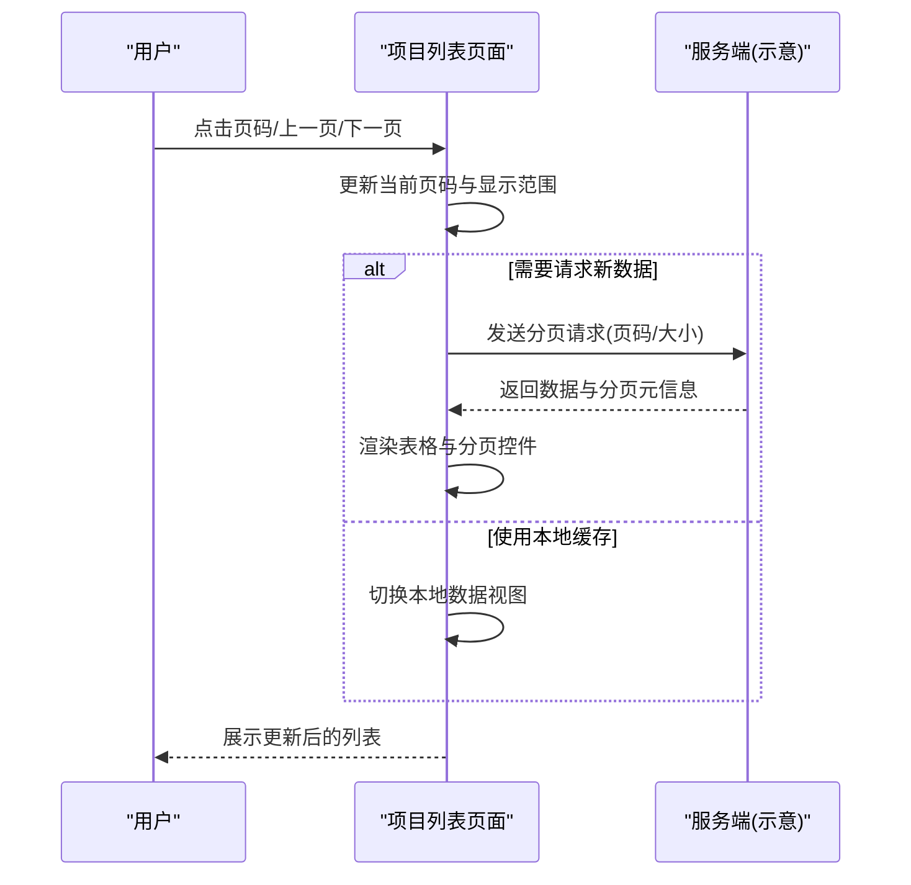
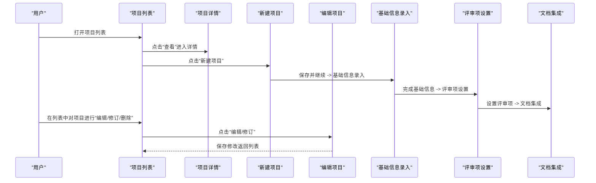
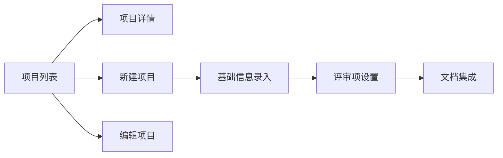

# 项目列表

<cite>
**本文档引用的文件**
- [project-list.html](file://pages/project-list.html)
- [project-detail.html](file://pages/project-detail.html)
- [project-create.html](file://pages/project-create.html)
- [project-edit.html](file://pages/project-edit.html)
- [project-init.html](file://pages/project-init.html)
- [project-review.html](file://pages/project-review.html)
- [project-integration.html](file://pages/project-integration.html)
</cite>

## 目录
1. [简介](#简介)
2. [项目结构](#项目结构)
3. [核心组件](#核心组件)
4. [架构总览](#架构总览)
5. [详细组件分析](#详细组件分析)
6. [依赖关系分析](#依赖关系分析)
7. [性能考虑](#性能考虑)
8. [故障排查指南](#故障排查指南)
9. [结论](#结论)
10. [附录](#附录)

## 简介
本文件面向“项目列表”页面，系统性阐述其数据展示与交互能力，包括：
- 项目基本信息表格展示
- 项目状态可视化标识
- 项目类型分类标签
- 进度条显示
- 操作按钮组
- 多维度筛选（搜索、状态、类别、类型、时间）
- 分页机制与数据加载思路
- 项目生命周期交互流程与状态转换示例

该页面是项目全生命周期管理的入口，用户可在此快速浏览、筛选、查看详情与执行操作。

## 项目结构
项目列表页面位于 pages 目录，采用单页应用风格，结合内联样式与少量脚本实现交互。页面包含侧边导航、顶部栏、筛选区、表格区与分页区。

图表来源
- [project-list.html:509-797](file://pages/project-list.html#L509-L797)

章节来源
- [project-list.html:509-797](file://pages/project-list.html#L509-L797)

## 核心组件
- 筛选区：提供多维度查询条件，支持实时筛选与重置。
- 表格区：展示项目列表，包含项目基本信息、状态标签、类型标签、进度条与操作按钮。
- 分页区：提供页码导航与记录统计信息。
- 主题切换：支持明暗主题切换。

章节来源
- [project-list.html:546-794](file://pages/project-list.html#L546-L794)

## 架构总览
项目列表页面采用前端静态页面架构，通过 HTML/CSS/JS 实现交互逻辑。页面结构清晰，组件职责明确，便于扩展与维护。

图表来源
- [project-list.html:509-797](file://pages/project-list.html#L509-L797)
- [project-detail.html:1-200](file://pages/project-detail.html#L1-L200)
- [project-create.html:536-740](file://pages/project-create.html#L536-L740)
- [project-edit.html:437-600](file://pages/project-edit.html#L437-L600)
- [project-init.html:688-790](file://pages/project-init.html#L688-L790)
- [project-review.html:1-120](file://pages/project-review.html#L1-L120)
- [project-integration.html:776-800](file://pages/project-integration.html#L776-L800)

## 详细组件分析

### 数据展示组件
- 表头与列定义：包含复选框、项目编号、项目名称、项目类别、项目类型、项目预算、完成进度、创建时间、操作按钮。
- 行内元素：
  - 项目名称为链接，点击进入详情页。
  - 类别与类型使用分类标签，颜色区分不同类别。
  - 进度条由外层容器与填充元素组成，宽度表示进度百分比。
  - 操作按钮组包含查看、编辑、删除等常用操作。

章节来源
- [project-list.html:594-778](file://pages/project-list.html#L594-L778)

### 状态与类型可视化
- 状态标签：通过不同背景色与文字颜色区分草稿、进行中、审查中、通过、失败、已发布等状态。
- 类型标签：工程类、货物类、服务类分别使用不同配色方案，便于快速识别。

章节来源
- [project-list.html:353-379](file://pages/project-list.html#L353-L379)

### 进度条组件
- 外层容器提供固定宽度与高度，内部填充元素按百分比宽度渲染。
- 支持动画过渡效果，提升用户体验。

章节来源
- [project-list.html:380-393](file://pages/project-list.html#L380-L393)

### 操作按钮组
- 查看：跳转至详情页。
- 编辑/修订：跳转至编辑或初始化页面。
- 删除：触发删除确认与后续处理。

章节来源
- [project-list.html:623-702](file://pages/project-list.html#L623-L702)

### 筛选功能
- 搜索项目：文本输入框，支持模糊匹配项目名称或编号。
- 项目状态：下拉选择器，支持“全部/进行中/已完成/已发布”等选项。
- 项目类别：下拉选择器，支持“全部/限额以下/产权交易/政府采购”等选项。
- 项目类型：下拉选择器，支持“全部/工程类/货物类/服务类”等选项。
- 创建时间：日期输入框，支持按时间范围筛选。
- 查询与重置：查询按钮触发展示更新；重置按钮清空筛选条件。

图表来源
- [project-list.html:546-586](file://pages/project-list.html#L546-L586)

章节来源
- [project-list.html:546-586](file://pages/project-list.html#L546-L586)

### 分页系统
- 记录统计：显示总记录数与当前显示范围。
- 页码导航：支持上一页、下一页与具体页码跳转。
- 加载机制：当前实现为静态数据，实际系统可替换为异步加载与服务端分页。

图表来源
- [project-list.html:780-793](file://pages/project-list.html#L780-L793)

章节来源
- [project-list.html:780-793](file://pages/project-list.html#L780-L793)

### 交互流程与状态转换示例
项目列表页面作为入口，连接多个后续流程页面，形成完整的项目生命周期管理链路。

图表来源
- [project-list.html:623-637](file://pages/project-list.html#L623-L637)
- [project-detail.html:1-200](file://pages/project-detail.html#L1-L200)
- [project-create.html:731-735](file://pages/project-create.html#L731-L735)
- [project-edit.html:562-596](file://pages/project-edit.html#L562-L596)
- [project-init.html:786-790](file://pages/project-init.html#L786-L790)
- [project-review.html:1-120](file://pages/project-review.html#L1-L120)
- [project-integration.html:776-800](file://pages/project-integration.html#L776-L800)

章节来源
- [project-list.html:623-637](file://pages/project-list.html#L623-L637)
- [project-detail.html:1-200](file://pages/project-detail.html#L1-L200)
- [project-create.html:731-735](file://pages/project-create.html#L731-L735)
- [project-edit.html:562-596](file://pages/project-edit.html#L562-L596)
- [project-init.html:786-790](file://pages/project-init.html#L786-L790)
- [project-review.html:1-120](file://pages/project-review.html#L1-L120)
- [project-integration.html:776-800](file://pages/project-integration.html#L776-L800)

## 依赖关系分析
- 页面间导航：项目列表通过按钮与链接跳转至详情、新建、编辑、初始化、评审与集成页面。
- 组件复用：状态标签、类型标签、进度条、操作按钮在多个页面中复用，保持一致的视觉与交互体验。
- 数据耦合：当前为静态数据演示，实际系统需对接后端接口，实现筛选、分页与状态变更。

图表来源
- [project-list.html:591-592](file://pages/project-list.html#L591-L592)
- [project-create.html:731-735](file://pages/project-create.html#L731-L735)
- [project-edit.html:562-596](file://pages/project-edit.html#L562-L596)
- [project-init.html:786-790](file://pages/project-init.html#L786-L790)
- [project-review.html:1-120](file://pages/project-review.html#L1-L120)
- [project-integration.html:776-800](file://pages/project-integration.html#L776-L800)

章节来源
- [project-list.html:591-592](file://pages/project-list.html#L591-L592)
- [project-create.html:731-735](file://pages/project-create.html#L731-L735)
- [project-edit.html:562-596](file://pages/project-edit.html#L562-L596)
- [project-init.html:786-790](file://pages/project-init.html#L786-L790)
- [project-review.html:1-120](file://pages/project-review.html#L1-L120)
- [project-integration.html:776-800](file://pages/project-integration.html#L776-L800)

## 性能考虑
- 静态数据渲染：当前页面为静态 HTML，首屏加载快，交互响应迅速。
- 分页优化：建议在真实场景中采用服务端分页与懒加载，避免一次性渲染大量数据。
- 样式与脚本：内联样式减少网络请求，但不利于缓存与复用；建议在生产环境拆分为外部资源并启用压缩与缓存策略。
- 主题切换：通过 CSS 变量实现主题切换，性能开销低，用户体验佳。

## 故障排查指南
- 筛选无效：检查筛选区输入是否正确，确认查询按钮是否被禁用或未触发事件。
- 分页异常：确认当前页码与总页数计算逻辑，检查分页控件是否正确渲染。
- 操作按钮失效：检查按钮绑定的事件与跳转逻辑，确保路径正确。
- 主题切换异常：确认 CSS 变量赋值逻辑与浏览器兼容性。

章节来源
- [project-list.html:800-818](file://pages/project-list.html#L800-L818)

## 结论
项目列表页面提供了清晰的数据展示与便捷的筛选、分页与操作能力，配合后续流程页面构成完整的项目生命周期管理链路。建议在真实系统中接入后端接口，完善筛选与分页的异步加载，并持续优化交互细节与性能表现。

## 附录
- 项目状态枚举（示例）：草稿、进行中、审查中、通过、失败、已发布
- 项目类型枚举（示例）：工程类、货物类、服务类
- 项目类别枚举（示例）：限额以下、产权交易、政府采购