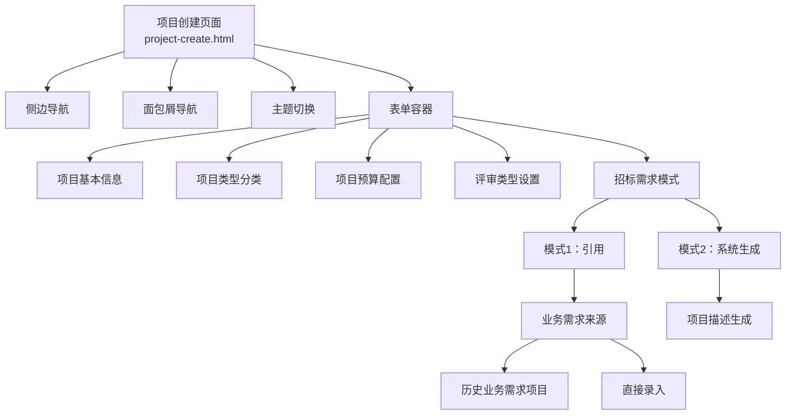
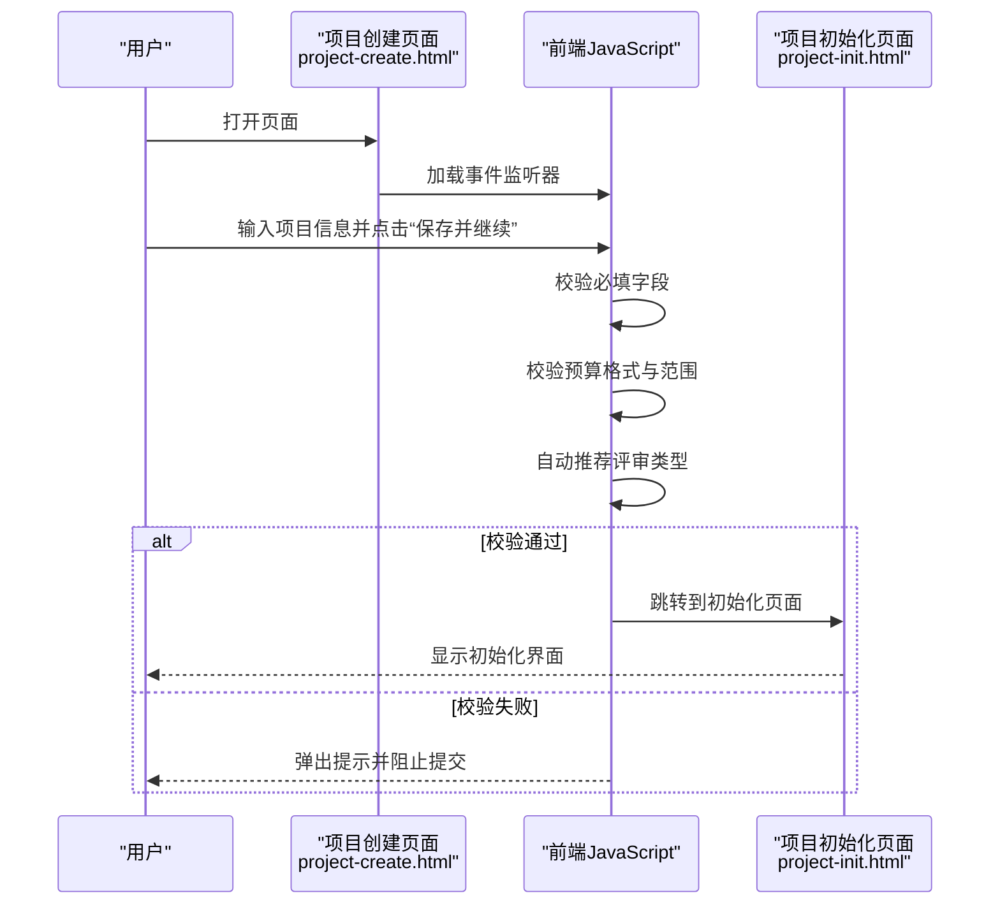
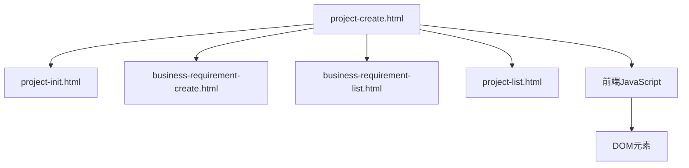

# 项目创建

<cite>
**本文引用的文件**
- [project-create.html](file://pages/project-create.html)
- [project-init.html](file://pages/project-init.html)
- [business-requirement-create.html](file://pages/business-requirement-create.html)
- [business-requirement-list.html](file://pages/business-requirement-list.html)
- [project-list.html](file://pages/project-list.html)
</cite>

## 目录
1. [简介](#简介)
2. [项目结构](#项目结构)
3. [核心组件](#核心组件)
4. [架构概览](#架构概览)
5. [详细组件分析](#详细组件分析)
6. [依赖关系分析](#依赖关系分析)
7. [性能考虑](#性能考虑)
8. [故障排除指南](#故障排除指南)
9. [结论](#结论)
10. [附录](#附录)

## 简介
本文件面向项目创建页面的功能文档，系统性阐述项目创建表单的设计与数据收集机制，涵盖项目基本信息录入、项目类型分类选择、项目预算配置、评审类型与招标需求模式设置等关键功能。文档同时解析前端表单验证策略（必填字段、数据格式、预算范围、时间逻辑等），并说明项目初始化流程（默认状态、权限分配、初始配置、项目编号规则）。最后提供最佳实践与常见错误处理方案，帮助开发者与使用者高效、准确地完成项目创建任务。

## 项目结构
项目创建页面位于 pages 目录下的 project-create.html，采用内联样式与内嵌脚本的方式实现完整的前端交互。页面包含侧边导航、面包屑导航、主题切换、表单容器与多个表单分组，以及提交动作按钮。页面还包含业务需求引用与系统生成两种招标需求模式，支持从历史业务需求项目或直接输入生成。

图表来源
- [project-create.html:536-881](file://pages/project-create.html#L536-L881)

章节来源
- [project-create.html:536-881](file://pages/project-create.html#L536-L881)

## 核心组件
- 项目基本信息表单：包含项目名称、项目类别、项目类型、项目预算、评审类型等字段，均标记为必填。
- 项目类型分类：提供工程类、货物类、服务类（含子类）的下拉选择。
- 项目预算配置：数值输入框，支持小数点后两位，最小值为0。
- 评审类型设置：人工评审与智能评审两种选项，系统根据预算与类型自动推荐。
- 招标需求模式：两种模式，引用已有业务需求或由系统根据项目描述生成。
- 表单验证与交互：前端JavaScript负责必填校验、预算范围校验、自动评审类型推荐、模式切换与内容展示。

章节来源
- [project-create.html:587-735](file://pages/project-create.html#L587-L735)
- [project-create.html:741-881](file://pages/project-create.html#L741-L881)

## 架构概览
项目创建页面采用单页应用风格，所有交互逻辑集中在页面内，通过事件监听与DOM操作实现动态内容切换与自动推荐。页面在用户点击“保存并继续”时执行前端校验，若通过则跳转至项目初始化页面（project-init.html）。

图表来源
- [project-create.html:741-776](file://pages/project-create.html#L741-L776)
- [project-create.html:797-821](file://pages/project-create.html#L797-L821)

章节来源
- [project-create.html:741-776](file://pages/project-create.html#L741-L776)
- [project-create.html:797-821](file://pages/project-create.html#L797-L821)

## 详细组件分析

### 1. 项目基本信息表单
- 字段与属性
  - 项目名称：文本输入，必填，提示长度1-100字符且不可重复。
  - 项目类别：下拉选择，必填，可选“限额以下”、“产权交易”、“政府采购”。
  - 项目类型：下拉选择，必填，包含工程类、货物类及服务类（含服务类、物业、IT服务、咨询服务、维保服务）。
  - 项目预算：数值输入，必填，步长0.01，最小值0，提示正数且保留两位小数。
  - 评审类型：单选按钮，必填，选项为“人工评审”和“智能评审”，系统根据预算与类型自动推荐。
- 数据收集与验证
  - 必填字段检查：前端校验所有必填字段是否为空。
  - 数据格式验证：预算使用数值输入，限制步长与最小值；名称长度与唯一性提示。
  - 预算范围限制：最小值为0，超出范围将触发校验失败。
  - 时间逻辑验证：页面未包含时间字段，无需时间逻辑校验。
- 用户体验
  - 提示文本帮助用户正确填写。
  - 自动评审类型推荐减少用户决策负担。

章节来源
- [project-create.html:589-657](file://pages/project-create.html#L589-L657)
- [project-create.html:741-776](file://pages/project-create.html#L741-L776)
- [project-create.html:797-821](file://pages/project-create.html#L797-L821)

### 2. 项目类型分类选择
- 分类结构
  - 工程类：适用于基础设施建设等工程类项目。
  - 货物类：适用于设备、材料等货物采购项目。
  - 服务类：细分为服务类、物业、IT服务、咨询服务、维保服务等。
- 选择策略
  - 与预算联动：当预算≥500万元或项目类型为工程类/货物类时，系统自动推荐“人工评审”。

章节来源
- [project-create.html:617-628](file://pages/project-create.html#L617-L628)
- [project-create.html:801-821](file://pages/project-create.html#L801-L821)

### 3. 项目预算配置
- 输入规范
  - 数值类型，步长0.01，最小值0，提示正数且保留两位小数。
- 校验逻辑
  - 必填校验：预算为空则阻止提交。
  - 范围校验：预算必须≥0。
- 自动推荐
  - 当预算≥500万元或项目类型为工程类/货物类时，自动勾选“人工评审”。

章节来源
- [project-create.html:634-635](file://pages/project-create.html#L634-L635)
- [project-create.html:797-821](file://pages/project-create.html#L797-L821)

### 4. 评审类型设置
- 选项
  - 人工评审：适用于高价值或复杂项目。
  - 智能评审：适用于常规项目，系统自动推荐。
- 自动推荐规则
  - 预算≥500万元或项目类型为工程类/货物类时，自动选择“人工评审”。
  - 否则自动选择“智能评审”。

章节来源
- [project-create.html:645-656](file://pages/project-create.html#L645-L656)
- [project-create.html:801-821](file://pages/project-create.html#L801-L821)

### 5. 招标需求模式
- 模式1：引用
  - 来源选择：可选择“业务需求模块的项目”或“直接录入”。
  - 引用来源：从历史业务需求项目中选择，展示其定稿的业务需求内容。
  - 直接录入：用户手动输入招标需求内容。
- 模式2：系统生成
  - 用户输入项目描述，系统根据描述生成招标需求内容并展示。
- 切换逻辑
  - 通过单选按钮切换两种模式，对应显示/隐藏相应内容区域。

章节来源
- [project-create.html:668-728](file://pages/project-create.html#L668-L728)
- [project-create.html:823-878](file://pages/project-create.html#L823-L878)

### 6. 表单验证机制
- 必填字段检查
  - 项目名称、项目类别、项目类型、项目预算、评审类型均需填写。
- 数据格式验证
  - 预算为数值型，步长0.01，最小值0。
- 预算范围限制
  - 预算必须为非负数。
- 时间逻辑验证
  - 页面未包含时间字段，无需时间逻辑校验。
- 错误处理
  - 校验失败时弹出提示并阻止提交，引导用户修正。

章节来源
- [project-create.html:741-776](file://pages/project-create.html#L741-L776)
- [project-create.html:797-821](file://pages/project-create.html#L797-L821)

### 7. 项目初始化流程
- 默认状态设置
  - 创建成功后跳转至项目初始化页面（project-init.html），页面显示项目基础信息与初始化步骤。
- 权限分配
  - 页面未明确展示权限分配逻辑，通常由后端系统在初始化阶段完成。
- 初始配置
  - 初始化页面包含进度指示器与步骤导航，引导用户完成后续配置。
- 项目编号规则
  - 页面未展示项目编号生成规则，通常由后端系统按统一规则生成（如 PRJ-YYYYMMDD-XXXX）。

章节来源
- [project-create.html:774-775](file://pages/project-create.html#L774-L775)
- [project-init.html:741-760](file://pages/project-init.html#L741-L760)

## 依赖关系分析
- 页面间依赖
  - project-create.html 依赖 project-init.html 进行初始化流程。
  - 业务需求引用模式依赖 business-requirement-create.html 与 business-requirement-list.html 的历史数据。
  - 项目列表页面（project-list.html）用于项目创建后的导航与管理。
- 交互依赖
  - JavaScript 事件监听器依赖 DOM 结构，模式切换与自动推荐依赖输入字段的联动。

图表来源
- [project-create.html:536-881](file://pages/project-create.html#L536-L881)
- [project-init.html:688-795](file://pages/project-init.html#L688-L795)
- [business-requirement-create.html:688-800](file://pages/business-requirement-create.html#L688-L800)
- [business-requirement-list.html:506-764](file://pages/business-requirement-list.html#L506-L764)
- [project-list.html:506-797](file://pages/project-list.html#L506-L797)

章节来源
- [project-create.html:536-881](file://pages/project-create.html#L536-L881)
- [project-init.html:688-795](file://pages/project-init.html#L688-L795)
- [business-requirement-create.html:688-800](file://pages/business-requirement-create.html#L688-L800)
- [business-requirement-list.html:506-764](file://pages/business-requirement-list.html#L506-L764)
- [project-list.html:506-797](file://pages/project-list.html#L506-L797)

## 性能考虑
- 前端渲染优化
  - 使用内联样式减少HTTP请求，但不利于缓存与复用。
  - JavaScript 事件绑定在页面加载时执行，避免重复绑定。
- 交互响应
  - 自动评审类型推荐在预算或类型变化时即时生效，提升用户体验。
- 数据传输
  - 页面为静态前端，无网络请求，性能开销低。

## 故障排除指南
- 常见问题
  - 项目名称为空：弹出提示“请输入项目名称”，请填写1-100字符的名称。
  - 项目类别未选择：弹出提示“请选择项目类别”，请从下拉菜单中选择。
  - 项目类型未选择：弹出提示“请选择项目类型”，请从下拉菜单中选择。
  - 项目预算为空或为负数：弹出提示“请输入项目预算”，请填写≥0的数值，保留两位小数。
  - 评审类型未选择：弹出提示“请选择评审类型”，请勾选“人工评审”或“智能评审”。
- 处理建议
  - 在提交前逐一核对必填字段。
  - 预算输入时注意小数点后两位与非负数限制。
  - 若系统未按预期推荐评审类型，请检查预算与项目类型是否符合自动推荐条件。

章节来源
- [project-create.html:741-776](file://pages/project-create.html#L741-L776)
- [project-create.html:797-821](file://pages/project-create.html#L797-L821)

## 结论
项目创建页面通过清晰的表单结构与完善的前端验证，实现了项目基本信息的高效采集与智能推荐。页面在预算与类型基础上自动推荐评审类型，简化了用户的决策过程；同时提供两种招标需求模式，满足不同场景下的需求生成与引用。初始化流程与权限分配由后续页面承接，整体流程连贯、用户体验良好。建议在实际部署中结合后端系统完善项目编号规则与权限分配细节，确保全流程的一致性与合规性。

## 附录
- 最佳实践
  - 在填写预算时，优先使用整数与两位小数，避免输入异常。
  - 项目类型选择应与实际业务相符，以便系统正确推荐评审类型。
  - 招标需求模式选择应基于项目复杂度与历史经验，必要时参考历史业务需求。
- 常见错误
  - 忘记勾选评审类型：系统会阻止提交，请务必选择。
  - 预算输入格式错误：请确保为数值型且保留两位小数。
  - 项目名称过长或过短：请遵循1-100字符的提示要求。