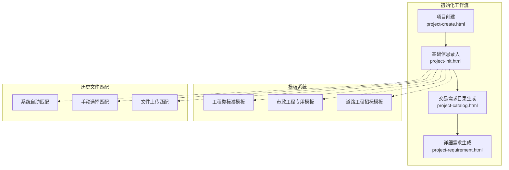
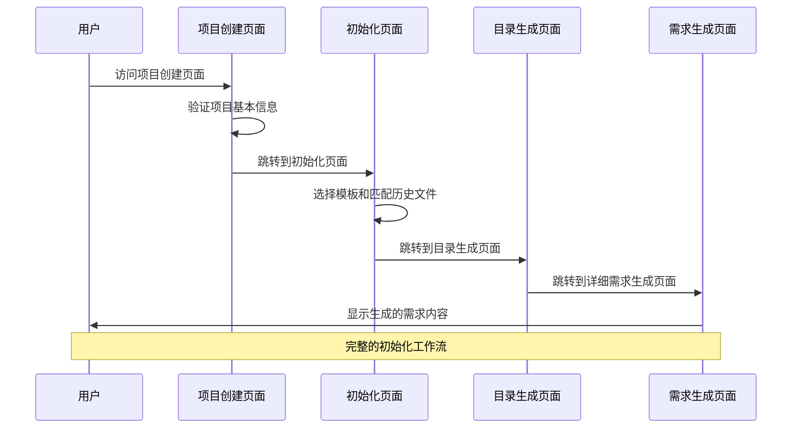
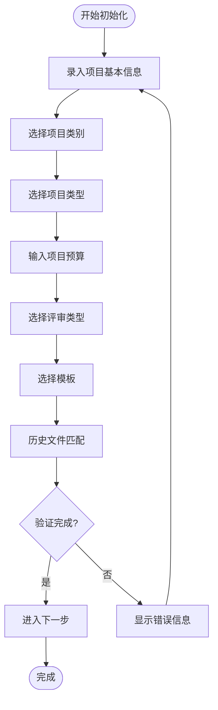
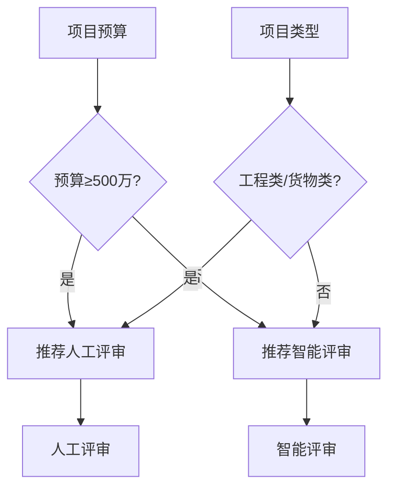
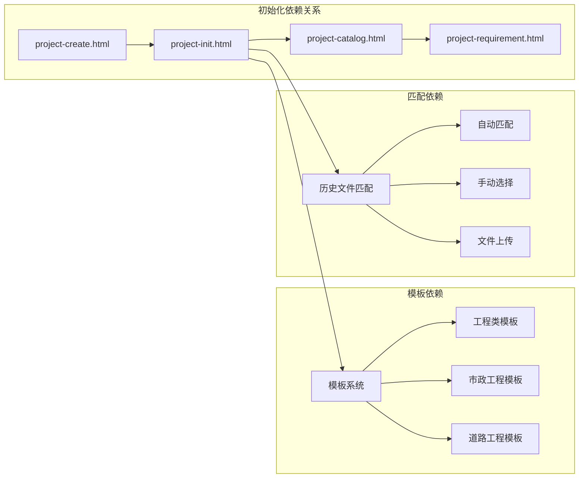

# 项目初始化

<cite>
**本文档引用的文件**
- [project-init.html](file://pages/project-init.html)
- [project-create.html](file://pages/project-create.html)
- [project-catalog.html](file://pages/project-catalog.html)
- [project-requirement.html](file://pages/project-requirement.html)
</cite>

## 目录
1. [简介](#简介)
2. [项目结构](#项目结构)
3. [核心组件](#核心组件)
4. [架构概览](#架构概览)
5. [详细组件分析](#详细组件分析)
6. [依赖分析](#依赖分析)
7. [性能考虑](#性能考虑)
8. [故障排除指南](#故障排除指南)
9. [结论](#结论)

## 简介

项目初始化是招标文件生成系统中的关键环节，负责为新项目建立基础配置框架。该流程通过多步骤的交互界面，引导用户完成项目基本信息录入、模板选择、历史文件匹配等关键配置，为后续的详细需求生成和文档编制奠定基础。

系统采用渐进式的工作流设计，通过进度指示器和步骤导航，确保用户能够清晰地了解当前所处的初始化阶段。整个流程从项目创建开始，经过基础信息录入、目录生成，最终进入详细需求生成阶段。

## 项目结构

项目初始化功能分布在多个HTML页面中，形成了完整的初始化工作流：

**图表来源**
- [project-create.html:742-776](file://pages/project-create.html#L742-L776)
- [project-init.html:1186-1206](file://pages/project-init.html#L1186-L1206)
- [project-catalog.html:1365-1368](file://pages/project-catalog.html#L1365-L1368)

**章节来源**
- [project-create.html:587-735](file://pages/project-create.html#L587-L735)
- [project-init.html:786-1170](file://pages/project-init.html#L786-L1170)
- [project-catalog.html:956-1270](file://pages/project-catalog.html#L956-L1270)

## 核心组件

### 1. 项目基本信息管理

系统提供完整的项目信息录入界面，支持多种项目类型的配置：

- **项目名称**：支持1-100字符的唯一性验证
- **项目类别**：限额以下、产权交易、政府采购三种选项
- **项目类型**：工程类、货物类、服务类（含多个子类别）
- **项目预算**：支持小数点后两位的金额输入
- **评审类型**：人工评审和智能评审两种模式

### 2. 模板管理系统

系统内置多种标准化的招标文件模板，支持用户根据项目特点选择合适的模板：

- **工程类标准模板**：适用于各类工程建设项目
- **市政工程专用模板**：针对市政工程的专业条款
- **道路工程招标模板**：专门的道路工程内容

每个模板都包含详细的元数据信息，如页数、更新日期等。

### 3. 历史文件匹配机制

提供三种智能匹配方式来利用历史项目经验：

- **系统自动匹配**：基于项目信息自动推荐最相似的历史文件
- **手动选择匹配**：从历史文件库中选择合适的参考文件
- **文件上传匹配**：允许用户上传特定的历史文件作为参考

**章节来源**
- [project-init.html:791-845](file://pages/project-init.html#L791-L845)
- [project-init.html:854-959](file://pages/project-init.html#L854-L959)
- [project-init.html:962-1056](file://pages/project-init.html#L962-L1056)

## 架构概览

项目初始化采用前后端分离的架构设计，前端通过HTML5+CSS3+JavaScript实现完整的用户交互体验：

**图表来源**
- [project-create.html:774-776](file://pages/project-create.html#L774-L776)
- [project-init.html:1204-1206](file://pages/project-init.html#L1204-L1206)
- [project-catalog.html:1366-1368](file://pages/project-catalog.html#L1366-L1368)

## 详细组件分析

### 基础信息录入组件

基础信息录入是项目初始化的核心环节，包含以下关键功能：

#### 1. 项目信息表单

**图表来源**
- [project-init.html:1186-1206](file://pages/project-init.html#L1186-L1206)

#### 2. 模板选择机制

模板选择采用卡片式布局，支持用户直观地浏览和选择：

- **模板卡片**：包含模板名称、描述、元数据信息
- **选中状态**：通过CSS类名控制选中样式
- **预览功能**：支持模板内容的快速预览

#### 3. 历史文件匹配系统

系统提供三种匹配策略：

- **自动匹配模式**：基于算法自动推荐最相似的历史文件
- **手动选择模式**：展示匹配度高的历史文件供用户选择
- **上传匹配模式**：支持用户上传特定文件作为参考

**章节来源**
- [project-init.html:1177-1180](file://pages/project-init.html#L1177-L1180)
- [project-init.html:1060-1079](file://pages/project-init.html#L1060-L1079)
- [project-init.html:1115-1141](file://pages/project-init.html#L1115-L1141)

### 项目创建组件

项目创建页面负责收集基础的项目信息，并进行初步的验证：

#### 1. 信息收集流程

项目创建页面提供标准化的信息收集界面：

- **项目名称验证**：确保名称的唯一性和格式正确
- **类别选择**：提供明确的分类选项
- **类型选择**：支持多层次的类型分类
- **预算输入**：支持精确的小数输入

#### 2. 自动评审类型推荐

系统根据项目特征自动推荐最适合的评审方式：

**图表来源**
- [project-create.html:801-821](file://pages/project-create.html#L801-L821)

**章节来源**
- [project-create.html:587-735](file://pages/project-create.html#L587-L735)
- [project-create.html:742-776](file://pages/project-create.html#L742-L776)

### 目录生成组件

目录生成页面展示了AI生成的交易需求目录结构：

#### 1. 目录树形结构

系统使用树形结构展示目录层级：

- **展开/折叠**：支持动态展开和折叠子节点
- **节点操作**：支持添加、编辑、删除节点
- **上下文菜单**：右键菜单提供丰富的操作选项

#### 2. AI助手集成

集成AI助手功能，提供智能化的目录管理：

- **智能建议**：根据用户需求提供修改建议
- **结构优化**：帮助用户优化目录结构
- **内容生成**：辅助生成目录内容

**章节来源**
- [project-catalog.html:982-1239](file://pages/project-catalog.html#L982-L1239)
- [project-catalog.html:1276-1457](file://pages/project-catalog.html#L1276-L1457)

## 依赖分析

项目初始化流程涉及多个页面间的依赖关系：

**图表来源**
- [project-create.html:774-776](file://pages/project-create.html#L774-L776)
- [project-init.html:1204-1206](file://pages/project-init.html#L1204-L1206)
- [project-catalog.html:1366-1368](file://pages/project-catalog.html#L1366-L1368)

### 数据流分析

初始化流程中的数据流转遵循严格的验证和转换规则：

1. **用户输入**：通过表单收集项目基本信息
2. **数据验证**：在客户端进行基本的数据完整性检查
3. **模板应用**：根据项目类型选择合适的模板
4. **历史匹配**：利用历史经验优化当前项目配置
5. **状态传递**：通过URL参数传递项目状态信息

**章节来源**
- [project-create.html:742-776](file://pages/project-create.html#L742-L776)
- [project-init.html:1186-1206](file://pages/project-init.html#L1186-L1206)
- [project-catalog.html:1365-1368](file://pages/project-catalog.html#L1365-L1368)

## 性能考虑

### 1. 前端性能优化

- **懒加载机制**：模板卡片和历史文件采用按需加载
- **事件委托**：使用事件委托减少DOM事件监听器数量
- **CSS变量缓存**：通过CSS变量实现主题切换的高性能渲染

### 2. 数据处理优化

- **本地验证**：优先在客户端进行数据验证，减少服务器负载
- **增量更新**：目录树支持局部更新，避免全量重绘
- **缓存策略**：模板内容和历史文件信息进行适当的缓存

### 3. 用户体验优化

- **进度指示**：清晰的进度条和状态提示
- **响应式设计**：适配不同屏幕尺寸的设备
- **无障碍访问**：支持键盘导航和屏幕阅读器

## 故障排除指南

### 1. 常见问题诊断

#### 表单验证失败

**症状**：保存按钮被禁用或出现错误提示
**原因**：
- 必填字段未填写
- 数据格式不正确
- 项目名称重复

**解决方案**：
- 检查必填字段是否完整填写
- 确认数据格式符合要求
- 修改重复的项目名称

#### 模板选择问题

**症状**：无法选择模板或模板样式异常
**原因**：
- JavaScript事件绑定失败
- CSS样式冲突
- 模板数据加载失败

**解决方案**：
- 刷新页面重新加载
- 检查浏览器控制台错误
- 确认网络连接正常

#### 历史文件匹配异常

**症状**：历史文件列表为空或匹配结果不准确
**原因**：
- 历史文件数据库连接失败
- 匹配算法计算超时
- 文件格式不支持

**解决方案**：
- 检查服务器连接状态
- 尝试重新生成匹配结果
- 确认上传文件格式正确

### 2. 回滚机制

系统提供了完善的回滚和恢复机制：

#### 步骤回退
- **上一步按钮**：允许用户返回到前一配置步骤
- **进度指示器**：显示已完成的配置步骤
- **状态保存**：自动保存已完成步骤的数据

#### 数据恢复
- **草稿保存**：支持临时草稿的保存和恢复
- **会话管理**：通过浏览器会话存储中间状态
- **错误恢复**：遇到错误时自动恢复到最近的安全状态

#### 系统恢复
- **默认配置**：提供系统默认配置作为备份
- **重置功能**：支持一键重置到初始状态
- **日志记录**：记录所有操作以便问题追踪

**章节来源**
- [project-init.html:1147-1161](file://pages/project-init.html#L1147-L1161)
- [project-catalog.html:1359-1363](file://pages/project-catalog.html#L1359-L1363)

### 3. 系统兼容性测试

#### 浏览器兼容性
- **现代浏览器**：Chrome、Firefox、Safari、Edge完全支持
- **IE浏览器**：部分功能可能受限
- **移动设备**：响应式设计适配主流移动设备

#### 功能完整性检查
- **表单验证**：确保所有必填字段得到验证
- **模板加载**：验证模板资源的完整性和可用性
- **历史匹配**：检查历史文件匹配算法的准确性

## 结论

项目初始化功能通过精心设计的多步骤工作流，为招标文件生成系统建立了坚实的基础。系统不仅提供了完整的配置选项，还集成了智能匹配和AI助手功能，大大提升了用户体验和工作效率。

### 主要优势

1. **用户体验优秀**：通过渐进式工作流和清晰的进度指示，确保用户能够顺利完成初始化配置
2. **功能完整性强**：涵盖了项目初始化的所有关键环节，从基本信息录入到模板选择
3. **智能化程度高**：集成AI助手和智能匹配功能，提供个性化的配置建议
4. **扩展性良好**：模块化的设计便于后续功能的扩展和维护

### 技术特色

1. **前后端分离**：采用现代化的前端技术栈，提供流畅的交互体验
2. **响应式设计**：适配各种设备和屏幕尺寸
3. **性能优化**：通过多种技术手段确保系统的高效运行
4. **错误处理完善**：提供全面的错误处理和回滚机制

项目初始化功能的成功实施，为整个招标文件生成系统的稳定运行奠定了坚实基础，也为用户提供了高效、便捷的项目管理体验。