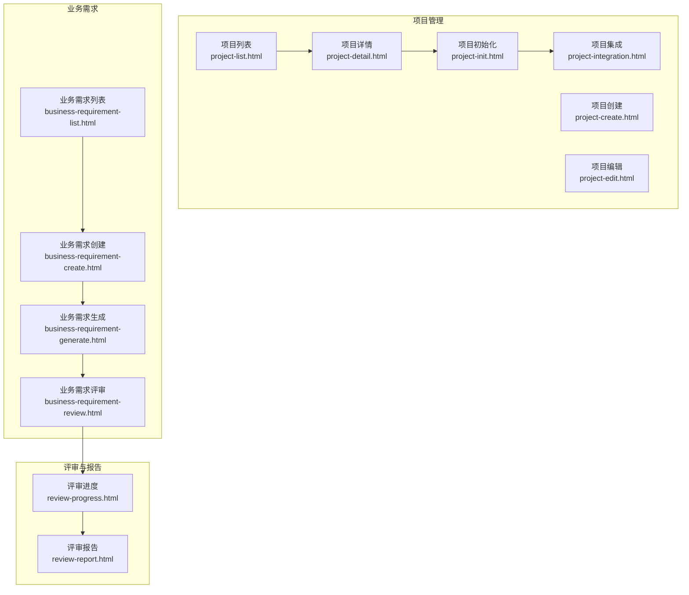
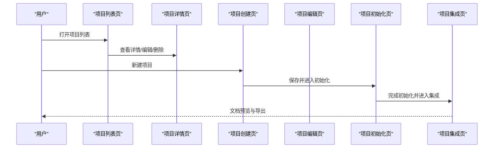
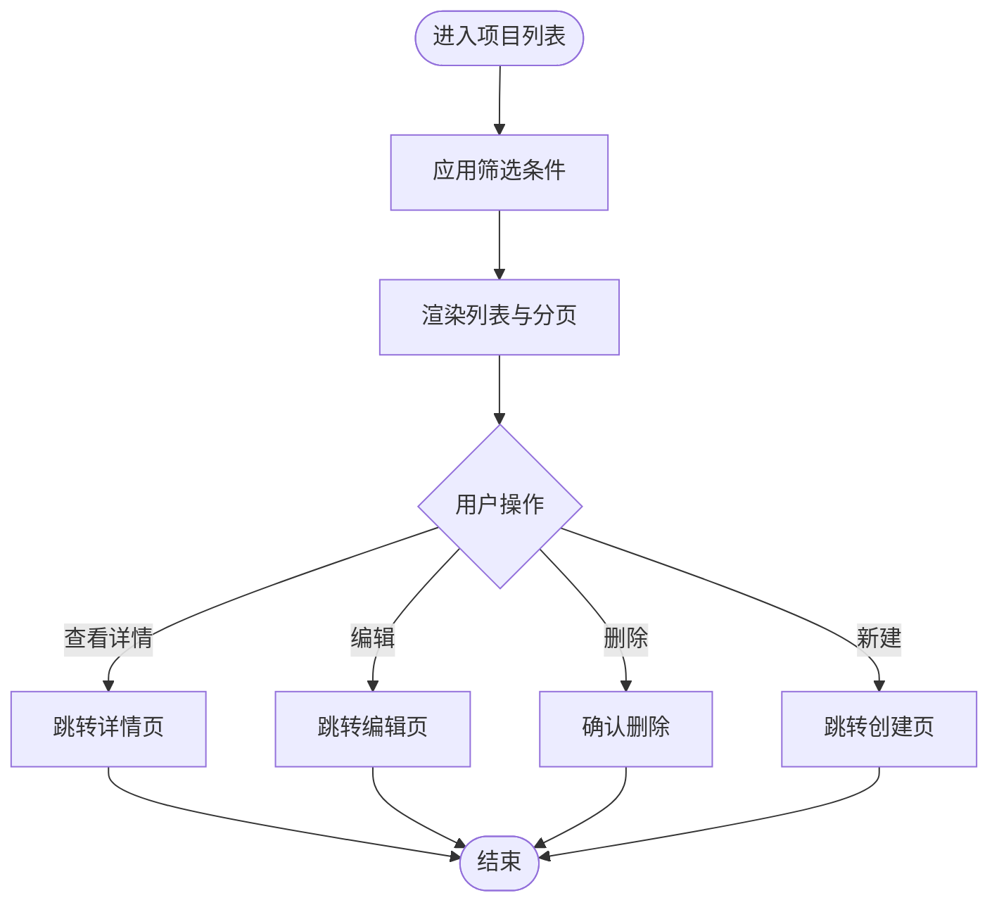
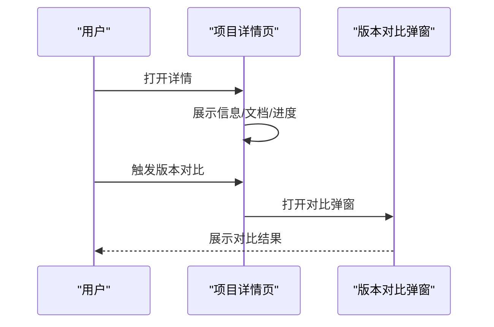
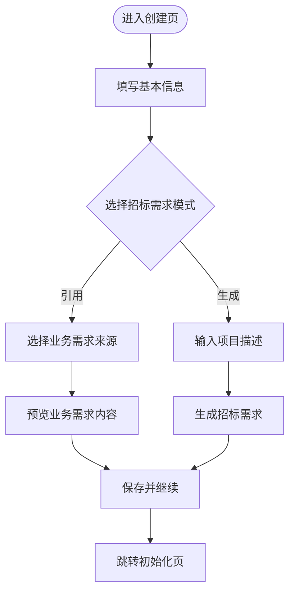
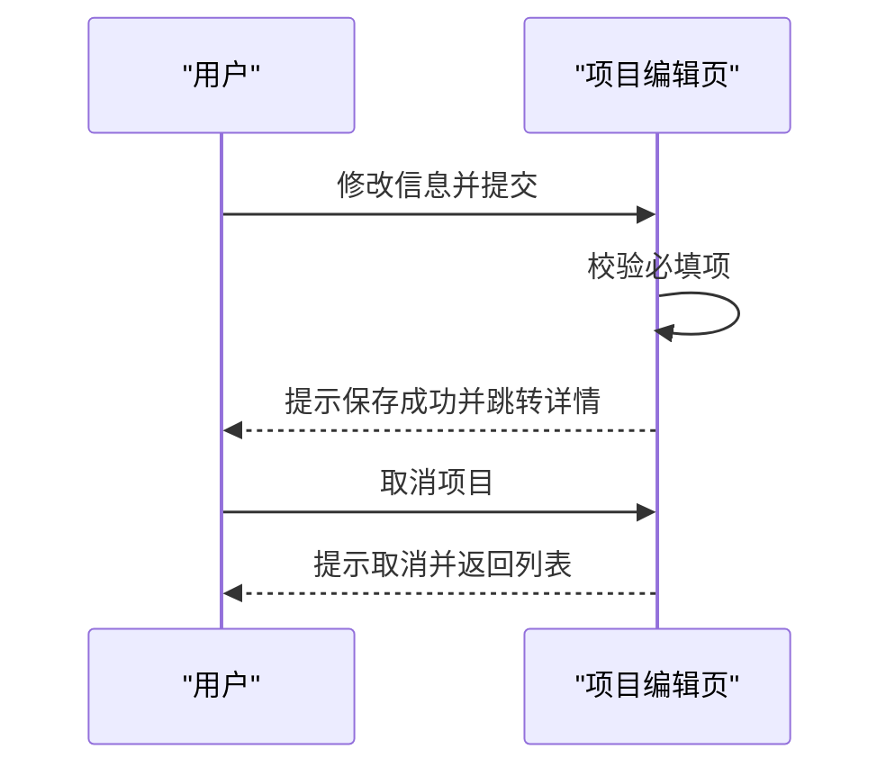
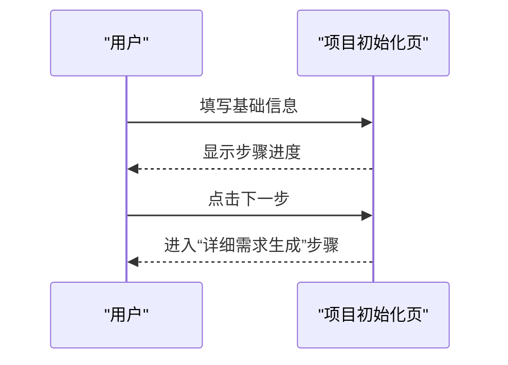
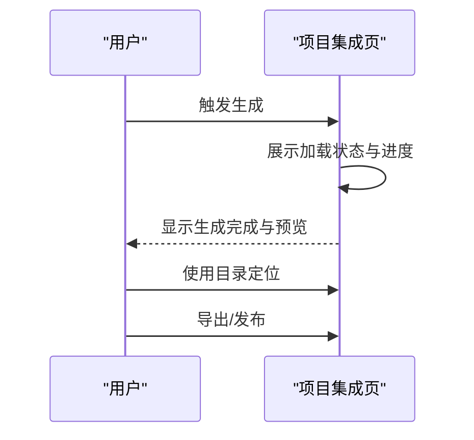
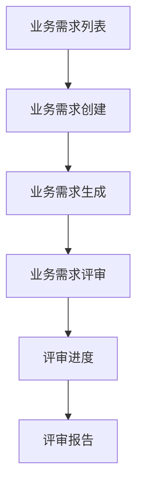
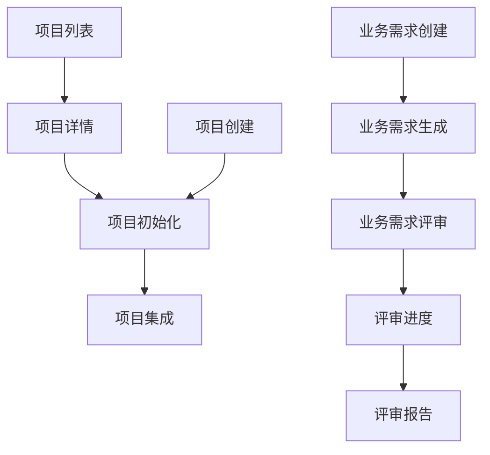

# 项目管理

<cite>
**本文引用的文件**
- [pages/project-list.html](file://pages/project-list.html)
- [pages/project-detail.html](file://pages/project-detail.html)
- [pages/project-create.html](file://pages/project-create.html)
- [pages/project-edit.html](file://pages/project-edit.html)
- [pages/project-init.html](file://pages/project-init.html)
- [pages/project-integration.html](file://pages/project-integration.html)
- [pages/business-requirement-list.html](file://pages/business-requirement-list.html)
- [pages/business-requirement-create.html](file://pages/business-requirement-create.html)
- [pages/business-requirement-generate.html](file://pages/business-requirement-generate.html)
- [pages/business-requirement-review.html](file://pages/business-requirement-review.html)
- [pages/review-progress.html](file://pages/review-progress.html)
- [pages/review-report.html](file://pages/review-report.html)
</cite>

## 目录
1. [简介](#简介)
2. [项目结构](#项目结构)
3. [核心组件](#核心组件)
4. [架构总览](#架构总览)
5. [详细组件分析](#详细组件分析)
6. [依赖关系分析](#依赖关系分析)
7. [性能考虑](#性能考虑)
8. [故障排查指南](#故障排查指南)
9. [结论](#结论)
10. [附录](#附录)

## 简介
本文件面向“招标文件生成系统”的项目管理模块，围绕项目全生命周期管理进行系统化说明，覆盖从项目创建、初始化配置、执行与集成，到最终评审与报告输出的完整流程。文档同时对项目列表、详情、创建与编辑等页面的功能与交互进行深入解析，并提供流程图与状态转换图，帮助开发者与运营人员快速理解与维护系统。

## 项目结构
项目采用多页面静态结构，以“pages”目录为核心，按功能划分为：
- 项目管理：项目列表、详情、创建、编辑、初始化、集成等页面
- 业务需求：业务需求列表、创建、生成、评审等页面
- 其他：消息中心、统计分析、模板管理、政策文件管理、系统设置等页面

图表来源
- [pages/project-list.html](file://pages/project-list.html)
- [pages/project-detail.html](file://pages/project-detail.html)
- [pages/project-create.html](file://pages/project-create.html)
- [pages/project-edit.html](file://pages/project-edit.html)
- [pages/project-init.html](file://pages/project-init.html)
- [pages/project-integration.html](file://pages/project-integration.html)
- [pages/business-requirement-list.html](file://pages/business-requirement-list.html)
- [pages/business-requirement-create.html](file://pages/business-requirement-create.html)
- [pages/business-requirement-generate.html](file://pages/business-requirement-generate.html)
- [pages/business-requirement-review.html](file://pages/business-requirement-review.html)
- [pages/review-progress.html](file://pages/review-progress.html)
- [pages/review-report.html](file://pages/review-report.html)

章节来源
- [pages/project-list.html](file://pages/project-list.html)
- [pages/project-detail.html](file://pages/project-detail.html)
- [pages/project-create.html](file://pages/project-create.html)
- [pages/project-edit.html](file://pages/project-edit.html)
- [pages/project-init.html](file://pages/project-init.html)
- [pages/project-integration.html](file://pages/project-integration.html)
- [pages/business-requirement-list.html](file://pages/business-requirement-list.html)
- [pages/business-requirement-create.html](file://pages/business-requirement-create.html)
- [pages/business-requirement-generate.html](file://pages/business-requirement-generate.html)
- [pages/business-requirement-review.html](file://pages/business-requirement-review.html)
- [pages/review-progress.html](file://pages/review-progress.html)
- [pages/review-report.html](file://pages/review-report.html)

## 核心组件
- 项目列表页：提供筛选、分页、状态与进度可视化、批量操作入口，支持跳转至详情、编辑与删除
- 项目详情页：集中展示项目信息、进度时间轴、文档卡片、发布区域与版本对比
- 项目创建页：录入项目基础信息、选择评审类型、配置招标需求（引用或生成），并保存后进入初始化流程
- 项目编辑页：支持修改项目关键信息、取消项目、返回列表与详情
- 项目初始化页：文件编制流程的第1步，包含步骤导航、基础信息录入与下一步推进
- 项目集成页：文件编制流程的第4步，包含生成状态、预览工具栏、目录面板与导出/发布
- 业务需求模块：独立于项目管理，提供业务需求的创建、生成与评审流程，支撑项目需求配置
- 评审与报告：评审进度跟踪与评审报告生成，贯穿业务需求与项目集成阶段

章节来源
- [pages/project-list.html](file://pages/project-list.html)
- [pages/project-detail.html](file://pages/project-detail.html)
- [pages/project-create.html](file://pages/project-create.html)
- [pages/project-edit.html](file://pages/project-edit.html)
- [pages/project-init.html](file://pages/project-init.html)
- [pages/project-integration.html](file://pages/project-integration.html)
- [pages/business-requirement-list.html](file://pages/business-requirement-list.html)
- [pages/business-requirement-create.html](file://pages/business-requirement-create.html)
- [pages/business-requirement-generate.html](file://pages/business-requirement-generate.html)
- [pages/business-requirement-review.html](file://pages/business-requirement-review.html)
- [pages/review-progress.html](file://pages/review-progress.html)
- [pages/review-report.html](file://pages/review-report.html)

## 架构总览
项目管理模块遵循“页面驱动”的前端架构，页面间通过统一的侧边栏导航与面包屑导航实现跳转。数据流以用户操作为驱动，从列表页筛选与操作，到详情页信息展示与版本对比，再到创建/编辑页的表单提交，最终在初始化与集成页推进流程并生成文档。

图表来源
- [pages/project-list.html](file://pages/project-list.html)
- [pages/project-detail.html](file://pages/project-detail.html)
- [pages/project-create.html](file://pages/project-create.html)
- [pages/project-edit.html](file://pages/project-edit.html)
- [pages/project-init.html](file://pages/project-init.html)
- [pages/project-integration.html](file://pages/project-integration.html)

## 详细组件分析

### 项目列表页面
- 功能要点
  - 多维筛选：项目名称/编号、状态、类别、类型、创建时间
  - 列表展示：项目编号、名称、类别/类型标签、预算、进度条、创建时间、操作按钮
  - 分页控制：上一页/下一页与页码跳转
  - 操作入口：新建项目、查看详情、编辑、删除
- 交互设计
  - 状态徽章与类型徽章用于快速识别项目状态与类型
  - 进度条直观展示完成度
  - 悬停高亮与主题切换增强可读性

图表来源
- [pages/project-list.html](file://pages/project-list.html)

章节来源
- [pages/project-list.html](file://pages/project-list.html)

### 项目详情页面
- 功能要点
  - 项目信息卡片：标题、状态徽章、元信息网格
  - 标签页：信息、文档、进度、发布等
  - 进度时间轴：展示流程节点与状态
  - 发布区域：发布提示与操作
  - 版本对比：弹窗展示版本差异
- 交互设计
  - 时间轴节点区分“已完成/进行中/未开始”
  - 发布区域强调成功态
  - 弹窗模态展示复杂对比信息

图表来源
- [pages/project-detail.html](file://pages/project-detail.html)

章节来源
- [pages/project-detail.html](file://pages/project-detail.html)

### 项目创建页面
- 功能要点
  - 基本信息：名称、类别、类型、预算、评审类型
  - 招标需求配置：两种模式
    - 模式1：引用业务需求模块的项目或直接录入
    - 模式2：系统根据项目描述自动生成
  - 表单校验与下一步跳转
- 交互设计
  - 自动推荐评审类型
  - 源选择联动展示业务需求内容或文本域
  - 生成结果可预览

图表来源
- [pages/project-create.html](file://pages/project-create.html)

章节来源
- [pages/project-create.html](file://pages/project-create.html)

### 项目编辑页面
- 功能要点
  - 修改项目名称、类型、评审类型、描述等
  - 取消项目（进入搁置库）
  - 返回列表与详情
- 交互设计
  - 必填项校验
  - 确认对话框保护关键操作

图表来源
- [pages/project-edit.html](file://pages/project-edit.html)

章节来源
- [pages/project-edit.html](file://pages/project-edit.html)

### 项目初始化页面
- 功能要点
  - 步骤指示器：基础信息录入、详细需求生成、评审项设置、文档集成
  - 左侧面板：流程步骤导航
  - 右侧面板：当前步骤表单与操作
- 交互设计
  - 步骤高亮与完成态标识
  - 下一步/返回按钮

图表来源
- [pages/project-init.html](file://pages/project-init.html)

章节来源
- [pages/project-init.html](file://pages/project-init.html)

### 项目集成页面
- 功能要点
  - 生成状态：加载动画、进度条、状态提示
  - 文档预览：工具栏（缩放、目录、分页）、预览容器
  - 文档信息：项目信息摘要
  - 导航与操作：返回、下一步、导出、发布
- 交互设计
  - 目录面板可展开/收起
  - 工具栏按钮状态切换

图表来源
- [pages/project-integration.html](file://pages/project-integration.html)

章节来源
- [pages/project-integration.html](file://pages/project-integration.html)

### 业务需求模块
- 业务需求列表：筛选、状态徽章、进度条、操作按钮
- 业务需求创建：基本信息、预算、需求描述、三种匹配模式（引用历史、上传文件、AI生成）
- 业务需求生成：生成结果展示与下一步
- 业务需求评审：评审流程与进度跟踪

图表来源
- [pages/business-requirement-list.html](file://pages/business-requirement-list.html)
- [pages/business-requirement-create.html](file://pages/business-requirement-create.html)
- [pages/business-requirement-generate.html](file://pages/business-requirement-generate.html)
- [pages/business-requirement-review.html](file://pages/business-requirement-review.html)
- [pages/review-progress.html](file://pages/review-progress.html)
- [pages/review-report.html](file://pages/review-report.html)

章节来源
- [pages/business-requirement-list.html](file://pages/business-requirement-list.html)
- [pages/business-requirement-create.html](file://pages/business-requirement-create.html)
- [pages/business-requirement-generate.html](file://pages/business-requirement-generate.html)
- [pages/business-requirement-review.html](file://pages/business-requirement-review.html)
- [pages/review-progress.html](file://pages/review-progress.html)
- [pages/review-report.html](file://pages/review-report.html)

## 依赖关系分析
- 页面耦合
  - 项目列表与详情存在强关联（查看详情、编辑、删除）
  - 创建页与初始化页存在流程依赖（保存后跳转）
  - 初始化页与集成页存在流程依赖（完成初始化后进入集成）
  - 业务需求模块与项目管理模块通过“引用业务需求”形成弱耦合
- 数据依赖
  - 项目详情依赖项目初始化与集成产生的文档与版本信息
  - 业务需求评审依赖业务需求生成的结果
- 导航依赖
  - 统一侧边栏与面包屑导航确保用户路径一致

图表来源
- [pages/project-list.html](file://pages/project-list.html)
- [pages/project-detail.html](file://pages/project-detail.html)
- [pages/project-create.html](file://pages/project-create.html)
- [pages/project-init.html](file://pages/project-init.html)
- [pages/project-integration.html](file://pages/project-integration.html)
- [pages/business-requirement-create.html](file://pages/business-requirement-create.html)
- [pages/business-requirement-generate.html](file://pages/business-requirement-generate.html)
- [pages/business-requirement-review.html](file://pages/business-requirement-review.html)
- [pages/review-progress.html](file://pages/review-progress.html)
- [pages/review-report.html](file://pages/review-report.html)

章节来源
- [pages/project-list.html](file://pages/project-list.html)
- [pages/project-detail.html](file://pages/project-detail.html)
- [pages/project-create.html](file://pages/project-create.html)
- [pages/project-init.html](file://pages/project-init.html)
- [pages/project-integration.html](file://pages/project-integration.html)
- [pages/business-requirement-create.html](file://pages/business-requirement-create.html)
- [pages/business-requirement-generate.html](file://pages/business-requirement-generate.html)
- [pages/business-requirement-review.html](file://pages/business-requirement-review.html)
- [pages/review-progress.html](file://pages/review-progress.html)
- [pages/review-report.html](file://pages/review-report.html)

## 性能考虑
- 渲染优化
  - 列表页采用虚拟滚动与懒加载策略，减少DOM数量
  - 预览页使用分页与缩放控制，避免一次性渲染大文档
- 交互响应
  - 步骤指示器与进度条采用过渡动画，提升反馈体验
  - 主题切换仅调整CSS变量，避免重排重绘
- 数据处理
  - 业务需求生成采用异步加载与进度条，避免阻塞UI
  - 版本对比弹窗按需打开，降低内存占用

## 故障排查指南
- 项目列表筛选无效
  - 检查筛选字段是否正确绑定事件与值
  - 确认分页参数传递与后端接口一致性
- 项目详情无法打开
  - 核对详情页URL参数与路由配置
  - 检查本地存储或会话状态是否异常
- 创建页保存失败
  - 校验必填字段与格式验证
  - 检查网络请求与接口返回状态
- 集成页生成卡顿
  - 检查生成任务是否异步执行
  - 优化预览容器渲染策略，启用分页与缩放
- 业务需求生成异常
  - 确认匹配模式选择与对应输入（引用/上传/AI）
  - 检查生成接口与返回数据结构

章节来源
- [pages/project-list.html](file://pages/project-list.html)
- [pages/project-detail.html](file://pages/project-detail.html)
- [pages/project-create.html](file://pages/project-create.html)
- [pages/project-integration.html](file://pages/project-integration.html)
- [pages/business-requirement-create.html](file://pages/business-requirement-create.html)

## 结论
项目管理模块通过清晰的页面分工与流程编排，实现了从项目创建到文档集成与评审报告的全生命周期管理。列表页提供高效检索与概览，详情页承载信息聚合与版本对比，创建/编辑页保障配置灵活性，初始化与集成页推动流程落地与产出交付。业务需求模块作为前置支撑，进一步完善了项目需求的生成与评审闭环。建议后续在数据层引入统一的状态机与事件总线，以增强跨页面协作与一致性。

## 附录
- 状态徽章与类型徽章规范
  - 状态：草稿、进行中、待检测、检测中、检测通过、检测不通过、已发布、已归档、已取消
  - 类型：工程类、货物类、服务类
- 流程图与状态转换图
  - 项目创建 → 初始化 → 集成 → 发布/归档
  - 业务需求创建 → 生成 → 评审 → 报告