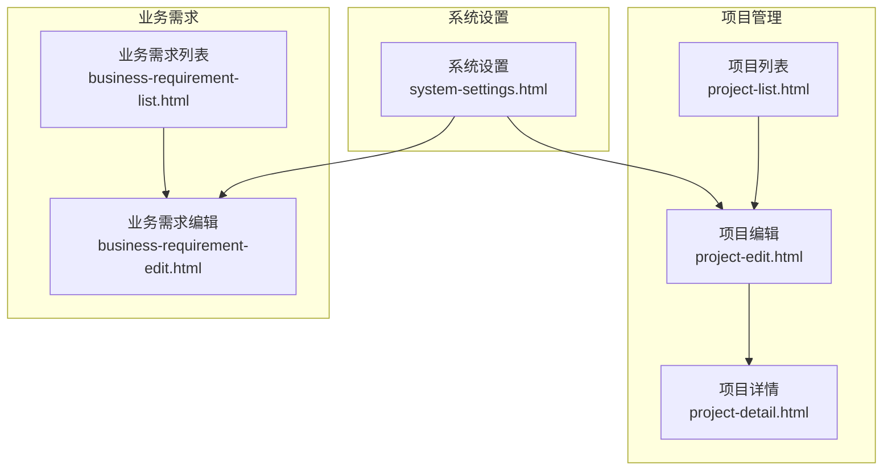
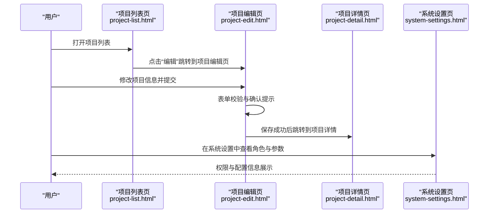
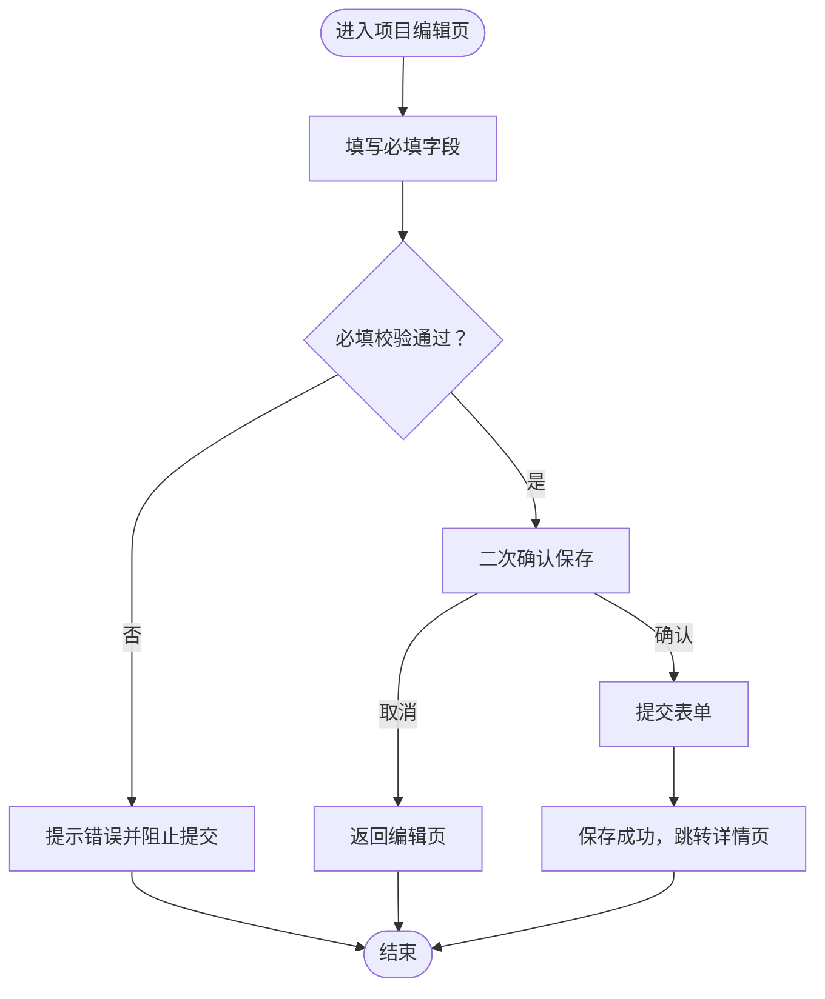
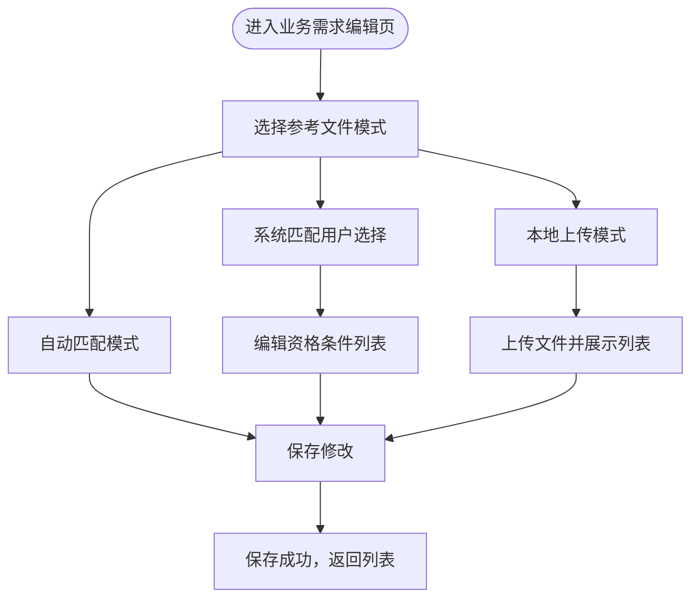
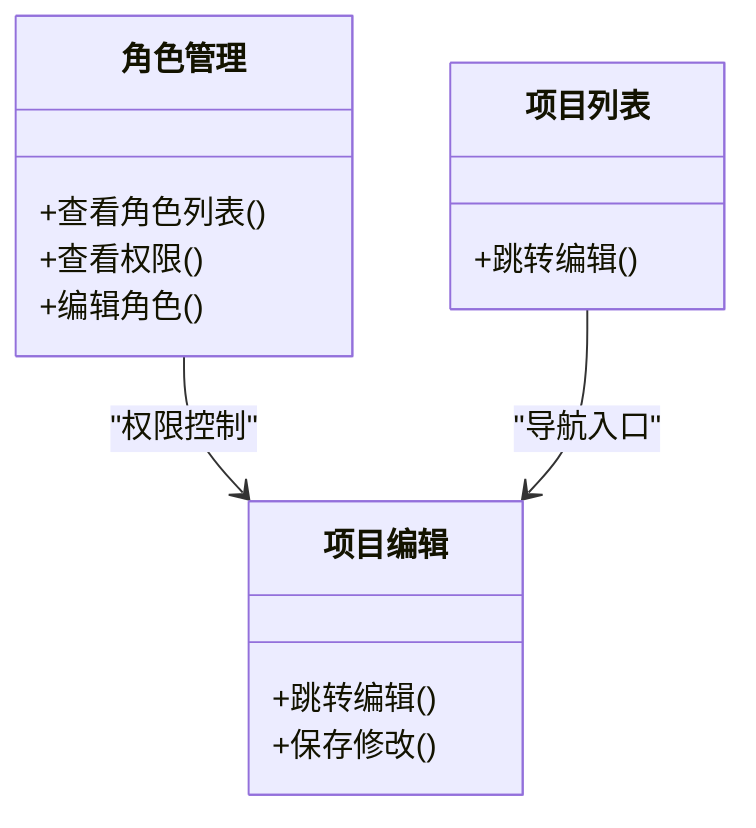
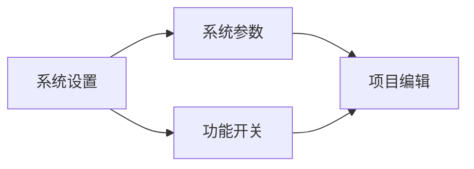
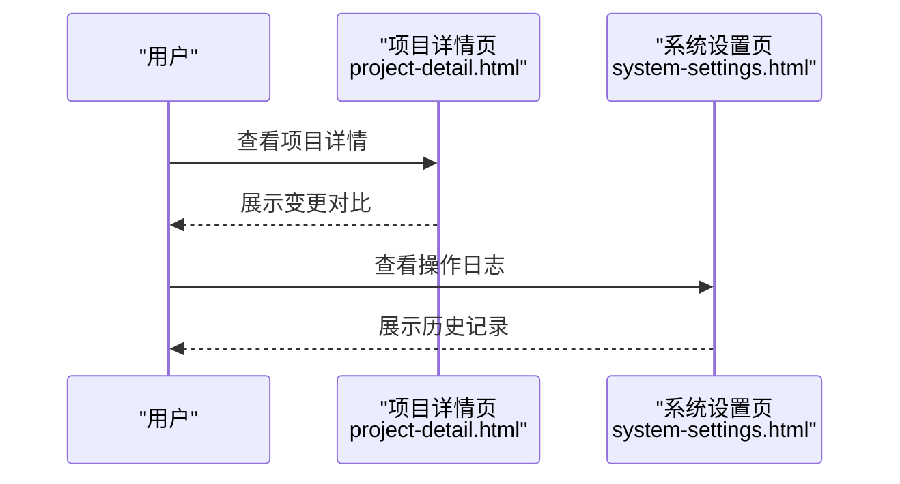
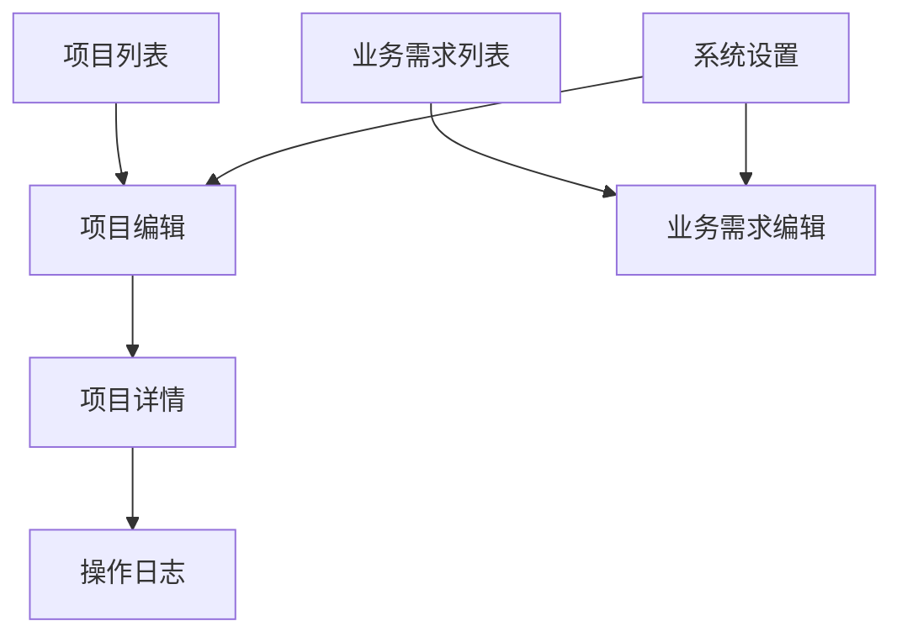

# 项目编辑

<cite>
**本文引用的文件**
- [project-edit.html](file://pages/project-edit.html)
- [project-list.html](file://pages/project-list.html)
- [business-requirement-edit.html](file://pages/business-requirement-edit.html)
- [business-requirement-list.html](file://pages/business-requirement-list.html)
- [system-settings.html](file://pages/system-settings.html)
- [project-detail.html](file://pages/project-detail.html)
- [review-report.html](file://pages/review-report.html)
- [review-progress.html](file://pages/review-progress.html)
</cite>

## 目录
1. [简介](#简介)
2. [项目结构](#项目结构)
3. [核心组件](#核心组件)
4. [架构概览](#架构概览)
5. [详细组件分析](#详细组件分析)
6. [依赖关系分析](#依赖关系分析)
7. [性能考虑](#性能考虑)
8. [故障排除指南](#故障排除指南)
9. [结论](#结论)
10. [附录](#附录)

## 简介
本文件面向项目编辑页面，系统性阐述项目信息动态更新、状态变更权限控制、配置参数调整与历史记录追踪等关键功能。同时，结合现有前端页面与系统设置，说明编辑权限管理机制（角色与操作）、编辑锁定与并发冲突处理建议、项目变更影响分析（下游流程影响评估、依赖自动更新与变更通知机制），以及安全措施与数据保护策略。

## 项目结构
项目编辑页面位于 pages 目录，围绕“项目管理”与“业务需求”两大主线展开：
- 项目管理：项目列表页提供跳转至项目编辑页的入口；项目编辑页负责项目信息的修改与保存。
- 业务需求：业务需求列表页提供跳转至业务需求编辑页的入口；业务需求编辑页负责需求信息的修改与保存。
- 系统设置：集中管理角色权限、系统参数、AI服务配置与操作日志，为权限控制与安全策略提供支撑。

**图表来源**
- [project-list.html](file://pages/project-list.html)
- [project-edit.html](file://pages/project-edit.html)
- [project-detail.html](file://pages/project-detail.html)
- [business-requirement-list.html](file://pages/business-requirement-list.html)
- [business-requirement-edit.html](file://pages/business-requirement-edit.html)
- [system-settings.html](file://pages/system-settings.html)

**章节来源**
- [project-list.html](file://pages/project-list.html)
- [project-edit.html](file://pages/project-edit.html)
- [business-requirement-list.html](file://pages/business-requirement-list.html)
- [business-requirement-edit.html](file://pages/business-requirement-edit.html)
- [system-settings.html](file://pages/system-settings.html)

## 核心组件
- 项目编辑表单组件：包含项目基本信息、资格要求、其他信息等字段，支持必填校验与提交确认。
- 业务需求编辑表单组件：包含需求基本信息、参考文件选择模式（自动匹配/用户选择/本地上传）、动态资格条件列表等。
- 角色与权限管理：系统设置中的角色列表与权限查看功能，支撑编辑权限的分配与审计。
- 系统参数与功能开关：系统参数配置、AI服务配置与检测规则，影响编辑过程中的辅助能力与合规性检测。
- 历史记录与日志：系统设置中的操作日志，用于追踪编辑行为与变更历史。

**章节来源**
- [project-edit.html](file://pages/project-edit.html)
- [business-requirement-edit.html](file://pages/business-requirement-edit.html)
- [system-settings.html](file://pages/system-settings.html)

## 架构概览
项目编辑页面的交互流程由“列表页 → 编辑页 → 详情页”的导航链路构成，配合系统设置中的权限与参数配置，形成完整的编辑与审批闭环。

**图表来源**
- [project-list.html](file://pages/project-list.html)
- [project-edit.html](file://pages/project-edit.html)
- [project-detail.html](file://pages/project-detail.html)
- [system-settings.html](file://pages/system-settings.html)

**章节来源**
- [project-list.html](file://pages/project-list.html)
- [project-edit.html](file://pages/project-edit.html)
- [project-detail.html](file://pages/project-detail.html)
- [system-settings.html](file://pages/system-settings.html)

## 详细组件分析

### 项目编辑表单组件
- 字段结构
  - 项目基本信息：项目编号（只读）、项目名称、项目类型、评审类型、项目状态（只读）、项目描述。
  - 资格要求：文本域，支持编辑。
  - 其他信息：创建时间/人（只读）、当前版本（只读）、使用模板（只读）。
- 动态更新与校验
  - 表单提交事件监听，进行必填字段校验（项目名称、项目类型）。
  - 提交前二次确认，避免误操作。
- 操作按钮
  - 返回列表、查看详情、取消项目、保存修改。
- 状态变更与权限控制
  - 当前页面未直接体现状态变更逻辑，但可通过系统设置中的角色与参数配置间接影响状态流转与可见性。

**图表来源**
- [project-edit.html](file://pages/project-edit.html)

**章节来源**
- [project-edit.html](file://pages/project-edit.html)

### 业务需求编辑表单组件
- 字段结构
  - 需求基本信息：需求名称、项目类型、项目预算、需求类型、需求描述。
  - 参考文件选择模式：自动匹配、系统匹配用户选择、本地上传三种模式。
  - 动态资格条件列表：支持添加/删除条目，保证至少保留一项。
- 动态交互
  - 模式切换：根据选择的模式显示对应的参考文件区域。
  - 文件上传：支持多文件上传，实时展示上传文件列表。
- 保存逻辑
  - 必填字段校验，弹窗提示保存成功并返回列表。

**图表来源**
- [business-requirement-edit.html](file://pages/business-requirement-edit.html)

**章节来源**
- [business-requirement-edit.html](file://pages/business-requirement-edit.html)

### 角色与权限管理机制
- 角色列表与权限查看
  - 系统设置页的角色标签页展示角色名称、描述、用户数量与创建时间，并提供“查看权限”入口。
- 权限分配与编辑
  - 提供“编辑角色”入口，便于在系统设置中进行角色权限的分配与调整。
- 与项目编辑的关系
  - 项目编辑页的“编辑”按钮在项目列表页中可见，权限控制应基于角色配置决定用户是否具备编辑权限。

**图表来源**
- [system-settings.html](file://pages/system-settings.html)
- [project-list.html](file://pages/project-list.html)
- [project-edit.html](file://pages/project-edit.html)

**章节来源**
- [system-settings.html](file://pages/system-settings.html)
- [project-list.html](file://pages/project-list.html)

### 系统参数与功能开关
- 系统参数配置
  - 包括系统名称、版本、文件存储路径、最大文件大小、会话超时时间、检测不通过上限次数等。
- 功能开关
  - 启用AI对话功能、启用智能检测功能、启用消息通知等。
- 对编辑的影响
  - 参数与开关直接影响编辑过程中的辅助能力（如AI检测）与合规性检查结果。

**图表来源**
- [system-settings.html](file://pages/system-settings.html)
- [project-edit.html](file://pages/project-edit.html)

**章节来源**
- [system-settings.html](file://pages/system-settings.html)

### 历史记录与变更追踪
- 操作日志
  - 系统设置页的操作日志标签页展示用户操作类型、对象、详情与IP地址等信息，可用于审计与追踪。
- 项目详情对比
  - 项目详情页提供变更对比视图，展示新增、修改、删除与影响等信息，帮助评估变更对下游流程的影响。

**图表来源**
- [project-detail.html](file://pages/project-detail.html)
- [system-settings.html](file://pages/system-settings.html)

**章节来源**
- [project-detail.html](file://pages/project-detail.html)
- [system-settings.html](file://pages/system-settings.html)

## 依赖关系分析
- 页面间依赖
  - 项目列表页提供“编辑”入口，跳转至项目编辑页；项目编辑页保存后跳转至项目详情页。
  - 业务需求列表页提供“编辑/修订”入口，跳转至业务需求编辑页。
- 权限与参数依赖
  - 项目编辑与业务需求编辑的可用性与可见性受系统设置中的角色与参数配置影响。
- 日志与审计依赖
  - 操作日志与变更对比为编辑行为提供审计与影响评估依据。

**图表来源**
- [project-list.html](file://pages/project-list.html)
- [project-edit.html](file://pages/project-edit.html)
- [project-detail.html](file://pages/project-detail.html)
- [business-requirement-list.html](file://pages/business-requirement-list.html)
- [business-requirement-edit.html](file://pages/business-requirement-edit.html)
- [system-settings.html](file://pages/system-settings.html)

**章节来源**
- [project-list.html](file://pages/project-list.html)
- [business-requirement-list.html](file://pages/business-requirement-list.html)
- [system-settings.html](file://pages/system-settings.html)

## 性能考虑
- 前端渲染与交互
  - 使用原生 JavaScript 处理表单校验与模式切换，避免引入重型框架，降低首屏加载与交互延迟。
- 文件上传与预览
  - 本地上传模式支持多文件上传，建议在客户端进行文件大小与格式校验，减少无效请求。
- 状态与进度
  - 列表页的进度条与状态徽标采用内联样式，保持轻量与快速渲染。

[本节为通用指导，无需具体文件分析]

## 故障排除指南
- 表单提交失败
  - 检查必填字段是否填写完整；确认二次确认对话框是否被取消。
- 编辑入口不可见
  - 检查系统设置中的角色权限配置，确认当前用户是否具备编辑权限。
- 参考文件上传异常
  - 确认文件大小与格式是否符合系统参数配置；检查功能开关中的“启用智能检测功能”是否开启。
- 历史记录缺失
  - 检查“启用消息通知”与“启用智能检测功能”等开关；核对操作日志中的记录时间与用户。

**章节来源**
- [project-edit.html](file://pages/project-edit.html)
- [business-requirement-edit.html](file://pages/business-requirement-edit.html)
- [system-settings.html](file://pages/system-settings.html)

## 结论
项目编辑页面通过简洁直观的表单设计与完善的权限、参数与日志体系，实现了项目信息的动态更新与变更追踪。结合业务需求编辑与系统设置，可有效支撑编辑权限管理、状态变更控制与影响评估。建议在现有基础上进一步完善并发编辑冲突处理与更细粒度的权限控制，以提升系统的安全性与稳定性。

[本节为总结性内容，无需具体文件分析]

## 附录
- 相关页面导航
  - 项目列表 → 项目编辑 → 项目详情
  - 业务需求列表 → 业务需求编辑
- 系统设置入口
  - 用户管理、角色权限、系统参数、AI服务配置、操作日志

**章节来源**
- [project-list.html](file://pages/project-list.html)
- [business-requirement-list.html](file://pages/business-requirement-list.html)
- [system-settings.html](file://pages/system-settings.html)