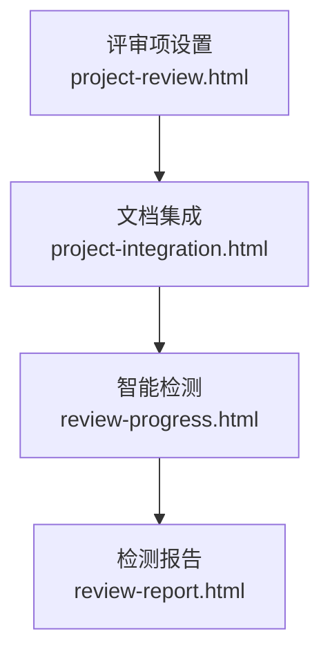
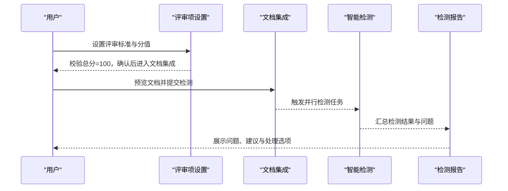
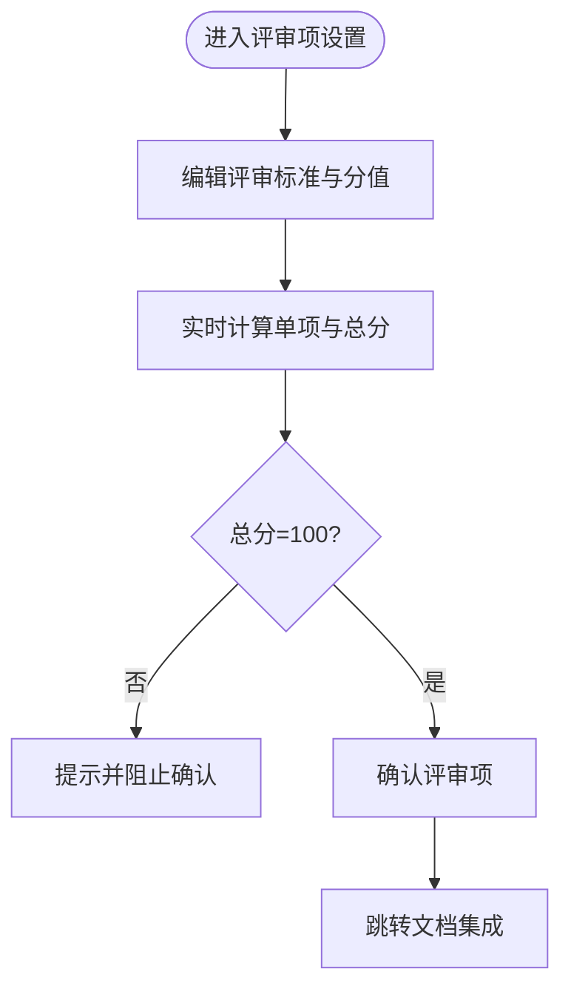
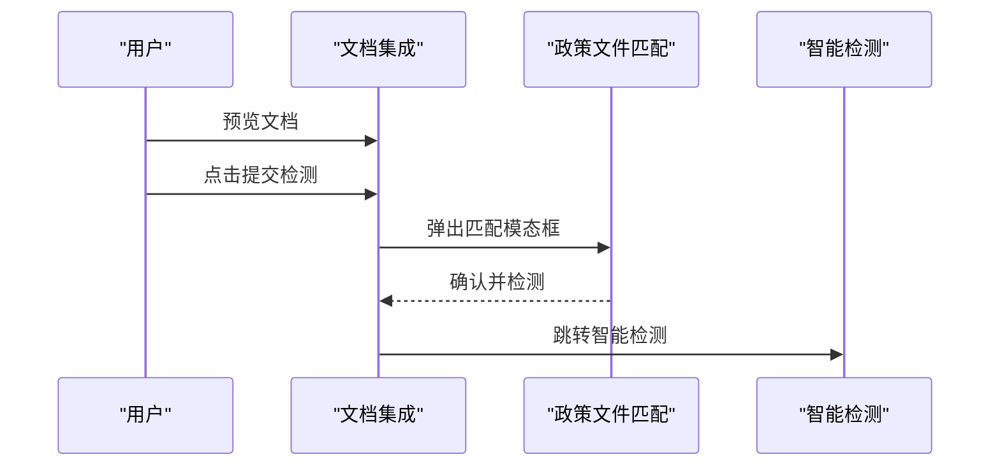
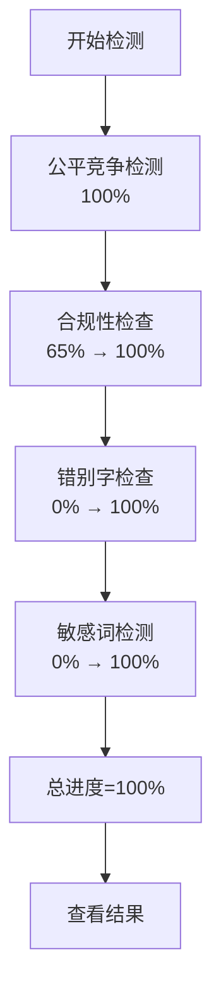
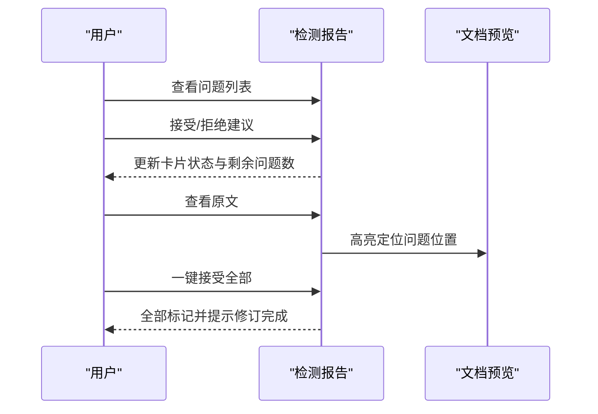
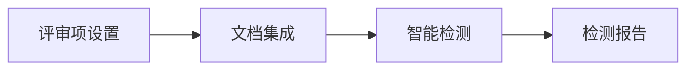

# 项目评审

<cite>
**本文引用的文件**
- [project-review.html](file://pages/project-review.html)
- [review-progress.html](file://pages/review-progress.html)
- [review-report.html](file://pages/review-report.html)
- [project-integration.html](file://pages/project-integration.html)
- [business-requirement-review.html](file://pages/business-requirement-review.html)
</cite>

## 目录
1. [简介](#简介)
2. [项目结构](#项目结构)
3. [核心组件](#核心组件)
4. [架构概览](#架构概览)
5. [详细组件分析](#详细组件分析)
6. [依赖分析](#依赖分析)
7. [性能考虑](#性能考虑)
8. [故障排除指南](#故障排除指南)
9. [结论](#结论)
10. [附录](#附录)

## 简介
本文件面向“项目评审”功能，围绕评审任务的创建、评审人员的分配、评审标准的设定以及评审进度的跟踪展开，系统性梳理评审过程的控制机制（多级审批、并行评审支持、意见收集整理）、评审结果处理（通过/不通过状态变更、整改要求生成、最终决策执行），并提供评审效率优化与质量保证策略建议。评审流程贯穿“评审项设置 → 文档集成 → 智能检测 → 检测报告 → 最终决策”的闭环。

## 项目结构
评审相关页面位于 pages 目录下，形成从“评审项设置”到“智能检测”的完整工作流：
- 评审项设置：定义评审维度（符合性审查、资信评审、技术评审、商务评审）与评分标准
- 文档集成：生成并预览招标文件，触发智能检测
- 智能检测：并行执行多项检测任务，实时展示进度
- 检测报告：汇总问题、分类分级、提供一键接受/拒绝建议
- 业务需求检测：前置的业务需求智能检测（对比参考）

图表来源
- [project-review.html](file://pages/project-review.html)
- [project-integration.html](file://pages/project-integration.html)
- [review-progress.html](file://pages/review-progress.html)
- [review-report.html](file://pages/review-report.html)

章节来源
- [project-review.html](file://pages/project-review.html)
- [project-integration.html](file://pages/project-integration.html)
- [review-progress.html](file://pages/review-progress.html)
- [review-report.html](file://pages/review-report.html)

## 核心组件
- 评审项设置表单：支持四类评审维度的条目增删改、分值配置与主观/客观标注；实时计算单项与总分，强制总分为100分
- 文档集成与预览：生成并预览招标文件，支持目录导航、缩放、打印、下载；提交后进入智能检测
- 智能检测：并行执行公平竞争检测、合规性检查、错别字检查、敏感词检测，实时更新总进度
- 检测报告：问题卡片化展示，支持接受/拒绝建议、一键接受全部、查看原文定位
- 业务需求检测：前置的业务需求智能检测页面，用于对照评审流程的早期质量把关

章节来源
- [project-review.html](file://pages/project-review.html)
- [project-integration.html](file://pages/project-integration.html)
- [review-progress.html](file://pages/review-progress.html)
- [review-report.html](file://pages/review-report.html)
- [business-requirement-review.html](file://pages/business-requirement-review.html)

## 架构概览
评审流程采用前端页面驱动的顺序编排，配合本地交互逻辑实现评审标准校验与检测进度可视化：

图表来源
- [project-review.html](file://pages/project-review.html)
- [project-integration.html](file://pages/project-integration.html)
- [review-progress.html](file://pages/review-progress.html)
- [review-report.html](file://pages/review-report.html)

## 详细组件分析

### 组件A：评审项设置（project-review.html）
- 功能要点
  - 四类评审维度：符合性审查（通过/不通过）、资信评审（客观/主观+分值）、技术评审（主观+分值）、商务评审（分值）
  - 表格化编辑：支持增删评审条目，输入评审标准文本，配置分值与主观/客观属性
  - 实时评分：按维度累加分值，动态更新单项与总分，强制总分=100分
  - AI助手：侧边悬浮窗，提供“添加评审项”“优化评分标准”“检查评分总和”等快捷建议
- 控制机制
  - 分值联动：任一输入变化即触发更新函数，重新计算单项与总分
  - 总分校验：确认按钮前进行100分校验，否则提示并阻止下一步
  - 重新生成：覆盖当前评审项，便于快速调整
- 数据流
  - 用户输入 → 表单控件 → 计算函数 → 分值显示 → 状态提示 → 跳转文档集成

图表来源
- [project-review.html](file://pages/project-review.html)

章节来源
- [project-review.html](file://pages/project-review.html)

### 组件B：文档集成与提交（project-integration.html）
- 功能要点
  - 文档生成完成状态提示与进度条
  - 文档信息展示（名称、大小、页数、生成时间）
  - 预览工具栏：目录导航、打印、下载、缩放
  - 政策文件匹配：根据项目类别匹配政策文件，支持勾选启用
  - 提交检测：弹出政策文件确认模态框，确认后跳转智能检测
- 控制机制
  - 目录面板：点击章节标题滚动至对应位置
  - 缩放控制：百分比缩放，transform 缩放预览区域
  - 提交流程：保存草稿与提交检测两种路径，提交触发政策文件匹配

图表来源
- [project-integration.html](file://pages/project-integration.html)

章节来源
- [project-integration.html](file://pages/project-integration.html)

### 组件C：智能检测（review-progress.html）
- 功能要点
  - 并行检测：公平竞争检测、合规性检查、错别字检查、敏感词检测
  - 进度可视化：单项进度条与总进度百分比，状态图标随进度变化
  - 自动推进：模拟各检测任务的随机进度，完成后更新状态与总进度
  - 结果入口：总进度达100%后启用“查看结果”按钮
- 控制机制
  - 进度计算：四项任务平均计算总进度，实时更新UI
  - 状态切换：单项完成后切换图标与文字状态，总进度达100%解锁结果页

图表来源
- [review-progress.html](file://pages/review-progress.html)

章节来源
- [review-progress.html](file://pages/review-progress.html)

### 组件D：检测报告与处理（review-report.html）
- 功能要点
  - 概况卡片：按检测类型（公平竞争、合规性、错别字、敏感词）展示结果与问题数量
  - 问题列表：按类型分组，问题卡片包含位置、标题、严重程度、描述与建议
  - 处理选项：接受建议（自动修订）、拒绝建议（手动修改）、查看原文、一键接受全部
  - 状态追踪：剩余问题计数随处理动作动态更新
- 控制机制
  - 接受/拒绝：更新卡片状态与操作区文案，刷新剩余问题数
  - 一键接受：遍历未处理问题，统一标记并提示修订完成
  - 重新检测：覆盖当前结果，回到进度页重新执行

图表来源
- [review-report.html](file://pages/review-report.html)

章节来源
- [review-report.html](file://pages/review-report.html)

### 组件E：业务需求检测（business-requirement-review.html）
- 功能要点
  - 进度条与汇总卡片：展示检测完成度与各类别问题数量
  - 检测详情：问题项分级（通过/警告/严重），提供建议与结论
  - 操作：返回列表、完成检测、重新检测
- 价值
  - 作为评审流程的前置质量把关，降低正式评审阶段的风险与返工成本

章节来源
- [business-requirement-review.html](file://pages/business-requirement-review.html)

## 依赖分析
- 页面间依赖
  - project-review.html → project-integration.html：确认评审项后进入文档集成
  - project-integration.html → review-progress.html：提交检测后进入智能检测
  - review-progress.html → review-report.html：检测完成后进入检测报告
- 内部依赖
  - 评审项设置依赖评分计算函数与总分校验逻辑
  - 智能检测依赖进度模拟与状态切换逻辑
  - 检测报告依赖问题状态管理与批量处理逻辑

图表来源
- [project-review.html](file://pages/project-review.html)
- [project-integration.html](file://pages/project-integration.html)
- [review-progress.html](file://pages/review-progress.html)
- [review-report.html](file://pages/review-report.html)

章节来源
- [project-review.html](file://pages/project-review.html)
- [project-integration.html](file://pages/project-integration.html)
- [review-progress.html](file://pages/review-progress.html)
- [review-report.html](file://pages/review-report.html)

## 性能考虑
- 前端渲染优化
  - 使用虚拟滚动或分页展示长列表（问题列表、检测任务列表）
  - 合理拆分大表格渲染，避免一次性重绘
- 交互流畅性
  - 进度动画使用requestAnimationFrame，减少主线程阻塞
  - 缩放与滚动采用transform与scrollIntoView，避免布局抖动
- 数据一致性
  - 评分计算采用防抖/节流，避免频繁重算
  - 总分校验在确认按钮处集中执行，减少中间态闪烁

## 故障排除指南
- 评审项确认失败
  - 现象：确认按钮不可用或提示总分非100
  - 处理：检查各维度分值合计，确保总分=100；必要时使用“重新生成”
- 智能检测卡住
  - 现象：某项进度长时间停滞
  - 处理：刷新页面重试；若仍异常，使用“重新检测”回到进度页
- 检测报告无结果
  - 现象：总进度未达100%，无法查看结果
  - 处理：等待检测完成；完成后自动解锁“查看结果”
- 文档预览异常
  - 现象：缩放无效或目录跳转异常
  - 处理：调整缩放百分比；检查章节ID与目录项一致

章节来源
- [project-review.html](file://pages/project-review.html)
- [review-progress.html](file://pages/review-progress.html)
- [review-report.html](file://pages/review-report.html)
- [project-integration.html](file://pages/project-integration.html)

## 结论
评审流程通过“评审项设置—文档集成—智能检测—检测报告”的闭环，实现了评审标准的标准化、评审过程的可视化与评审结果的可追溯。前端交互逻辑确保了评分总分约束、并行检测进度展示与问题处理的便捷性。建议在后续迭代中引入后端服务以持久化评审数据、支持多人协作与审批流转，并扩展更多检测维度与规则引擎，进一步提升评审效率与质量。

## 附录
- 评审流程关键节点
  - 评审项设置：总分=100分校验
  - 文档集成：政策文件匹配与提交检测
  - 智能检测：四项任务并行推进
  - 检测报告：问题处理与批量操作
- 建议的评审效率优化
  - 引入AI辅助评分：基于历史数据与规则引擎自动生成评分建议
  - 支持并行评审：多评审员同时评审不同维度，系统汇总结果
  - 审批自动化：满足条件自动通过，异常项触发人工复核
- 质量保证策略
  - 前置检测：业务需求检测与评审项设置双把关
  - 可追溯性：记录每次修改与建议采纳轨迹
  - 持续改进：定期回溯检测报告，优化评审标准与检测规则