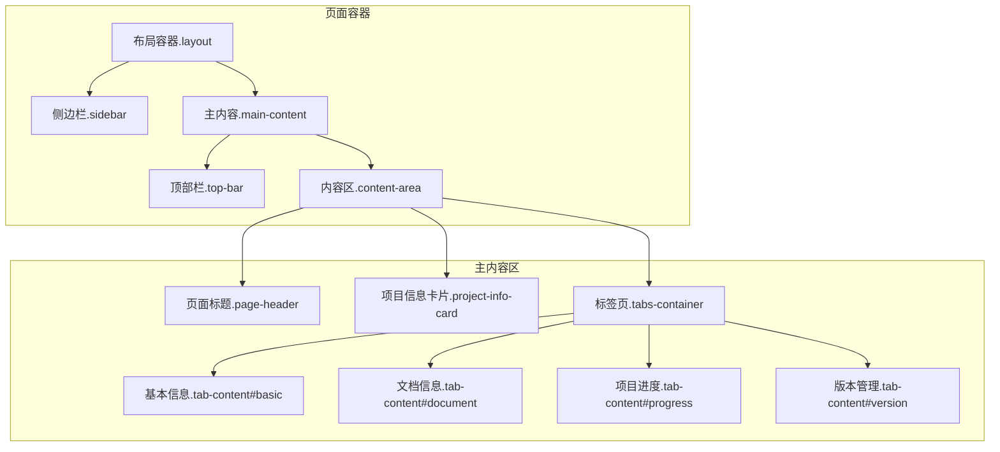
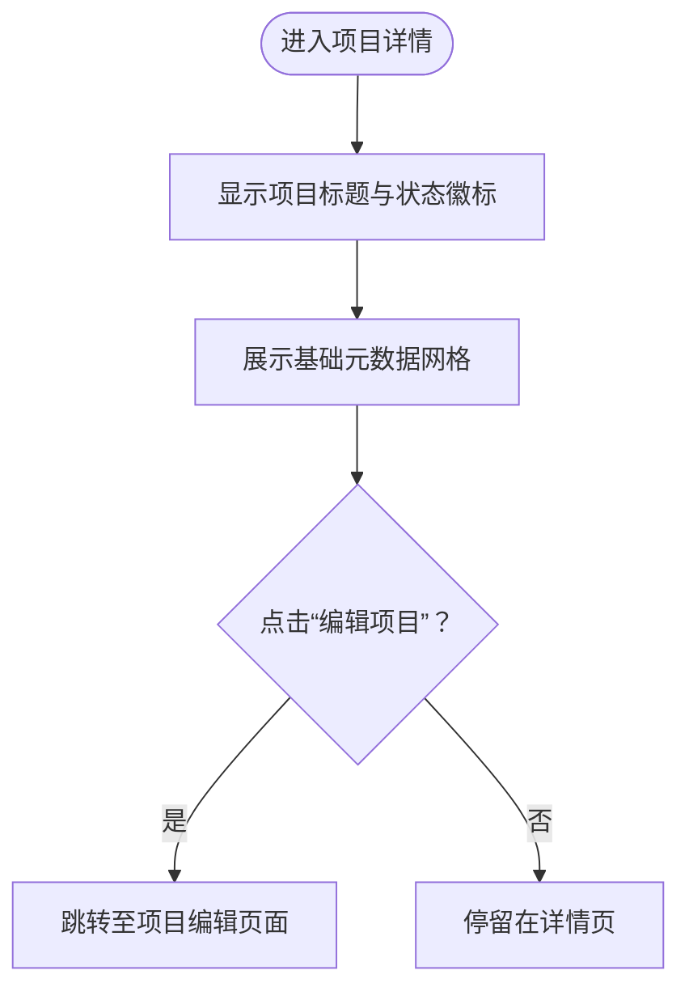
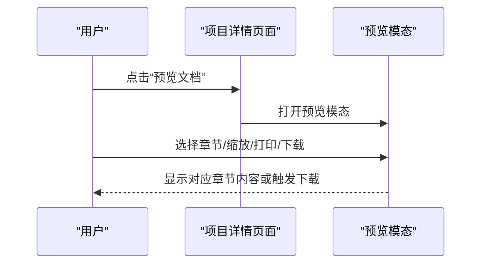
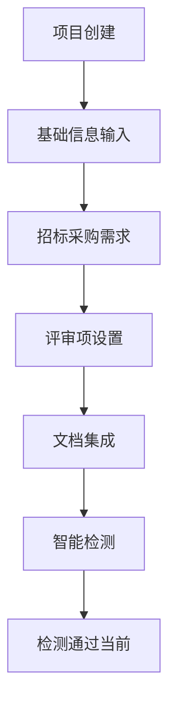
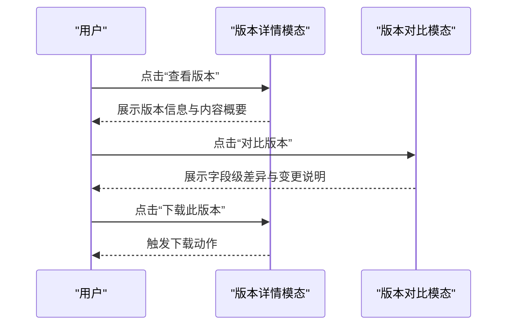
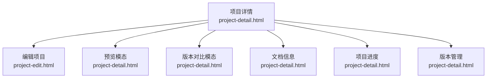

# 项目详情

<cite>
**本文引用的文件**
- [project-detail.html](file://pages/project-detail.html)
- [project-list.html](file://pages/project-list.html)
- [project-edit.html](file://pages/project-edit.html)
- [project-create.html](file://pages/project-create.html)
- [project-init.html](file://pages/project-init.html)
- [project-integration.html](file://pages/project-integration.html)
- [project-requirement.html](file://pages/project-requirement.html)
- [project-review.html](file://pages/project-review.html)
- [business-requirement-create.html](file://pages/business-requirement-create.html)
- [business-requirement-edit.html](file://pages/business-requirement-edit.html)
- [business-requirement-generate.html](file://pages/business-requirement-generate.html)
- [business-requirement-review.html](file://pages/business-requirement-review.html)
- [template-detail.html](file://pages/template-detail.html)
</cite>

## 目录
1. [简介](#简介)
2. [项目结构](#项目结构)
3. [核心组件](#核心组件)
4. [架构总览](#架构总览)
5. [详细组件分析](#详细组件分析)
6. [依赖关系分析](#依赖关系分析)
7. [性能考虑](#性能考虑)
8. [故障排查指南](#故障排查指南)
9. [结论](#结论)
10. [附录](#附录)

## 简介
本文件面向“项目详情”页面，系统化梳理其信息展示与交互能力，覆盖以下方面：
- 项目基本信息的完整展示与编辑入口
- 项目进度的实时跟踪与可视化时间线
- 历史记录与版本管理的查看、对比与下载
- 相关附件的预览、导出与下载
- 页面布局与信息层级设计，帮助用户快速定位关键信息
- 与业务流程页面的衔接关系（如业务需求、模板、评审等）

## 项目结构
项目详情页面采用单页应用风格，包含侧边导航、顶部面包屑与用户信息、主内容区三大区域。页面内通过标签页实现“基本信息”“文档信息”“项目进度”“版本管理”四个信息域的切换。

图表来源
- [project-detail.html:879-1214](file://pages/project-detail.html#L879-L1214)

章节来源
- [project-detail.html:879-1214](file://pages/project-detail.html#L879-L1214)

## 核心组件
- 项目信息卡片：集中展示项目标题、状态徽标、基础元数据（编号、类别、类型、预算、评审类型、创建时间、创建人、所属部门），并提供“编辑项目”入口。
- 标签页容器：通过“基本信息”“文档信息”“项目进度”“版本管理”四个标签页组织信息域。
- 文档卡片：展示当前文档与引入的初稿，支持预览、导出、下载等操作。
- 进度时间线：以时间轴形式呈现项目关键节点与状态变更，突出“已完成”“进行中”“待处理”等状态。
- 版本管理：列出版本历史，支持查看版本详情、对比版本差异、下载特定版本。
- 预览模态：提供文档分章节预览、缩放控制、打印与下载能力。
- 主题切换：支持深浅主题切换，提升阅读体验。

章节来源
- [project-detail.html:927-1211](file://pages/project-detail.html#L927-L1211)
- [project-detail.html:1108-1176](file://pages/project-detail.html#L1108-L1176)
- [project-detail.html:1178-1210](file://pages/project-detail.html#L1178-L1210)
- [project-detail.html:1373-1573](file://pages/project-detail.html#L1373-L1573)
- [project-detail.html:1708-1725](file://pages/project-detail.html#L1708-L1725)

## 架构总览
项目详情页面围绕“信息展示 + 交互操作 + 流程衔接”的目标构建，前端通过标签页与模态框承载不同维度的信息与操作，同时与业务流程页面形成串联，体现从“业务需求”到“项目创建/初始化/集成/评审”，再到“文档生成与发布”的闭环。

图表来源
- [business-requirement-create.html:1-200](file://pages/business-requirement-create.html#L1-L200)
- [business-requirement-edit.html:1-200](file://pages/business-requirement-edit.html#L1-L200)
- [business-requirement-generate.html:1-200](file://pages/business-requirement-generate.html#L1-L200)
- [business-requirement-review.html:1-200](file://pages/business-requirement-review.html#L1-L200)
- [project-create.html:1-200](file://pages/project-create.html#L1-L200)
- [project-init.html:1-200](file://pages/project-init.html#L1-L200)
- [project-requirement.html:1-200](file://pages/project-requirement.html#L1-L200)
- [project-integration.html:1-200](file://pages/project-integration.html#L1-L200)
- [project-review.html:1-200](file://pages/project-review.html#L1-L200)
- [project-detail.html:879-1214](file://pages/project-detail.html#L879-L1214)
- [project-edit.html:1-200](file://pages/project-edit.html#L1-L200)

## 详细组件分析

### 组件A：项目信息卡片与基本信息展示
- 功能要点
  - 展示项目标题与状态徽标（如“检测通过”）
  - 展示项目基础元数据（编号、类别、类型、预算、评审类型、创建时间、创建人、所属部门）
  - 提供“编辑项目”按钮，跳转至编辑页面
- 信息层级
  - 标题区：项目标题 + 状态徽标
  - 元数据区：网格布局展示8项基础信息
  - 操作区：编辑按钮
- 交互行为
  - 点击“编辑项目”触发页面跳转
  - 状态徽标根据状态动态变化（成功/警告/信息等）

图表来源
- [project-detail.html:927-977](file://pages/project-detail.html#L927-L977)
- [project-detail.html:1584-1586](file://pages/project-detail.html#L1584-L1586)

章节来源
- [project-detail.html:927-977](file://pages/project-detail.html#L927-L977)
- [project-detail.html:1584-1586](file://pages/project-detail.html#L1584-L1586)
- [project-edit.html:1-200](file://pages/project-edit.html#L1-L200)

### 组件B：文档信息与附件管理
- 功能要点
  - 当前文档卡片：显示文档标题、大小、页数、版本等信息，支持“预览”“导出”
  - 引入初稿卡片：显示来源、名称、引入时间，支持“预览初稿”“下载初稿”
  - 文档结构：以文本形式展示章节结构
- 交互行为
  - “预览”打开预览模态，支持分章节切换与缩放
  - “导出/下载”触发相应动作提示
  - 初稿卡片提供下载入口

图表来源
- [project-detail.html:1060-1106](file://pages/project-detail.html#L1060-L1106)
- [project-detail.html:1373-1573](file://pages/project-detail.html#L1373-L1573)
- [project-detail.html:1594-1647](file://pages/project-detail.html#L1594-L1647)
- [project-detail.html:1649-1655](file://pages/project-detail.html#L1649-L1655)

章节来源
- [project-detail.html:1060-1106](file://pages/project-detail.html#L1060-L1106)
- [project-detail.html:1373-1573](file://pages/project-detail.html#L1373-L1573)
- [project-detail.html:1594-1655](file://pages/project-detail.html#L1594-L1655)

### 组件C：项目进度与状态跟踪
- 功能要点
  - 时间线展示项目关键节点与状态变更
  - 支持“已完成”“进行中”“待处理”等状态标识
  - 每个节点包含标题、描述与时间戳
- 交互行为
  - 通过标签页“项目进度”查看
  - 可结合“文档信息”中的“检测通过”状态理解当前阶段

图表来源
- [project-detail.html:1108-1176](file://pages/project-detail.html#L1108-L1176)

章节来源
- [project-detail.html:1108-1176](file://pages/project-detail.html#L1108-L1176)

### 组件D：版本管理与对比
- 功能要点
  - 版本列表：展示当前版本与历史版本，标注创建时间与说明
  - 查看版本：弹出模态展示版本号、创建时间、作者、版本说明与内容概要
  - 对比版本：对比两个版本的关键字段差异，高亮新增/修改/删除项
  - 下载版本：支持下载特定版本文档
- 交互行为
  - “查看”打开版本详情模态
  - “对比”打开对比模态
  - “下载此版本”触发下载动作

图表来源
- [project-detail.html:1178-1210](file://pages/project-detail.html#L1178-L1210)
- [project-detail.html:1216-1272](file://pages/project-detail.html#L1216-L1272)
- [project-detail.html:1274-1371](file://pages/project-detail.html#L1274-L1371)
- [project-detail.html:1657-1694](file://pages/project-detail.html#L1657-L1694)
- [project-detail.html:1696-1706](file://pages/project-detail.html#L1696-L1706)

章节来源
- [project-detail.html:1178-1210](file://pages/project-detail.html#L1178-L1210)
- [project-detail.html:1216-1272](file://pages/project-detail.html#L1216-L1272)
- [project-detail.html:1274-1371](file://pages/project-detail.html#L1274-L1371)
- [project-detail.html:1657-1706](file://pages/project-detail.html#L1657-L1706)

### 组件E：预览与下载（文档与版本）
- 功能要点
  - 预览模态：支持章节切换、缩放控制、打印、下载
  - 文档下载：支持导出为Word格式
  - 版本下载：按版本号下载对应文档
- 交互行为
  - 通过“预览文档”“导出文档”“下载此版本”等按钮触发
  - 模态支持Esc键关闭

章节来源
- [project-detail.html:1373-1573](file://pages/project-detail.html#L1373-L1573)
- [project-detail.html:1594-1647](file://pages/project-detail.html#L1594-L1647)
- [project-detail.html:1649-1694](file://pages/project-detail.html#L1649-L1694)

## 依赖关系分析
- 页面间依赖
  - 项目详情页面作为枢纽，承接业务需求与项目流程的成果展示
  - 编辑页面用于修改项目信息
- 组件间耦合
  - 标签页与各信息域强关联，切换逻辑统一由脚本控制
  - 预览与版本对比依赖模态组件，事件绑定集中在同一脚本块
- 外部依赖
  - 无外部JS库，纯HTML/CSS/JS实现，便于维护与部署

图表来源
- [project-detail.html:879-1214](file://pages/project-detail.html#L879-L1214)
- [project-edit.html:1-200](file://pages/project-edit.html#L1-L200)

章节来源
- [project-detail.html:879-1214](file://pages/project-detail.html#L879-L1214)
- [project-edit.html:1-200](file://pages/project-edit.html#L1-L200)

## 性能考虑
- 模态加载策略：仅在需要时打开预览与对比模态，避免一次性渲染大量DOM
- 缩放与分页：预览采用分页与缩放控制，降低单页渲染压力
- 事件委托：模态遮罩点击与Esc键关闭，减少重复监听
- 样式复用：统一的主题变量与样式类，便于维护与扩展

## 故障排查指南
- 预览无法打开
  - 检查“预览文档”按钮绑定与模态开关逻辑
  - 确认模态遮罩点击事件与Esc键事件未被覆盖
- 版本对比异常
  - 确认版本数据对象存在且字段完整
  - 检查对比面板的字段映射与高亮类名
- 下载失败
  - 确认下载函数触发路径与提示文案
  - 如为占位逻辑，需补充真实下载实现
- 主题切换无效
  - 检查CSS变量赋值与样式更新逻辑

章节来源
- [project-detail.html:1594-1647](file://pages/project-detail.html#L1594-L1647)
- [project-detail.html:1657-1706](file://pages/project-detail.html#L1657-L1706)
- [project-detail.html:1708-1725](file://pages/project-detail.html#L1708-L1725)

## 结论
项目详情页面以清晰的信息层级与直观的交互设计，实现了项目信息的全貌展示与关键流程的可视化追踪。通过标签页与模态的组合，兼顾了信息密度与操作便捷性；与业务流程页面的串联，使项目从需求到发布的全过程在页面间自然流转。建议后续在版本对比与下载功能上补充真实实现，以进一步完善闭环体验。

## 附录
- 项目状态徽标颜色与含义
  - 成功：表示检测通过等已完成状态
  - 警告：表示进行中或待处理状态
  - 信息：表示默认或提示状态
- 布局与交互建议
  - 在移动端优化标签页滚动与模态适配
  - 增加搜索与筛选功能以提升大列表场景下的可用性