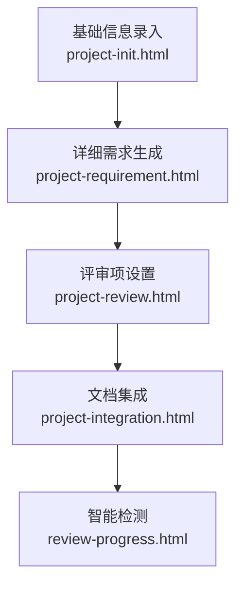
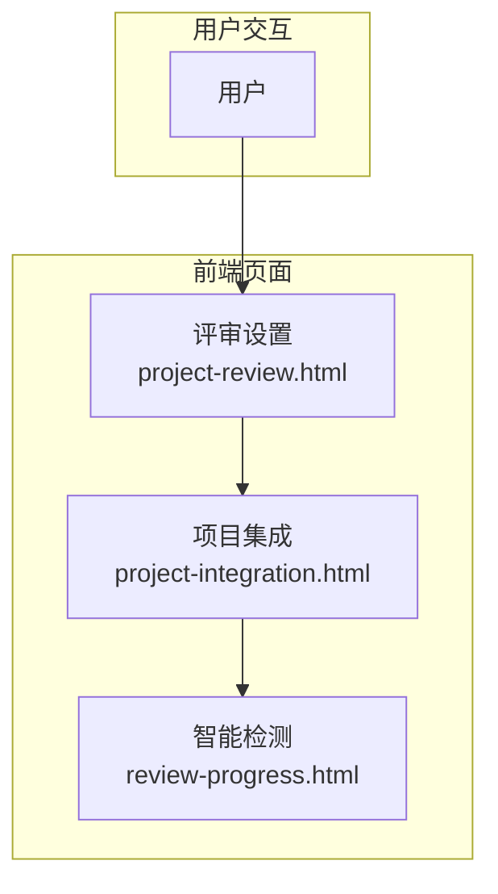
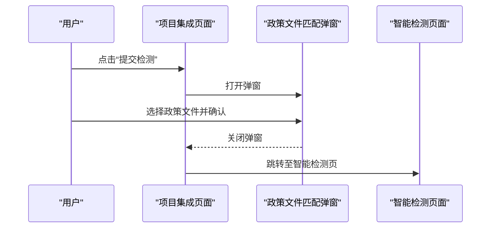
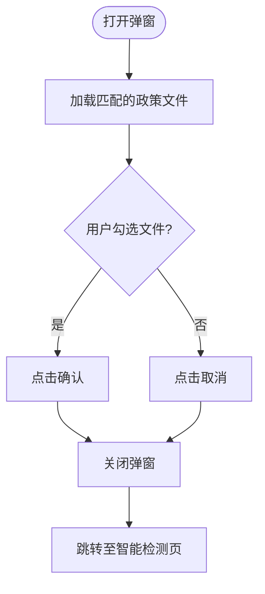
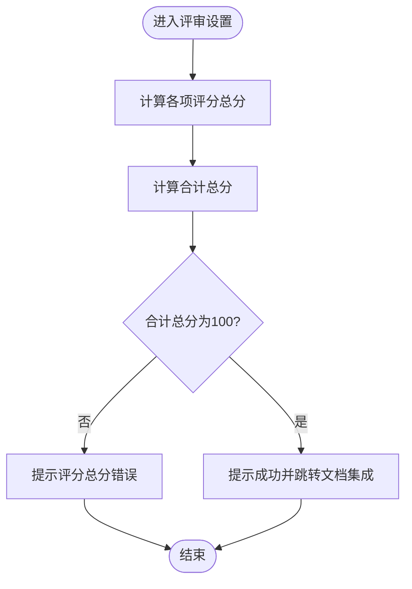
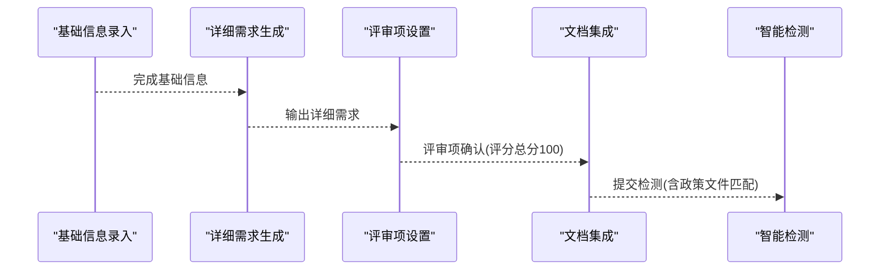
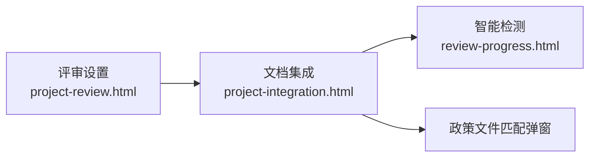

# 项目集成

<cite>
**本文引用的文件**
- [project-integration.html](file://pages/project-integration.html)
- [project-review.html](file://pages/project-review.html)
- [review-progress.html](file://pages/review-progress.html)
- [project-requirement.html](file://pages/project-requirement.html)
- [project-init.html](file://pages/project-init.html)
- [business-requirement-create.html](file://pages/business-requirement-create.html)
</cite>

## 目录
1. [简介](#简介)
2. [项目结构](#项目结构)
3. [核心组件](#核心组件)
4. [架构总览](#架构总览)
5. [详细组件分析](#详细组件分析)
6. [依赖关系分析](#依赖关系分析)
7. [性能考量](#性能考量)
8. [故障排查指南](#故障排查指南)
9. [结论](#结论)
10. [附录](#附录)

## 简介
本文件面向“项目集成”阶段，系统化梳理从基础信息、详细需求、评审项设置到文档集成与智能检测的完整流程。重点阐述：
- 各模块数据的整合与统一生成
- 文档确认、预览与导出
- 状态的最终确认与系统间协调
- 数据同步机制、一致性检查、版本控制与冲突解决策略
- 集成结果的验证流程（质量检查、合规性验证）与异常处理、质量保证措施

## 项目结构
项目采用前端单页应用风格，通过页面间的跳转串联“文件编制”流程的各个阶段。项目集成页面位于 pages 目录下，作为流程的第四个关键节点，承接前序阶段的产出并进入最终确认与检测环节。

图表来源
- [project-init.html:1-200](file://pages/project-init.html#L1-L200)
- [project-requirement.html:1-200](file://pages/project-requirement.html#L1-L200)
- [project-review.html:1430-1441](file://pages/project-review.html#L1430-L1441)
- [project-integration.html:827-850](file://pages/project-integration.html#L827-L850)
- [review-progress.html:1-200](file://pages/review-progress.html#L1-L200)

章节来源
- [project-integration.html:827-850](file://pages/project-integration.html#L827-L850)
- [project-review.html:1430-1441](file://pages/project-review.html#L1430-L1441)

## 核心组件
- 流程进度指示器：展示“基础信息录入—详细需求生成—评审项设置—文档集成—智能检测”的五步流程，当前处于“文档集成”阶段。
- 步骤导航：左侧步骤导航与顶部面包屑联动，支持快速跳转至各阶段页面。
- 文档集成区：包含“生成状态”“文档信息”“文档确认”三大板块，提供目录导航、缩放、打印、下载等工具。
- 行为控制：保存草稿、提交检测（触发政策文件匹配弹窗）、返回上一步等交互按钮。
- 政策文件匹配弹窗：用于在提交检测前选择适用的政策文件，作为合规性验证的基础。

章节来源
- [project-integration.html:827-1070](file://pages/project-integration.html#L827-L1070)
- [project-integration.html:1077-1149](file://pages/project-integration.html#L1077-L1149)

## 架构总览
项目集成阶段的前端架构以页面为边界，通过浏览器端 JavaScript 实现交互逻辑；前后端数据交互在本仓库中以静态页面形式呈现，实际系统中应由后端接口提供数据持久化与状态流转。

图表来源
- [project-integration.html:1061-1067](file://pages/project-integration.html#L1061-L1067)
- [project-review.html:1430-1441](file://pages/project-review.html#L1430-L1441)
- [review-progress.html:1-200](file://pages/review-progress.html#L1-L200)

## 详细组件分析

### 组件一：文档集成界面
- 功能职责
  - 展示“文档集成完成”的状态与进度条
  - 展示文档元信息（名称、大小、页数、生成时间）
  - 提供目录导航、缩放、打印、下载等预览工具
  - 提供“保存草稿”“提交检测”等操作入口
- 交互要点
  - 目录面板可展开/收起，点击目录项平滑滚动至对应章节
  - 缩放控制通过 transform 实现，实时更新百分比显示
  - 提交检测时弹出政策文件匹配弹窗，确认后跳转至智能检测页

图表来源
- [project-integration.html:1205-1224](file://pages/project-integration.html#L1205-L1224)

章节来源
- [project-integration.html:885-1070](file://pages/project-integration.html#L885-L1070)

### 组件二：政策文件匹配弹窗
- 功能职责
  - 根据项目类别自动匹配政策文件
  - 支持勾选“匹配的政策文件”和“本单位政策文件”
  - 确认后关闭弹窗并提示跳转至智能检测
- 设计要点
  - 使用模态框承载，避免干扰主流程
  - 采用复选框与分组布局，便于用户快速筛选

图表来源
- [project-integration.html:1077-1149](file://pages/project-integration.html#L1077-L1149)
- [project-integration.html:1217-1224](file://pages/project-integration.html#L1217-L1224)

章节来源
- [project-integration.html:1077-1149](file://pages/project-integration.html#L1077-L1149)

### 组件三：评审项确认与流程衔接
- 功能职责
  - 在评审设置页完成评审项配置后，校验评分总分是否为100分
  - 成功后自动跳转至“文档集成”页面
- 设计要点
  - 评分总分校验失败时给出明确提示，防止错误状态进入下一阶段

图表来源
- [project-review.html:1430-1441](file://pages/project-review.html#L1430-L1441)

章节来源
- [project-review.html:1430-1441](file://pages/project-review.html#L1430-L1441)

### 组件四：流程与数据流
- 前置阶段
  - 基础信息录入：收集项目基础信息
  - 详细需求生成：基于业务需求生成详细需求
  - 评审项设置：设置评审权重与评分标准
- 集成阶段
  - 文档集成：整合各模块数据，统一生成文档
  - 智能检测：对生成文档进行合规性与质量检查
- 数据一致性与版本控制
  - 前置阶段的数据校验与确认，确保进入集成阶段的数据有效
  - 集成阶段的“保存草稿”与“提交检测”形成版本化状态推进

图表来源
- [project-init.html:1-200](file://pages/project-init.html#L1-L200)
- [project-requirement.html:1-200](file://pages/project-requirement.html#L1-L200)
- [project-review.html:1430-1441](file://pages/project-review.html#L1430-L1441)
- [project-integration.html:1061-1067](file://pages/project-integration.html#L1061-L1067)
- [review-progress.html:1-200](file://pages/review-progress.html#L1-L200)

章节来源
- [project-integration.html:827-850](file://pages/project-integration.html#L827-L850)
- [project-review.html:1430-1441](file://pages/project-review.html#L1430-L1441)

## 依赖关系分析
- 页面间依赖
  - 评审设置页完成后跳转至文档集成页
  - 文档集成页提交检测后跳转至智能检测页
- 组件内依赖
  - 文档集成页依赖目录导航、缩放、打印、下载等工具函数
  - 政策文件匹配弹窗依赖提交检测流程，作为合规性前置校验

图表来源
- [project-review.html:1430-1441](file://pages/project-review.html#L1430-L1441)
- [project-integration.html:1061-1067](file://pages/project-integration.html#L1061-L1067)
- [review-progress.html:1-200](file://pages/review-progress.html#L1-L200)

章节来源
- [project-integration.html:1061-1067](file://pages/project-integration.html#L1061-L1067)
- [project-review.html:1430-1441](file://pages/project-review.html#L1430-L1441)

## 性能考量
- 前端渲染与交互
  - 目录导航与缩放通过 DOM 操作与 CSS transform 实现，避免重排重绘开销
  - 弹窗采用一次性渲染与显示/隐藏控制，减少重复创建成本
- 文档预览
  - 预览区域采用固定尺寸容器与内嵌样式，降低复杂布局计算
  - 分页符使用视觉样式模拟，避免真实分页带来的渲染压力
- 建议
  - 对于大型文档，建议在后端进行分段渲染或懒加载
  - 图片与多媒体资源按需加载，减少首屏压力

## 故障排查指南
- 评审项评分总分不为100
  - 现象：评审设置页无法确认并跳转
  - 处理：检查资信、技术、商务三项评分总和，确保合计为100
- 提交检测无响应
  - 现象：点击“提交检测”后无反应
  - 处理：确认已正确勾选政策文件；若弹窗未出现，检查浏览器控制台是否存在脚本错误
- 文档预览异常
  - 现象：目录跳转无效或缩放异常
  - 处理：刷新页面；检查元素 ID 是否与目录项一致；确认 CSS 样式未被覆盖
- 导航与跳转问题
  - 现象：点击步骤导航或面包屑无法跳转
  - 处理：确认页面路径正确；检查浏览器安全策略是否阻止本地文件访问

章节来源
- [project-review.html:1430-1441](file://pages/project-review.html#L1430-L1441)
- [project-integration.html:1154-1224](file://pages/project-integration.html#L1154-L1224)

## 结论
项目集成阶段通过“文档集成”页面完成各模块数据的统一整合与最终确认，并以“政策文件匹配弹窗”作为合规性前置校验，随后进入“智能检测”阶段进行质量与合规性验证。该流程设计清晰、交互直观，配合评审项评分总分校验与提交检测的版本化推进，有助于保障集成结果的质量与一致性。

## 附录
- 相关页面
  - 基础信息录入：[project-init.html:1-200](file://pages/project-init.html#L1-L200)
  - 详细需求生成：[project-requirement.html:1-200](file://pages/project-requirement.html#L1-L200)
  - 评审项设置：[project-review.html:1430-1441](file://pages/project-review.html#L1430-L1441)
  - 文档集成：[project-integration.html:827-1070](file://pages/project-integration.html#L827-L1070)
  - 智能检测：[review-progress.html:1-200](file://pages/review-progress.html#L1-L200)