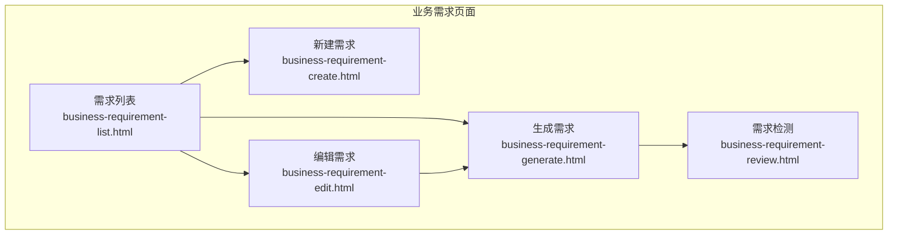
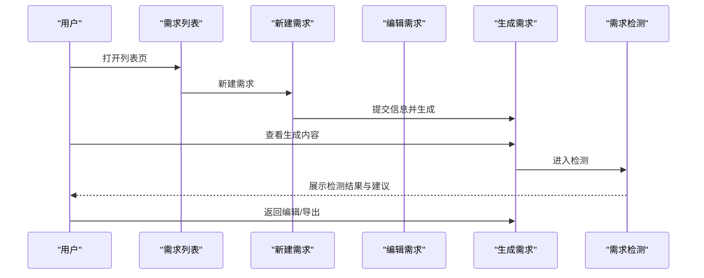
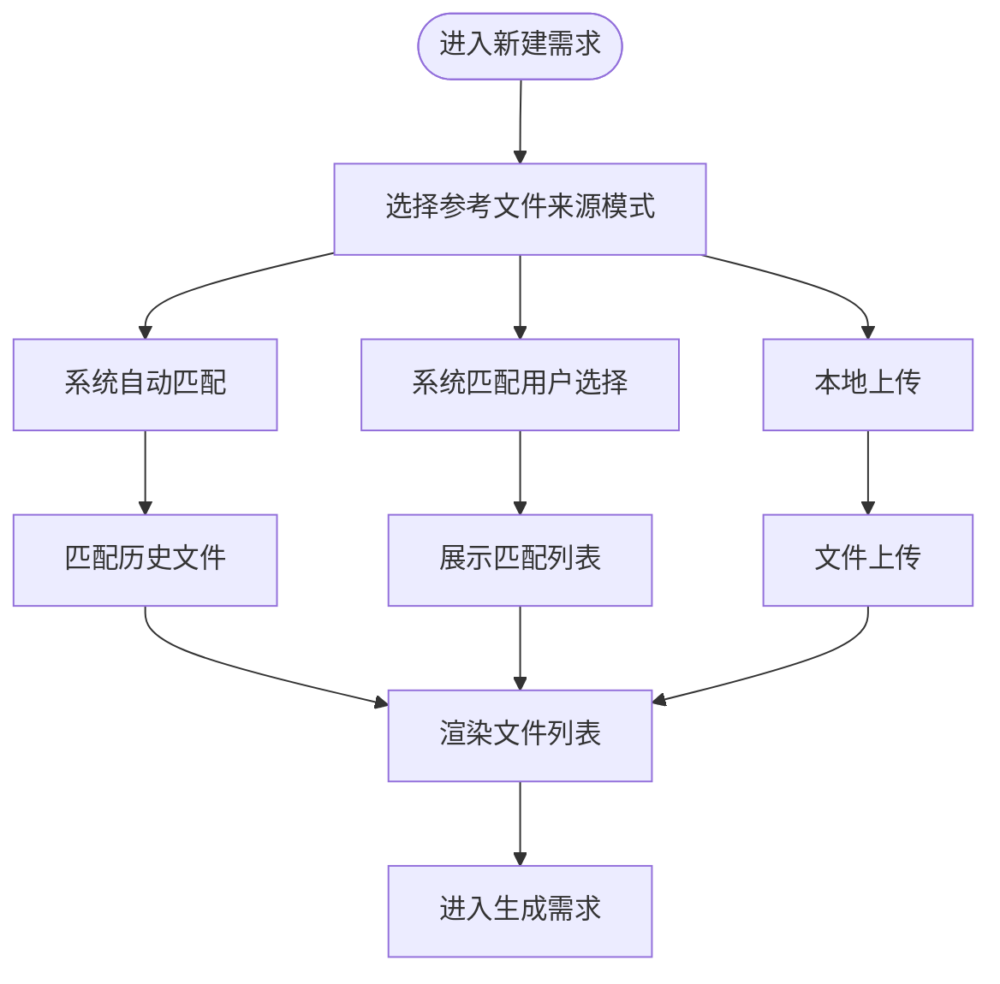
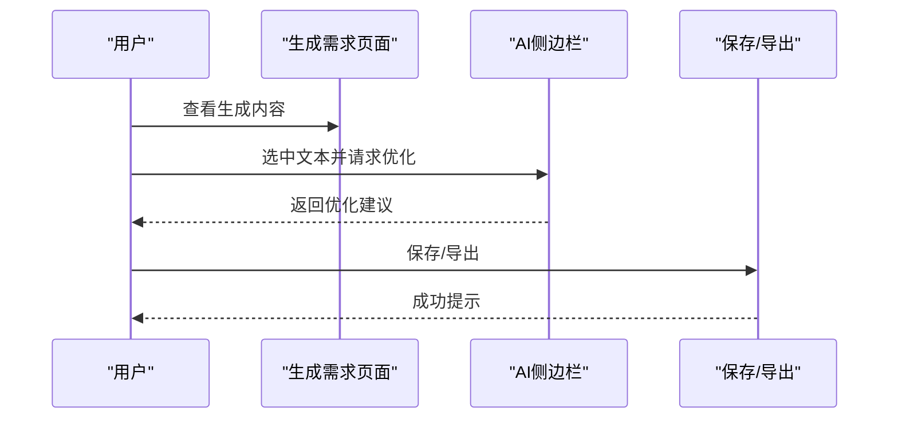
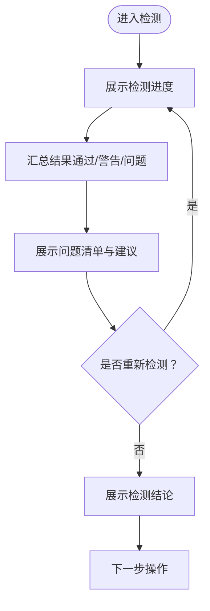
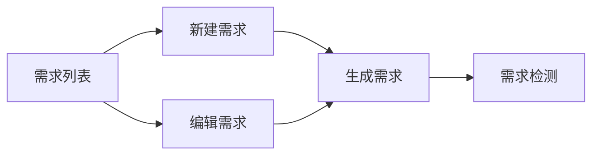

# 项目需求

<cite>
**本文引用的文件**
- [business-requirement-create.html](file://pages/business-requirement-create.html)
- [business-requirement-edit.html](file://pages/business-requirement-edit.html)
- [business-requirement-generate.html](file://pages/business-requirement-generate.html)
- [business-requirement-list.html](file://pages/business-requirement-list.html)
- [business-requirement-review.html](file://pages/business-requirement-review.html)
- [2026-04-10-招标文件AI编制会议纪要.md](file://2026-04-10-招标文件AI编制会议纪要.md)
</cite>

## 目录
1. [简介](#简介)
2. [项目结构](#项目结构)
3. [核心组件](#核心组件)
4. [架构总览](#架构总览)
5. [详细组件分析](#详细组件分析)
6. [依赖关系分析](#依赖关系分析)
7. [性能考虑](#性能考虑)
8. [故障排查指南](#故障排查指南)
9. [结论](#结论)
10. [附录](#附录)

## 简介
本文件面向“项目需求”页面，系统性梳理业务需求配置的全流程能力，包括需求信息录入、模板智能匹配、AI生成内容编辑以及需求文档的版本管理与导出。文档还阐述需求与模板的关联机制（模板选择算法、内容适配规则、个性化定制）、AI辅助需求生成的技术实现（上下文理解、历史匹配、智能优化建议），并提供最佳实践与常见问题解决方案，帮助使用者高效完成业务需求的编制与审核。

## 项目结构
本项目采用前后端分离的静态页面架构，业务需求相关页面位于 pages 目录，包含需求创建、编辑、生成、列表与检测等页面。整体布局采用侧边导航 + 主内容区的结构，页面风格统一，支持明暗主题切换。

图表来源
- [business-requirement-list.html:509-764](file://pages/business-requirement-list.html#L509-L764)
- [business-requirement-create.html:692-737](file://pages/business-requirement-create.html#L692-L737)
- [business-requirement-edit.html:611-656](file://pages/business-requirement-edit.html#L611-L656)
- [business-requirement-generate.html:697-743](file://pages/business-requirement-generate.html#L697-L743)
- [business-requirement-review.html:529-575](file://pages/business-requirement-review.html#L529-L575)

章节来源
- [business-requirement-list.html:509-764](file://pages/business-requirement-list.html#L509-L764)
- [business-requirement-create.html:692-737](file://pages/business-requirement-create.html#L692-L737)
- [business-requirement-edit.html:611-656](file://pages/business-requirement-edit.html#L611-L656)
- [business-requirement-generate.html:697-743](file://pages/business-requirement-generate.html#L697-L743)
- [business-requirement-review.html:529-575](file://pages/business-requirement-review.html#L529-L575)

## 核心组件
- 需求信息录入组件：负责收集项目基本信息（名称、类型、预算、描述等），并提供表单校验与提示。
- 模板智能匹配组件：支持三种参考文件来源模式（系统自动匹配、系统匹配用户选择、本地上传），并提供文件列表与预览能力。
- AI生成与编辑组件：提供生成进度展示、内容区域、AI侧边栏（聊天、选项、文本选择优化）、编辑与导出按钮。
- 智能检测组件：展示检测进度、结果汇总、问题清单与建议、检测结论，并支持重新检测。
- 版本管理与导出：支持保存、编辑、导出等操作，便于后续版本迭代与归档。

章节来源
- [business-requirement-create.html:740-800](file://pages/business-requirement-create.html#L740-L800)
- [business-requirement-edit.html:659-780](file://pages/business-requirement-edit.html#L659-L780)
- [business-requirement-generate.html:756-782](file://pages/business-requirement-generate.html#L756-L782)
- [business-requirement-review.html:577-707](file://pages/business-requirement-review.html#L577-L707)

## 架构总览
系统围绕“需求信息录入 → 模板智能匹配 → AI生成 → 内容编辑 → 智能检测 → 导出/归档”的主流程组织。页面间通过导航与按钮跳转串联，形成闭环的工作流。

图表来源
- [business-requirement-list.html:588-627](file://pages/business-requirement-list.html#L588-L627)
- [business-requirement-create.html:740-741](file://pages/business-requirement-create.html#L740-L741)
- [business-requirement-generate.html:756-782](file://pages/business-requirement-generate.html#L756-L782)
- [business-requirement-review.html:577-594](file://pages/business-requirement-review.html#L577-L594)

## 详细组件分析

### 组件一：需求信息录入与模板匹配
- 功能要点
  - 收集项目基本信息（名称、类型、预算、描述等），并提供必填校验与输入提示。
  - 参考文件来源模式：系统自动匹配、系统匹配用户选择、本地上传。
  - 用户可对匹配到的历史文件进行勾选或上传本地文件作为参考。
- 关键交互
  - 单选模式切换（自动/选择/上传）。
  - 文件列表展示与预览按钮。
  - 上传区域支持多文件、限制文件类型与大小。
- 数据流
  - 表单字段 → 校验规则 → 生成请求参数 → 模板匹配算法 → 返回匹配结果 → 渲染文件列表。

图表来源
- [business-requirement-create.html:740-800](file://pages/business-requirement-create.html#L740-L800)
- [business-requirement-edit.html:717-780](file://pages/business-requirement-edit.html#L717-L780)

章节来源
- [business-requirement-create.html:740-800](file://pages/business-requirement-create.html#L740-L800)
- [business-requirement-edit.html:717-780](file://pages/business-requirement-edit.html#L717-L780)

### 组件二：AI生成与内容编辑
- 功能要点
  - 展示生成进度（百分比与状态）。
  - 内容区域展示项目基本信息与参考文件。
  - AI侧边栏提供聊天、选项按钮、文本选择优化能力。
  - 支持保存、编辑、导出等操作。
- 关键交互
  - AI侧边栏折叠/展开。
  - 文本选择后触发AI优化建议。
  - 保存/导出按钮触发相应动作。
- 数据流
  - 生成请求 → AI模型处理 → 返回内容片段 → 合并到内容区域 → 用户编辑 → 保存/导出。

图表来源
- [business-requirement-generate.html:345-477](file://pages/business-requirement-generate.html#L345-L477)
- [business-requirement-generate.html:555-572](file://pages/business-requirement-generate.html#L555-L572)

章节来源
- [business-requirement-generate.html:345-477](file://pages/business-requirement-generate.html#L345-L477)
- [business-requirement-generate.html:555-572](file://pages/business-requirement-generate.html#L555-L572)

### 组件三：智能检测与问题反馈
- 功能要点
  - 展示检测进度条与完成状态。
  - 结果汇总（通过/警告/问题）统计。
  - 问题清单与建议，支持重新检测。
  - 检测结论与下一步操作引导。
- 关键交互
  - 重新检测按钮触发检测流程。
  - 上一步/完成检测按钮控制流程推进。
- 数据流
  - 检测请求 → 大模型审查 → 返回问题清单 → 渲染汇总与详情 → 用户确认/修改。

图表来源
- [business-requirement-review.html:577-594](file://pages/business-requirement-review.html#L577-L594)
- [business-requirement-review.html:596-614](file://pages/business-requirement-review.html#L596-L614)
- [business-requirement-review.html:616-693](file://pages/business-requirement-review.html#L616-L693)
- [business-requirement-review.html:695-707](file://pages/business-requirement-review.html#L695-L707)

章节来源
- [business-requirement-review.html:577-594](file://pages/business-requirement-review.html#L577-L594)
- [business-requirement-review.html:596-614](file://pages/business-requirement-review.html#L596-L614)
- [business-requirement-review.html:616-693](file://pages/business-requirement-review.html#L616-L693)
- [business-requirement-review.html:695-707](file://pages/business-requirement-review.html#L695-L707)

### 组件四：版本管理与导出
- 功能要点
  - 内容区域支持编辑与导出。
  - 保存用于版本迭代，导出用于归档与提交。
- 关键交互
  - 编辑按钮进入可编辑态。
  - 导出按钮触发下载或输出。
- 数据流
  - 编辑态内容 → 保存（生成新版本）→ 导出（标准化输出）。

章节来源
- [business-requirement-generate.html:758-782](file://pages/business-requirement-generate.html#L758-L782)

## 依赖关系分析
- 页面耦合
  - 列表页与创建/编辑/生成/检测页之间通过导航链接耦合。
  - 生成页与检测页之间存在流程依赖。
- 组件内聚
  - 模板匹配、AI生成、检测、导出等模块在各自页面内相对独立，职责清晰。
- 外部依赖
  - AI模型与知识库（会议纪要指出知识库尚未建成，需后续提供标准接口对接）。
  - 检测能力复用现有银行级智能审查能力。

图表来源
- [business-requirement-list.html:588-627](file://pages/business-requirement-list.html#L588-L627)
- [business-requirement-create.html:740-741](file://pages/business-requirement-create.html#L740-L741)
- [business-requirement-edit.html:659-660](file://pages/business-requirement-edit.html#L659-L660)
- [business-requirement-generate.html:756-757](file://pages/business-requirement-generate.html#L756-L757)
- [business-requirement-review.html:577-578](file://pages/business-requirement-review.html#L577-L578)

章节来源
- [business-requirement-list.html:588-627](file://pages/business-requirement-list.html#L588-L627)
- [business-requirement-create.html:740-741](file://pages/business-requirement-create.html#L740-L741)
- [business-requirement-edit.html:659-660](file://pages/business-requirement-edit.html#L659-L660)
- [business-requirement-generate.html:756-757](file://pages/business-requirement-generate.html#L756-L757)
- [business-requirement-review.html:577-578](file://pages/business-requirement-review.html#L577-L578)

## 性能考虑
- 页面渲染与交互
  - 使用固定布局与卡片容器，减少重排与重绘。
  - 主题切换通过CSS变量实现，避免频繁DOM变更。
- 模板匹配与上传
  - 文件上传采用异步处理与进度提示，避免阻塞主线程。
- AI交互
  - 侧边栏折叠/展开使用过渡动画，保证流畅体验。
- 检测流程
  - 进度条与状态提示增强用户感知，避免长时间等待的不确定性。

## 故障排查指南
- 表单校验失败
  - 检查必填字段是否填写完整，数值型字段是否符合范围与精度要求。
- 模板匹配无结果
  - 确认项目类型、预算等关键信息是否准确；尝试切换匹配模式或上传本地文件。
- AI侧边栏无响应
  - 检查浏览器控制台是否有错误；确认网络连接正常；尝试刷新页面。
- 检测结果异常
  - 使用“重新检测”按钮触发新一轮检测；核对输入信息是否完整。
- 导出失败
  - 确认已保存最新版本；检查浏览器下载权限；尝试更换浏览器或网络环境。

章节来源
- [business-requirement-create.html:740-800](file://pages/business-requirement-create.html#L740-L800)
- [business-requirement-edit.html:717-780](file://pages/business-requirement-edit.html#L717-L780)
- [business-requirement-generate.html:345-477](file://pages/business-requirement-generate.html#L345-L477)
- [business-requirement-review.html:732-738](file://pages/business-requirement-review.html#L732-L738)

## 结论
本项目需求页面围绕“信息录入—模板匹配—AI生成—内容编辑—智能检测—导出归档”的完整闭环构建，界面友好、流程清晰。结合会议纪要中的技术规划，系统将在后续阶段完善知识库与AI模型对接、检测能力复用与评审项管理，持续提升智能化水平与合规性保障。

## 附录
- 最佳实践
  - 在录入阶段尽量提供完整、准确的项目信息，有助于提高模板匹配与AI生成质量。
  - 优先使用系统匹配的参考文件，必要时补充本地上传文件作为辅助。
  - 生成后及时进行内容编辑与AI优化，确保表述清晰、条款完整。
  - 在提交前务必完成检测，按建议逐项整改，降低后续风险。
- 常见问题
  - 预算信息不完整：建议补充预算分解与计算依据。
  - 工期要求不明确：明确开工/完工日期或起始点。
  - 质量与安全标准描述不足：列出具体适用的标准与规范名称。
  - 检测结论与建议：按问题级别逐项落实修改。

章节来源
- [business-requirement-review.html:616-693](file://pages/business-requirement-review.html#L616-L693)
- [2026-04-10-招标文件AI编制会议纪要.md:13-21](file://2026-04-10-招标文件AI编制会议纪要.md#L13-L21)