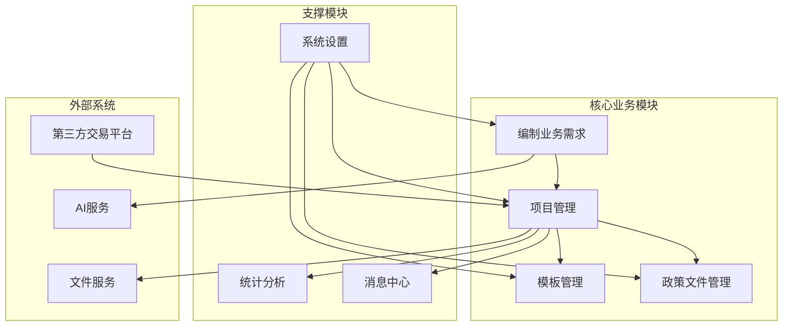
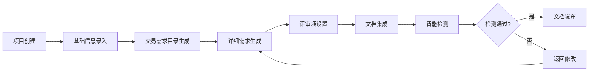
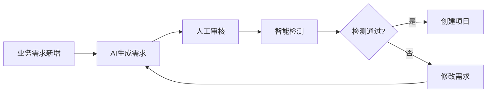
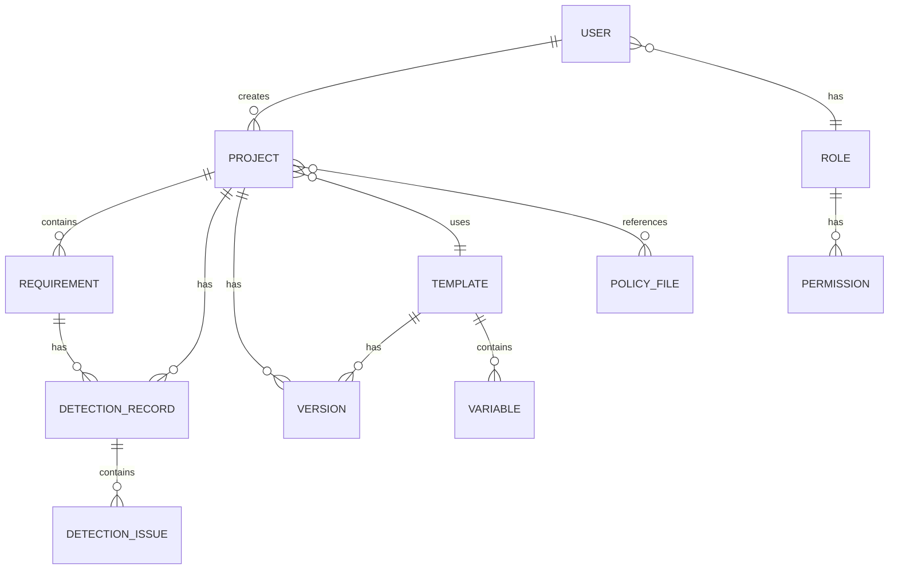
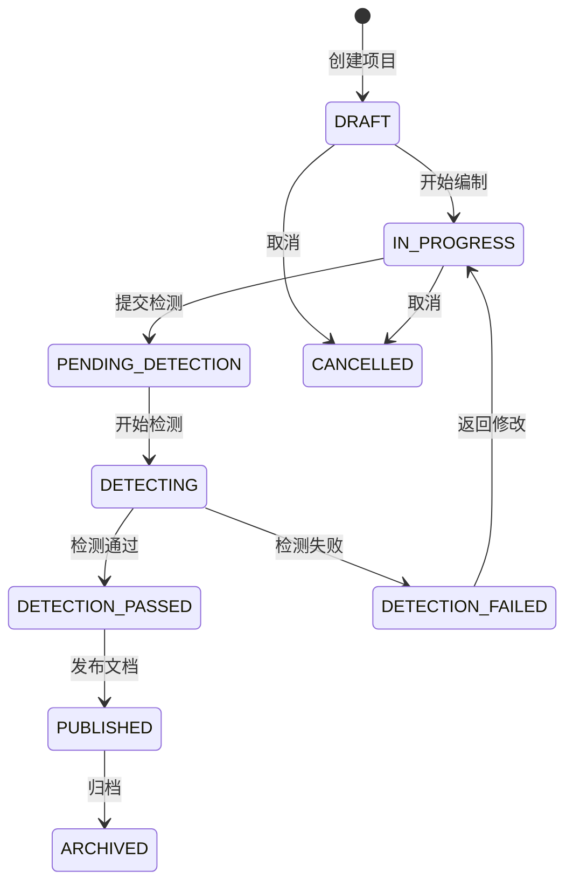
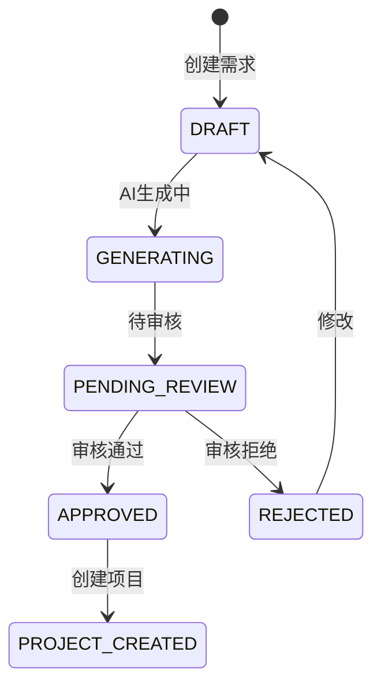

# 招标文件AI编制系统 - 原型设计索引

> 本文档基于需求文档和原型设计文件梳理业务关系，建立原型设计索引。

## 一、系统模块概览



## 二、页面索引表

### 2.1 登录模块

| 序号 | 页面标题 | 文件名 | 页面业务功能 | 业务关联关系 | 涉及系统 |
|------|----------|--------|--------------|--------------|----------|
| 1 | 登录页 | login.html | 用户身份认证登录，支持账号密码登录，记住密码功能 | → 编制业务需求列表 / 项目列表 | support模块(认证服务) |

### 2.2 编制业务需求模块

| 序号 | 页面标题 | 文件名 | 页面业务功能 | 业务关联关系 | 涉及系统 |
|------|----------|--------|--------------|--------------|----------|
| 2 | 业务需求列表 | business-requirement-list.html | 展示业务需求列表，支持搜索、筛选、新建、编辑、删除操作 | → 业务需求新增/编辑 → 项目创建 | core模块 |
| 3 | 业务需求新增 | business-requirement-create.html | 新建业务需求，录入需求基本信息，支持AI辅助生成 | → 业务需求生成 | core模块、ai模块 |
| 4 | 业务需求编辑 | business-requirement-edit.html | 编辑已有业务需求，修改需求内容 | → 业务需求生成 | core模块 |
| 5 | 业务需求生成 | business-requirement-generate.html | AI智能生成业务需求内容，支持SSE流式响应，人工审核确认 | → 业务需求智能检测 | core模块、ai模块 |
| 6 | 业务需求智能检测 | business-requirement-review.html | 对业务需求进行智能检测（公平竞争、合规性、错别字、敏感词） | → 项目创建 | core模块、ai模块 |

### 2.3 项目管理模块

| 序号 | 页面标题 | 文件名 | 页面业务功能 | 业务关联关系 | 涉及系统 |
|------|----------|--------|--------------|--------------|----------|
| 7 | 项目列表 | project-list.html | 展示项目列表，支持搜索、筛选、状态查看、操作入口 | → 项目创建 → 项目详情 → 项目编辑 | core模块 |
| 8 | 项目创建 | project-create.html | 创建新项目，支持两种模式：基本信息录入 / 招标需求导入 | → 基础信息录入 | core模块 |
| 9 | 项目编辑 | project-edit.html | 编辑项目基本信息 | → 项目详情 | core模块 |
| 10 | 项目详情 | project-detail.html | 项目详情总览，包含四个Tab：基本信息、文档信息、项目进度、版本管理 | → 各编制阶段页面 | core模块 |
| 11 | 基础信息录入 | project-init.html | 项目基础信息录入，模板选择，历史招标文件匹配 | → 交易需求目录生成 | core模块、ai模块 |
| 12 | 交易需求目录生成 | project-catalog.html | AI生成交易需求目录结构，树形展示，支持拖拽调整 | → 详细需求生成 | core模块、ai模块 |
| 13 | 详细需求生成 | project-requirement.html | AI生成各章节详细需求内容，富文本编辑，AI助手辅助 | → 评审项设置 | core模块、ai模块 |
| 14 | 评审项设置 | project-review.html | 设置评审项（符合性审查、资信评审、技术评审、商务评审） | → 文档集成 | core模块 |
| 15 | 文档集成 | project-integration.html | 文档预览、政策文件匹配、生成最终招标文件 | → 智能检测 | core模块、file模块 |
| 16 | 智能检测进度 | review-progress.html | 展示四项检测进度（公平竞争、合规性、错别字、敏感词） | → 检测报告 | core模块、ai模块 |
| 17 | 检测报告 | review-report.html | 展示检测结果，问题列表，接受/拒绝建议功能 | → 文档发布 或 返回修改 | core模块、ai模块 |

### 2.4 模板管理模块

| 序号 | 页面标题 | 文件名 | 页面业务功能 | 业务关联关系 | 涉及系统 |
|------|----------|--------|--------------|--------------|----------|
| 18 | 模板列表 | template-list.html | 展示模板列表，支持搜索、筛选、启用/禁用、设置默认模板 | → 模板详情 → 模板新建 → 模板编辑 | core模块 |
| 19 | 模板新建 | template-create.html | 新建招标文件模板，富文本编辑，变量配置 | → 模板列表 | core模块 |
| 20 | 模板详情 | template-detail.html | 查看模板详情，包含基本信息、模板预览、变量列表、版本历史 | → 模板编辑 → 模板复制 | core模块 |
| 21 | 模板编辑 | template-edit.html | 编辑模板内容，更新版本 | → 模板详情 | core模块 |

### 2.5 政策文件管理模块

| 序号 | 页面标题 | 文件名 | 页面业务功能 | 业务关联关系 | 涉及系统 |
|------|----------|--------|--------------|--------------|----------|
| 22 | 政策文件列表 | policy-file-list.html | 管理政策文件（法律法规、规章制度、政策文件），支持上传、分类、搜索 | → 文档集成（政策文件匹配） | core模块、file模块 |

### 2.6 统计分析模块

| 序号 | 页面标题 | 文件名 | 页面业务功能 | 业务关联关系 | 涉及系统 |
|------|----------|--------|--------------|--------------|----------|
| 23 | 统计分析 | statistics.html | 数据统计展示，项目数量、检测通过率、模板使用情况等 | ← 项目管理数据 | core模块 |

### 2.7 消息中心模块

| 序号 | 页面标题 | 文件名 | 页面业务功能 | 业务关联关系 | 涉及系统 |
|------|----------|--------|--------------|--------------|----------|
| 24 | 消息中心 | message-center.html | 消息通知管理，分类展示（系统通知、检测通知、项目通知），全部已读 | ← 系统各模块消息 | support模块 |

### 2.8 系统设置模块

| 序号 | 页面标题 | 文件名 | 页面业务功能 | 业务关联关系 | 涉及系统 |
|------|----------|--------|--------------|--------------|----------|
| 25 | 系统设置 | system-settings.html | 系统配置管理，包含：用户管理、角色权限、系统参数、AI服务配置、操作日志 | → 全系统配置 | support模块、ai模块 |

### 2.9 设计规范文档

| 序号 | 页面标题 | 文件名 | 页面业务功能 | 业务关联关系 | 涉及系统 |
|------|----------|--------|--------------|--------------|----------|
| 26 | UI设计方案 | UI设计方案.html | 系统UI设计规范，包含色彩体系、字体规范、组件示例 | — | — |

## 三、业务流程关系

### 3.1 项目编制主流程



### 3.2 业务需求编制流程



### 3.3 模板使用流程


## 四、页面间导航关系

### 4.1 侧边栏导航结构

```
招标文件生成系统
├── 编制业务需求
│   ├── 业务需求列表
│   ├── 业务需求新增
│   ├── 业务需求编辑
│   ├── 业务需求生成
│   └── 业务需求智能检测
├── 项目管理
│   ├── 项目列表
│   ├── 项目创建
│   ├── 项目详情
│   │   ├── 基础信息录入
│   │   ├── 交易需求目录生成
│   │   ├── 详细需求生成
│   │   ├── 评审项设置
│   │   ├── 文档集成
│   │   ├── 智能检测进度
│   │   └── 检测报告
│   └── 项目编辑
├── 模板管理
│   ├── 模板列表
│   ├── 模板新建
│   ├── 模板详情
│   └── 模板编辑
├── 政策文件管理
│   └── 政策文件列表
├── 统计分析
│   └── 统计分析
├── 消息中心
│   └── 消息中心
└── 系统设置
    ├── 用户管理
    ├── 角色权限
    ├── 系统参数
    ├── AI服务配置
    └── 操作日志
```

### 4.2 页面跳转关系矩阵

| 源页面 | 目标页面 | 触发条件 |
|--------|----------|----------|
| 登录页 | 业务需求列表 | 登录成功 |
| 业务需求列表 | 业务需求新增 | 点击"新建需求" |
| 业务需求列表 | 业务需求编辑 | 点击"编辑" |
| 业务需求列表 | 业务需求生成 | 点击"生成" |
| 业务需求生成 | 业务需求智能检测 | 点击"提交检测" |
| 业务需求智能检测 | 项目创建 | 检测通过后点击"创建项目" |
| 项目列表 | 项目创建 | 点击"新建项目" |
| 项目列表 | 项目详情 | 点击项目名称 |
| 项目详情 | 各编制阶段页面 | 点击进度步骤 |
| 文档集成 | 智能检测进度 | 点击"提交检测" |
| 智能检测进度 | 检测报告 | 检测完成后自动跳转 |
| 检测报告 | 文档集成 | 检测未通过，点击"返回修改" |
| 模板列表 | 模板新建 | 点击"新建模板" |
| 模板列表 | 模板详情 | 点击模板名称 |
| 模板详情 | 模板编辑 | 点击"编辑模板" |
| 模板详情 | 模板新建(复制) | 点击"复制模板" |

## 五、涉及系统模块映射

### 5.1 后端服务模块对应

| 前端页面 | 后端服务 | API前缀 | 数据库 |
|----------|----------|---------|--------|
| 登录页 | support模块 | /api/v1 | MySQL(db=6) |
| 编制业务需求 | core模块 | /api/core | MySQL(db=6) + Redis(db=6) |
| 项目管理 | core模块 | /api/core | MySQL(db=6) + Redis(db=6) |
| AI生成/检测 | ai模块 | /api/ai | MySQL(db=6) + Redis(db=6) + Milvus |
| 文件上传/下载 | file模块 | /api/file | MySQL(db=6) + 本地磁盘 |
| 模板管理 | core模块 | /api/core | MySQL(db=6) |
| 政策文件管理 | core模块 | /api/core | MySQL(db=6) |
| 统计分析 | core模块 | /api/core | MySQL(db=6) |
| 消息中心 | support模块 | /api/v1 | MySQL(db=6) |
| 系统设置 | support模块 | /api/v1 | MySQL(db=6) |

### 5.2 AI能力调用关系

| 页面 | AI能力 | 调用方式 |
|------|--------|----------|
| 业务需求生成 | 智能生成业务需求 | SSE流式响应 |
| 基础信息录入 | 历史文件匹配推荐 | 同步请求 |
| 交易需求目录生成 | 智能生成目录结构 | SSE流式响应 |
| 详细需求生成 | 智能生成章节内容 | SSE流式响应 |
| 详细需求生成 | AI助手对话 | SSE流式响应 |
| 文档集成 | 政策文件匹配推荐 | 同步请求 |
| 智能检测 | 公平竞争检测 | 异步任务 |
| 智能检测 | 合规性检查 | 异步任务 |
| 智能检测 | 错别字检查 | 异步任务 |
| 智能检测 | 敏感词检测 | 异步任务 |

## 六、关键业务实体关系



## 七、状态流转

### 7.1 项目状态流转



### 7.2 业务需求状态流转



## 八、原型文件清单

| 序号 | 文件名                                | 页面类型 | 说明 |
|------|------------------------------------|----------|------|
| 1 | login.html                         | 登录页 | 用户登录入口 |
| 2 | business-requirement-list.html     | 列表页 | 业务需求管理 |
| 3 | business-requirement-create.html   | 表单页 | 新建业务需求 |
| 4 | business-requirement-edit.html     | 表单页 | 编辑业务需求 |
| 5 | business-requirement-generate.html | 功能页 | AI生成需求 |
| 6 | business-requirement-review.html   | 功能页 | 智能检测 |
| 7 | project-list.html                  | 列表页 | 项目管理 |
| 8 | project-create.html                | 表单页 | 创建项目 |
| 9 | project-edit.html                  | 表单页 | 编辑项目 |
| 10 | project-detail.html                | 详情页 | 项目详情总览 |
| 11 | project-init.html                  | 功能页 | 基础信息录入 |
| 12 | project-catalog.html               | 功能页 | 目录生成 |
| 13 | project-requirement.html           | 功能页 | 需求生成 |
| 14 | project-review.html                | 功能页 | 评审项设置 |
| 15 | project-integration.html           | 功能页 | 文档集成 |
| 16 | review-progress.html               | 功能页 | 检测进度 |
| 17 | review-report.html                 | 功能页 | 检测报告 |
| 18 | template-list.html                 | 列表页 | 模板管理 |
| 19 | template-create.html               | 表单页 | 新建模板 |
| 20 | template-detail.html               | 详情页 | 模板详情 |
| 21 | template-edit.html                 | 表单页 | 编辑模板 |
| 22 | policy-file-list.html              | 列表页 | 政策文件管理 |
| 23 | statistics.html                    | 功能页 | 统计分析 |
| 24 | message-center.html                | 功能页 | 消息中心 |
| 25 | system-settings.html               | 功能页 | 系统设置 |
| 26 | UI设计方案.html               | 文档页 | UI设计规范 |

---

*文档生成时间: 2026-04-14*
*基于需求文档版本: V1.0*
