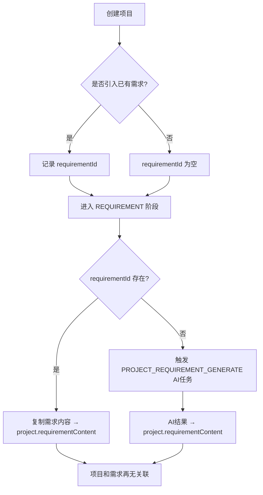

# AI编制系统规范

## 1. 定位

本文档描述 AI 编制系统业务模块的规范，覆盖 `ele-ai-tender-core` 和 `ele-ai-tender-ai`。

## 2. 模块职责

### 2.1 core模块 (8082) — 业务编排

- 项目管理（CRUD + 版本管理 + 状态流转）
- 业务需求编制（需求创建 + 历史匹配 + AI生成）
- 评审项管理（三级嵌套结构）
- 文档生成（调用 ai模块，管理生成记录）

### 2.2 ai模块 (8083) — AI能力提供

- AI助手（对话式助手、文本优化、SSE流式响应）
- 知识库（文档上传、向量化、Milvus检索）
- 智能检测（公平性、合规性、错别字、敏感词）
- 模型路由（本地模型/云端模型智能路由）
- 文档生成（Markdown → Word转换）

### 2.3 职责边界

- **core模块**: 负责"何时生成"——组装参数、调用ai模块、管理文档记录、版本快照
- **ai模块**: 负责"如何生成"——Markdown→Word实际转换、模板渲染、格式处理
- **调用链路**: `core DocumentService` → HTTP调用 → `ai WordGenerator`

## 3. 当前接口

### 3.1 core模块（`/api/v1`）

**项目管理**:
- `POST /projects` — 创建项目
- `GET /projects` — 查询项目列表
- `GET /projects/{id}` — 获取项目详情
- `PUT /projects/{id}` — 更新项目
- `DELETE /projects` — 批量删除项目
- `POST /projects/{id}/generate` — AI生成招标文件
- `GET /projects/{id}/versions` — 获取版本历史
- `GET /projects/{id}/versions/compare` — 版本对比
- `POST /projects/{id}/export` — 导出Word文档
- `POST /projects/{id}/publish` — 发布项目
- `PUT /projects/{id}/phase` — 推进项目阶段（RequestBody: targetPhase + context）

**业务需求**:
- `POST /requirements` — 创建业务需求
- `GET /requirements` — 查询需求列表
- `GET /requirements/{id}` — 获取需求详情
- `PUT /requirements/{id}` — 更新需求
- `POST /requirements/{id}/match` — 匹配历史模板
- `POST /requirements/{id}/generate` — AI生成需求初稿
- `POST /requirements/{id}/submit` — 提交审核

**评审项**:
- `POST /review-items` — 创建评审项
- `GET /review-items/{projectId}` — 查询评审项树
- `PUT /review-items/{id}` — 更新评审项
- `DELETE /review-items/{id}` — 删除评审项
- `POST /review-items/generate` — AI生成评审项

### 3.2 ai模块（`/api/v1`）

**AI助手**:
- `POST /ai/optimize` — 文本优化(SSE流式)
- `POST /ai/suggest` — 获取AI建议
- `POST /ai/generate` — AI内容生成
- `POST /ai/chat` — 对话式AI助手

**智能检测**:
- `POST /detection/start` — 启动检测
- `GET /detection/{id}/status` — 查询检测状态
- `GET /detection/{id}/result` — 获取检测结果
- `POST /detection/{id}/confirm` — 确认检测结果

**知识库**:
- `POST /knowledge/documents` — 上传知识文档
- `GET /knowledge/documents` — 查询知识文档列表
- `DELETE /knowledge/documents/{id}` — 删除知识文档
- `POST /knowledge/retrieve` — 检索知识(向量检索)
- `POST /knowledge/vectorize` — 手动触发向量化

**文档生成**:
- `POST /documents/generate` — 生成Word文档（内部接口，由core模块调用）

## 4. 当前关键表

### AI编制业务表（`ai_*`）

| 表名 | 用途 |
|------|------|
| `ai_project` | 项目表，存储 `project_code` / `project_name` / `project_category` / `project_type` / `budget` / `status` / `template_id` / `requirement_id` / `requirement_source` / `requirement_content` |
| `ai_project_version` | 项目版本表，存储 `project_id` / `version_no` / `content_snapshot`(JSON) / `change_description` |
| `ai_requirement` | 业务需求表，存储 `requirement_name` / `requirement_description` / `match_mode` / `matched_file_id` / `matched_similarity` / `content`（**无 projectId**，需求与项目通过 `ai_project.requirement_id` 单向关联） |
| `ai_template` | 模板表，存储 `template_code` / `template_name` / `project_category` / `project_type` / `content`(Markdown) / `structure_definition`(JSON) / `is_default` |
| `ai_knowledge_document` | 知识库文档表，存储 `doc_name` / `doc_category` / `file_id` / `file_type` / `vector_collection` / `vector_ids`(JSON) |
| `ai_detection_record` | 检测记录表，存储 `project_id` / `detection_type` / `content_snapshot` / `result`(JSON) / `status` |
| `ai_review_item` | 评审项表，存储 `project_id` / `parent_id` / `level`(1/2/3) / `item_name` / `item_content` / `sort_order` |
| `ai_model_config` | AI模型配置表，存储 `model_name` / `model_type`(LOCAL/CLOUD/PRIVATE) / `api_endpoint` / `api_key`(加密) / `model_params`(JSON) / `usage_scenario` / `token_usage` |

所有表继承 `BaseEntity` 基础字段（`create_time`、`modify_time`、`ver`、`is_delete` 等）。

## 5. 核心约束

### 5.1 项目状态流转

```
DRAFT → IN_PROGRESS → PENDING_DETECTION → DETECTING → DETECTION_PASSED / DETECTION_FAILED → PUBLISHED → ARCHIVED / CANCELLED
```

- 状态流转必须在 Service 层进行校验，不允许跳过中间状态
- 每次状态变更需记录操作日志

### 5.1.1 编制阶段流转

项目编制分为5个阶段，由 PhaseFlowController 统一管控推进规则和触发器执行：

```
BASIC_INFO(1) → REQUIREMENT(2) → REVIEW_ITEM(3) → DOCUMENT(4) → DETECTION(5)
```

- 阶段只能顺序推进，不能跳跃或倒退
- 每个阶段有独立的 PhaseTrigger（onEnter/onExit/canComplete），进入新阶段时自动触发AI任务
- Phase 与 Status 联动：进入编制阶段→IN_PROGRESS，进入检测阶段→DETECTING
- 详细规范见 [PHASE_FLOW_SPEC.md](PHASE_FLOW_SPEC.md)

### 5.1.2 项目与需求的关系

项目与需求是**单向关联 + 内容快照**模型，不再维持双向绑定：



- **创建项目时**：可通过引入模式关联已有需求（设置 `requirementId`），也可不关联
- **进入需求阶段时**：
  - 有关联需求 → 从 `ai_requirement.content` 复制到 `project.requirementContent`，之后不再访问需求表
  - 无关联需求 → 触发 AI 任务 `PROJECT_REQUIREMENT_GENERATE`，结果直接写入 `project.requirementContent`
- **进入需求阶段后**：项目和需求再无关联，后续阶段均从 `project.requirementContent` 读取需求内容
- **需求来源**：`requirementSource` 标记 `REFERENCE`（引入已有需求）或 `SYSTEM_GENERATE`（AI生成）
- **注意**：`ai_requirement` 表**无 `project_id` 字段**，需求是独立实体，不反向关联项目

### 5.2 评审项三级结构

- 第一级：`level=1`, `parent_id=0`
- 第二级：`level=2`, `parent_id=一级ID`
- 第三级：`level=3`, `parent_id=二级ID`
- 删除父级时必须检查是否存在子级

### 5.3 AI流式响应

- SSE接口必须设置合理的超时时间（推荐60秒）
- 必须处理客户端断开连接的情况，及时释放资源
- AI生成内容必须有人工审核机制

### 5.4 知识库向量化

- 文档分块大小：500-1000字/块
- 向量检索返回 Top-K（推荐K=5）
- 向量化过程异步执行，避免阻塞上传接口

### 5.5 Token管理

- 每个 AI 模型配置独立的 Token 用量统计
- 支持按用户/项目设置 Token 上限
- Token 使用量缓存到 Redis：`ai:token:limit:{user_id}:{date}`

## 6. Redis 数据结构

```
ai:task:queue:{task_id}        - Hash  AI任务队列
ai:task:status:{task_id}       - String 任务状态
ai:assistant:session:{id}      - Hash  AI助手会话上下文
ai:assistant:history:{id}      - List  对话历史
ai:detection:result:{proj_id}  - Hash  检测结果缓存
ai:token:limit:{user_id}:{date} - String 当日Token使用量
```

## 7. AI模型配置

### 7.1 模型类型

- `LOCAL`: 本地微调模型（处理大批量生成任务）
- `CLOUD`: 云端大模型如 DeepSeek（处理优化和检测任务）
- `PRIVATE`: 私有化部署模型

### 7.2 使用场景

- `GENERATION`: 内容生成
- `OPTIMIZATION`: 文本优化
- `DETECTION`: 智能检测

### 7.3 模型路由

```
任务类型 → ModelRouter → 本地模型(生成类) / 云端模型(优化/检测类)
```

## 8. 文档生成流程

```
Markdown模板 → flexmark-java解析 → poi-tl填充Word模板 → 导出.docx
```

- 模板使用 Markdown 格式，便于编辑和版本管理
- Word生成使用 poi-tl 模板引擎，保证格式保真
- 生成完成后固化版本快照到 `ai_project_version`

## 9. 排障原则

- **项目状态异常** → 查 `ai_project.status` 字段，检查状态流转是否合法
- **阶段推进失败** → 查 PhaseFlowController 日志，检查 canComplete 和转换规则，详见 [PHASE_FLOW_SPEC.md](PHASE_FLOW_SPEC.md)
- **需求阶段内容为空** → 查 `ai_project.requirement_id` 是否有值：有值则检查对应需求是否有 content；无值则检查 AI 任务 `PROJECT_REQUIREMENT_GENERATE` 是否成功
- **AI生成失败** → 查 `ai_model_config` 配置是否正确，检查 Token 用量是否超限
- **检测结果异常** → 查 `ai_detection_record.result` JSON，确认检测类型和输入内容
- **知识库检索不准** → 查 `ai_knowledge_document.vector_ids`，确认向量化是否完成
- **评审项结构错误** → 查 `ai_review_item.parent_id` 和 `level`，确认三级结构完整

## 相关规范

- [CODE_CONVENTIONS.md](CODE_CONVENTIONS.md) — 通用编码规范（命名、分层、异常处理、安全）
- [PROJECT_SPEC_FINAL.md](PROJECT_SPEC_FINAL.md) — 全局模块边界与 JWT 约束
- [SUPPORT_SYSTEM_SPEC.md](SUPPORT_SYSTEM_SPEC.md) — 支撑中心模块规范
- [FILE_SERVICE_SPEC.md](FILE_SERVICE_SPEC.md) — 文件服务模块规范
