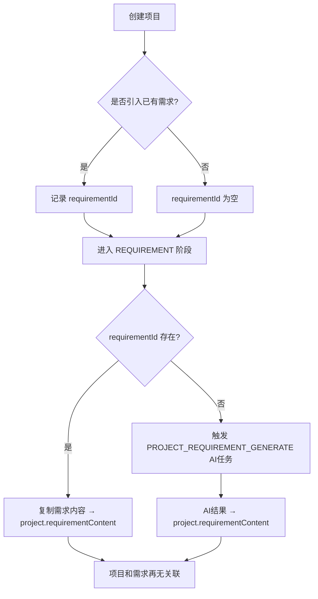

# AI编制系统规范

## 1. 定位

本文档描述 AI 编制系统业务模块的规范，覆盖 `ele-ai-tender-core` 和 `ele-ai-tender-ai`。

## 2. 模块职责

### 2.1 core模块 (8082) — 业务编排

- 项目管理（CRUD + 版本管理 + 状态流转）
- 业务需求编制（需求创建 + 历史匹配 + AI生成）
- 评审项管理（三级嵌套结构）
- 文档集成（创建AI任务，ai模块调用File服务生成Word，结果同步回写）
- 检测管理（提交检测 + 查看结果 + 接受/拒绝建议 + 一键接受 + 重试）
- AI内容反馈、用户消息、用户政策文件
- 项目模板快照

### 2.2 ai模块 (8083) — AI能力提供

- AI助手（对话式助手、文本优化、SSE流式响应）
- 知识库（文档上传、向量化、Milvus检索）
- 智能检测（敏感词、错别字、政策文件审查、格式规范检测）
- 模型路由（本地模型/云端模型/私有化模型智能路由）
- 文档匹配（基于知识库的文档相似度匹配）

### 2.3 职责边界

- **core模块**: 负责"何时生成"——组装参数、写入AI任务到 `ai_task` 表、管理文档记录、版本快照
- **ai模块**: 负责"如何生成"——AiTaskProcessor轮询任务、Markdown→Word转换、模板渲染、格式处理、检测执行
- **调用链路**: `core Service` → 写入 `ai_task` → `AiTaskProcessor` 轮询执行 → `core AiTaskResultSyncHandler` 读取结果

## 3. 当前接口

### 3.1 core模块（`/api/v1`）

**项目管理**:
- `POST /projects` — 创建项目
- `GET /projects` — 查询项目列表
- `GET /projects/{id}` — 获取项目详情
- `PUT /projects/{id}` — 更新项目
- `DELETE /projects` — 批量删除项目
- `PUT /projects/{id}/phase` — 推进项目阶段（RequestBody: targetPhase + context）

**业务需求**:
- `POST /requirements` — 创建业务需求
- `GET /requirements` — 查询需求列表
- `GET /requirements/{id}` — 获取需求详情
- `PUT /requirements/{id}` — 更新需求
- `POST /requirements/{id}/match` — 匹配历史模板
- `POST /requirements/{id}/generate` — AI生成需求初稿

**评审项**:
- `POST /review-items` — 创建评审项
- `GET /review-items/{projectId}` — 查询评审项树
- `PUT /review-items/{id}` — 更新评审项
- `DELETE /review-items/{id}` — 删除评审项
- `POST /review-items/generate` — AI生成评审项

**检测管理**:
- `POST /detections/submit` — 提交检测
- `GET /detections/{projectId}/progress` — 查询检测进度
- `GET /detections/{projectId}/report` — 获取检测报告
- `POST /detections/{recordId}/accept?issueIndex=N` — 接受建议（接受即修复：调用文件服务替换Word文本，更新generatedFileId）
- `POST /detections/{recordId}/reject?issueIndex=N` — 拒绝建议
- `POST /detections/{projectId}/accept-all` — 一键接受全部（批量替换 + 更新generatedFileId）
- `POST /detections/{projectId}/retry` — 重试检测
- `PUT /detections/{projectId}/skip` — 跳过检测

**文档集成**:
- `POST /v1/documents/integrate/{projectId}` — 提交文档集成（异步，返回AiTask）
- `GET /v1/documents/preview/{projectId}` — 获取集成预览
- `PUT /v1/documents/edit/{projectId}` — 编辑集成内容（暂不支持）

**项目模板快照**:
- `GET /project-templates/{projectId}` — 获取项目模板快照
- `PUT /project-templates/{projectId}` — 更新项目模板快照

**AI任务管理**:
- `GET /ai-tasks/latest` — 获取最新AI任务
- `GET /ai-tasks/{id}` — 获取AI任务详情

**AI内容反馈**:
- `POST /ai-content-feedback` — 提交反馈
- `GET /ai-content-feedback` — 查询反馈

**用户消息**:
- `GET /user-messages` — 查询消息列表
- `GET /user-messages/unread-count` — 未读消息数
- `PUT /user-messages/{id}/read` — 标记已读

**用户政策文件**:
- `GET /policy-files` — 查询用户政策文件
- `POST /policy-files` — 上传用户政策文件
- `DELETE /policy-files/{id}` — 删除用户政策文件

### 3.2 ai模块（`/api/v1`）

**AI助手**:
- `POST /ai/chat` — 对话式AI助手(SSE流式)
- `POST /ai/optimize` — 文本优化(SSE流式)

**文档匹配**:
- `POST /document-match/match` — 文档相似度匹配

**知识库**:
- `POST /knowledge/documents` — 上传知识文档
- `GET /knowledge/documents` — 查询知识文档列表
- `DELETE /knowledge/documents/{id}` — 删除知识文档
- `POST /knowledge/retrieve` — 检索知识(向量检索)

**AI任务处理（内部，非HTTP接口）**:
- `AiTaskProcessor` — 轮询 `ai_task` 表执行AI任务
- `DetectionEngine` — 检测引擎（敏感词/错别字/政策审查/格式检测）
- `RequirementGenerator` — 需求生成器
- `ReviewItemGenerator` — 评审项生成器
- `TextOptimizer` — 文本优化器
- `ModelRouter` + `DynamicChatClientFactory` — 动态模型路由

## 4. 当前关键表

### 核心业务表（`tb_*`）

| 表名 | 用途 |
|------|------|
| `tb_project` | 项目表，存储 `project_code` / `project_name` / `project_category` / `project_type` / `service_sub_type` / `budget` / `status` / `current_phase` / `progress` / `template_id` / `requirement_id` / `requirement_content` / `generated_file_id` |
| `tb_project_version` | 项目版本表，存储 `project_id` / `version_no` / `content_snapshot`(JSON) / `change_description` |
| `tb_requirement` | 业务需求表，存储 `requirement_name` / `project_category` / `project_type` / `service_sub_type` / `budget` / `requirement_description` / `match_mode` / `matched_file_id` / `matched_similarity` / `uploaded_file_id` / `content` / `auto_save_content` / `status` / `progress`（**无 projectId**，需求与项目通过 `tb_project.requirement_id` 单向关联） |
| `tb_project_template` | 项目模板快照表，存储 `project_id` / `template_id` / `template_name` / `project_category` / `project_type` / `file_id` / `content` / `structure_definition`(JSON) / `version_no` |
| `tb_detection_record` | 检测记录表，存储 `requirement_id` / `project_id` / `detection_type` / `content_snapshot` / `result`(JSON) / `status` / `task_id` / `policy_file_ids` / `started_at` / `completed_at` |
| `tb_project_review_item` | 评审项表，存储 `project_id` / `parent_id` / `level` / `item_name` / `item_content` / `sort_order` / `review_type` / `score` / `max_score` / `weight` / `subjectivity` / `is_required` |
| `tb_policy_file` | 用户政策文件表，存储 `file_name` / `file_category` / `applicable_category` / `file_id` / `file_size` / `file_type` / `description` / `user_id` / `status` |

### AI服务表（`ai_*`）

| 表名 | 用途 |
|------|------|
| `ai_task` | AI任务表，存储 `task_type` / `project_id` / `biz_id` / `biz_type` / `request_params` / `file_ids` / `status` / `result` / `error_msg` / `retry_count` / `max_retry` / `started_at` / `completed_at` / `timeout_minutes` |
| `ai_knowledge_document` | 知识库文档表，存储 `doc_name` / `doc_category` / `file_id` / `file_type` / `content` / `vector_collection` / `vector_ids`(JSON) / `status` |
| `ai_content_feedback` | AI内容反馈表 |
| `ai_response_log` | AI响应日志表，存储 `model` / `role` / `messages` / `content` / `finish_reason` / `prompt_tokens` / `completion_tokens` / `total_tokens` / `task_id` / `conversation_id` |

所有表继承 `BaseEntity` 基础字段（`create_time`、`modify_time`、`ver`、`is_delete` 等）。

## 5. 核心约束

### 5.1 项目状态流转

```
DRAFT → IN_PROGRESS → PENDING_DETECTION → DETECTING → DETECTION_PASSED / DETECTION_FAILED / DETECTION_SKIPPED → PUBLISHED → ARCHIVED / CANCELLED
```

- 状态流转必须在 Service 层进行校验，不允许跳过中间状态
- 每次状态变更需记录操作日志
- `DETECTION_FAILED` 可通过 `DETECTION_PASSED`（所有问题处理完毕后自动转换）或 `IN_PROGRESS`（重试检测时）转出

### 5.1.1 编制阶段流转

项目编制分为5个阶段，由 PhaseFlowController 统一管控推进规则和触发器执行：

```
BASIC_INFO(1) → REQUIREMENT(2) → REVIEW_ITEM(3) → DOCUMENT(4) → DETECTION(5)
```

- 阶段只能顺序推进，不能跳跃或倒退
- 每个阶段有独立的 PhaseTrigger（onEnter/onExit/canComplete），进入新阶段时自动触发AI任务
- Phase 与 Status 联动：进入编制阶段→IN_PROGRESS，进入检测阶段→DETECTING
- 详细规范见 [PHASE_FLOW_SPEC.md](PHASE_FLOW_SPEC.md)

### 5.1.2 项目与需求的关系

项目与需求是**单向关联 + 内容快照**模型，不再维持双向绑定：



- **创建项目时**：可通过引入模式关联已有需求（设置 `requirementId`），也可不关联
- **进入需求阶段时**：
  - 有关联需求 → 从 `tb_requirement.content` 复制到 `project.requirementContent`，之后不再访问需求表
  - 无关联需求 → 触发 AI 任务 `PROJECT_REQUIREMENT_GENERATE`，结果直接写入 `project.requirementContent`
- **进入需求阶段后**：项目和需求再无关联，后续阶段均从 `project.requirementContent` 读取需求内容
- **需求来源**：`requirementSource` 标记 `REFERENCE`（引入已有需求）或 `SYSTEM_GENERATE`（AI生成）
- **注意**：`tb_requirement` 表**无 `project_id` 字段**，需求是独立实体，不反向关联项目

### 5.2 评审项三级结构

- 第一级：`level=1`, `parent_id=0`
- 第二级：`level=2`, `parent_id=一级ID`
- 第三级：`level=3`, `parent_id=二级ID`
- 删除父级时必须检查是否存在子级

### 5.2.1 评审项模板配置（review_config）

评审项的生成受模板 `review_config` JSON 字段控制，配置存储在 `sup_template` 和 `tb_project_template` 中：

```json
{
  "reviewTypes": [
    {"reviewType": "COMPLIANCE", "enabled": true, "generateStandard": true},
    {"reviewType": "TECHNICAL", "enabled": true, "generateStandard": false},
    {"reviewType": "CREDIT", "enabled": false, "generateStandard": true},
    {"reviewType": "COMMERCIAL", "enabled": true, "generateStandard": false}
  ]
}
```

| 字段 | 作用 |
|------|------|
| `enabled` | 控制该评审类型是否启用，不启用的类型不生成/不输出/不显示Tab |
| `generateStandard` | false时，AI不生成该类型的评审项，插入占位一级节点（item_name="详见评审文件"，isRequired=0） |

**数据流**：支撑中心模板编辑页配置 → 项目绑定时快照 → AI生成读取配置只生成启用+需标准的类型 → 结果同步插入占位节点+过滤违规 → 文档集成只输出启用类型表格 → 前端动态Tab

**向后兼容**：`review_config` 为 null 时全链路回退到"全部启用"默认行为。

**DTO**：`ReviewConfig`（fromJson/isEnabled/isGenerateStandard/getEnabledTypes/defaultConfig）、`ReviewTypeConfig`

### 5.3 AI流式响应

- SSE接口必须设置合理的超时时间（推荐60秒）
- 必须处理客户端断开连接的情况，及时释放资源
- AI生成内容必须有人工审核机制

### 5.4 知识库向量化

- 文档分块大小：500-1000字/块
- 向量检索返回 Top-K（推荐K=5）
- 向量化过程异步执行，避免阻塞上传接口

### 5.5 Token管理

- 每个 AI 模型配置独立的 Token 用量统计
- 支持按用户/项目设置 Token 上限
- Token 使用量缓存到 Redis：`ai:token:limit:{user_id}:{date}`

## 6. Redis 数据结构

```
ai:task:queue:{task_id}        - Hash  AI任务队列
ai:task:status:{task_id}       - String 任务状态
ai:assistant:session:{id}      - Hash  AI助手会话上下文
ai:assistant:history:{id}      - List  对话历史
ai:detection:result:{proj_id}  - Hash  检测结果缓存
ai:token:limit:{user_id}:{date} - String 当日Token使用量
```

## 7. AI模型配置

### 7.1 模型类型

- `LOCAL`: 本地微调模型（处理大批量生成任务）
- `CLOUD`: 云端大模型如 DeepSeek（处理优化和检测任务）
- `PRIVATE`: 私有化部署模型

### 7.2 使用场景

AiTaskType 枚举定义了所有AI任务类型：
- `REQUIREMENT_GENERATE`: 需求生成
- `PROJECT_REQUIREMENT_GENERATE`: 项目需求生成
- `REVIEW_ITEM_GENERATE`: 评审项生成
- `DOCUMENT_INTEGRATION`: 文档集成（AI语义匹配占位符与数据key + 调用File服务poi-tl生成Word）
- `DETECTION_SENSITIVE_WORD`: 敏感词检测
- `DETECTION_TYPO`: 错别字检测
- `DETECTION_POLICY_REVIEW`: 政策文件审查
- `DETECTION_FORMAT_CHECK`: 格式规范检测
- `TEXT_OPTIMIZE`: 文本优化

AiUsageScenario 枚举定义模型使用场景：
- `GENERATION`: 内容生成
- `OPTIMIZATION`: 文本优化
- `DETECTION`: 智能检测

### 7.3 模型路由

```
任务类型 → ModelRouter → DynamicChatClientFactory → 本地模型(LOCAL) / 云端模型(CLOUD) / 私有化模型(PRIVATE)
```

- 模型路由由 `ModelRouter` + `DynamicChatClientFactory` 动态选择
- `ModelConfigCacheService` 缓存模型配置，定期从 `sup_model_config` 刷新
- 路由规则通过 `sup_model_route_rule` 配置主备模型

## 8. 文档生成流程

```
Word模板上传 → WordStructureParser解析模板结构 → DocumentDataAssembler组装数据 → poi-tl填充Word模板 → 导出.docx
```

- 模板使用 Word(.docx) 格式上传，通过 `WordStructureParser` 解析结构定义
- 数据组装由 core 模块的 `DocumentDataAssembler` 完成
- Word生成使用 file 模块的 `WordTemplateEngine`(poi-tl) 用于项目文档模板填充
- core 模块的 `WordDocumentGenerator` + `MarkdownTemplateEngine` 用于需求导出等场景（已从 file 模块移入）
- 生成完成后固化版本快照到 `tb_project_version`

## 9. 检测修复流程

```
4项检测完成 → 自动创建版本备份 → DETECTION_FAILED(有问题) / DETECTION_PASSED(无问题)
    ↓
自动填充locationRef → 调用extractText获取segments → fillLocationRefs匹配每个issue
    ↓
用户接受建议 → 提取original/targeted+locationRef → 调用文件服务fixDocument → 更新generatedFileId
    ↓
所有问题处理完 → 自动转为 DETECTION_PASSED
```

- **locationRef 自动填充**: 检测完成后 `AiTaskResultSyncHandler.syncDetection()` 自动调用文件服务 `extractText` 获取文本+位置索引，再通过 `DetectionResultParser.fillLocationRefs()` 为每个 issue 填充 `locationRef`（嵌入 result JSON，不改表结构）
- **locationRef 结构**: `{type: "paragraph"|"table", elementIndex, tableIndex?, rowIndex?, cellIndex?}`，elementIndex 是 IBodyElement 序号（段落和表格共享索引空间）
- **接受即修复**: `acceptIssue` 调用 `InternalFileServiceClient.fixDocument()` 直接修改 Word 文档，携带 locationRef 精准定位，成功则 `handleStatus=1`，未找到原文则 `handleStatus=3`
- **批量修复**: `acceptAll` 先标记所有 handleStatus=1，再收集所有替换项（含 locationRef）一次性调用 `fixDocument`
- **版本备份**: 检测完成（DETECTION_PASSED / DETECTION_FAILED）时自动创建 `tb_project_version` 快照，`contentSnapshot` 存储 `{generatedFileId, status}`
- **自动流转**: 每次接受/拒绝后检查是否仍有 handleStatus=0 的问题，无则自动从 DETECTION_FAILED 转为 DETECTION_PASSED

## 10. 排障原则

- **项目状态异常** → 查 `tb_project.status` 字段，检查状态流转是否合法
- **阶段推进失败** → 查 PhaseFlowController 日志，检查 canComplete 和转换规则，详见 [PHASE_FLOW_SPEC.md](PHASE_FLOW_SPEC.md)
- **需求阶段内容为空** → 查 `tb_project.requirement_id` 是否有值：有值则检查对应需求是否有 content；无值则检查 AI 任务 `PROJECT_REQUIREMENT_GENERATE` 是否成功
- **AI生成失败** → 查 `sup_model_config` 配置是否正确，检查 Token 用量是否超限
- **检测结果异常** → 查 `tb_detection_record.result` JSON，确认检测类型和输入内容
- **接受建议后文档未修复** → 检查 issue 的 `original`/`targeted` 是否有效、`WordDocumentFixEngine` 日志是否报告未找到原文、`project.generated_file_id` 是否已更新、`locationRef` 是否正确传递（`FixReplacement.locationRef` 不能为空才能精准定位）
- **locationRef 未填充** → 检查 `AiTaskResultSyncHandler` 日志是否报 `extractText` 或 `fillLocationRefs` 失败、`project.generated_file_id` 是否有值
- **检测后状态未流转** → 检查是否所有 detection_record 已终态、是否仍有 handleStatus=0 的问题、DETECTION_FAILED 需全部处理完才会自动转 PASSED
- **知识库检索不准** → 查 `ai_knowledge_document.vector_ids`，确认向量化是否完成
- **评审项结构错误** → 查 `tb_project_review_item.parent_id` 和 `level`，确认三级结构完整

## 相关规范

- [CODE_CONVENTIONS.md](CODE_CONVENTIONS.md) — 通用编码规范（命名、分层、异常处理、安全）
- [PROJECT_SPEC_FINAL.md](PROJECT_SPEC_FINAL.md) — 全局模块边界与 JWT 约束
- [SUPPORT_SYSTEM_SPEC.md](SUPPORT_SYSTEM_SPEC.md) — 支撑中心模块规范
- [FILE_SERVICE_SPEC.md](FILE_SERVICE_SPEC.md) — 文件服务模块规范
