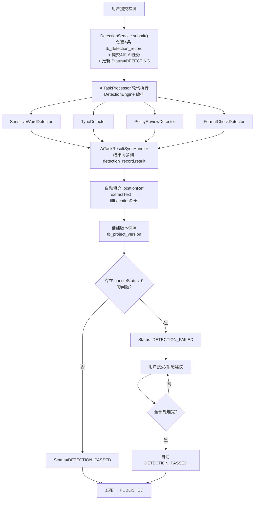
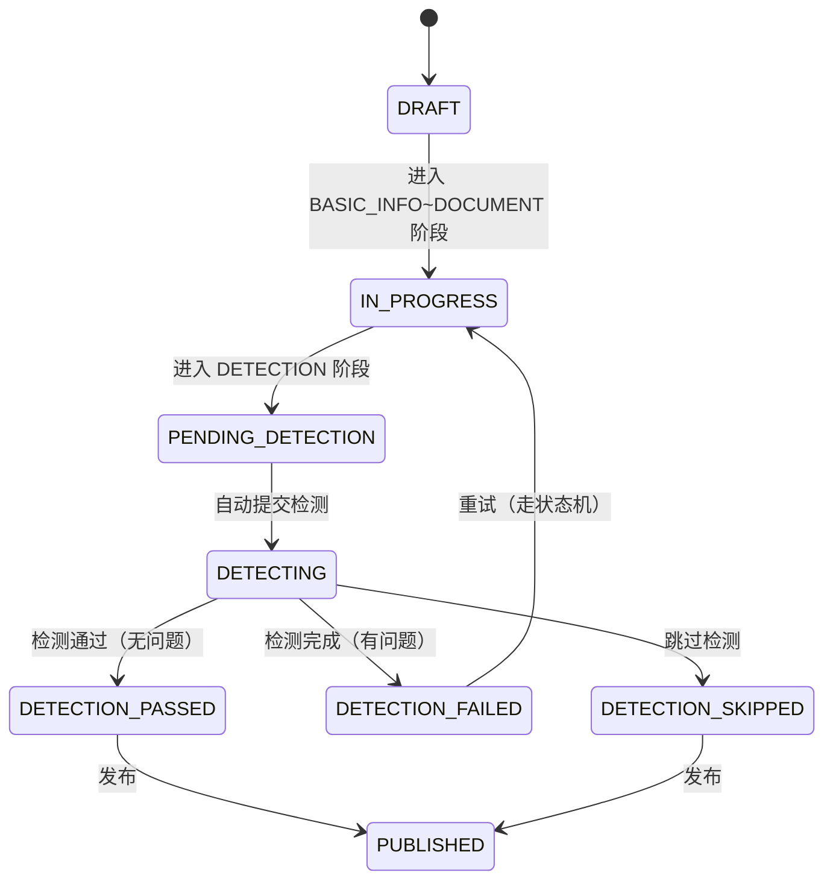

# 检测全链路规范

## 1. 定位

本文档描述从提交检测到修复完成的完整链路，跨越 core、ai、file 三个模块。

## 2. 全链路流程



## 3. 检测类型

| 类型 | 枚举值 | 说明 |
|------|--------|------|
| 敏感词检测 | SENSITIVE_WORD | 检测歧视性、敏感性词汇 |
| 错别字检测 | TYPO | 检测错别字和语法错误 |
| 政策文件审查 | POLICY_REVIEW | 对照政策文件检查合规性 |
| 格式规范检测 | FORMAT_CHECK | 检查文档格式规范 |

## 4. 提交检测

### 4.1 提交入口

两个入口触发检测：

1. **阶段推进触发**：`DetectionPhaseTrigger.onEnter()` — 从 context 提取 policyFileIds，调用 `DetectionService.submit()`
2. **手动提交**：`POST /api/v1/detection/submit/{projectId}` — 前端手动调用

### 4.2 DetectionService.submit() 职责

- 调用 `buildDetectionContent()` 构建检测内容（见 4.4）
- 创建4条 `tb_detection_record`（每种检测类型一条，`content_file_id=null`，`content_snapshot=检测内容`）
- 提交4项 AI任务到 `ai_task` 表，`DetectionParams.content` 传入检测内容文本
- 更新项目 Status 为 DETECTING

### 4.3 DetectionService.submit() 不做的事

- **不自行推进阶段**，阶段推进由 PhaseFlowController 统一管理

### 4.4 检测内容范围（仅系统生成内容）

智能检测**仅检测系统生成的招标需求内容 + 评审项标准，不检测模板内容**。`buildDetectionContent(project, reviewItems)` 拼接纯文本：

```
Requirement Content
{project.requirementContent}

Review Items
- [COMPLIANCE] {评审项标准}
- [TECHNICAL] {评审项标准}
...
```

- `tb_detection_record.content_file_id` 始终为 `null`（旧版本传 `project.generatedFileId` 检测最终 Word 文件，已废弃）
- 检测内容存入 `content_snapshot` 字段并作为 `DetectionParams.content` 传入 AI 任务
- 模板的 `content`/`structureDefinition`/`reviewConfig` 等完全不在检测范围内
- `retry()` 重试同样用 `buildDetectionContent()` 重建内容

> **检测对象 vs 定位对象**：检测对象是上述纯文本快照，但 issue 的 `locationRef` 仍基于 `project.generated_file_id` 对应的 Word 文件提取 segments 来定位（见第 6 节），用于后续"接受即修复"时精准定位 Word 段落。

## 5. 检测执行

### 5.1 AiTaskProcessor 调度

轮询 `ai_task` 表中 PENDING 状态的任务，按 `task_type` 分派到对应的 Detector。

### 5.2 DetectionEngine 编排

- 协调4种检测并行执行
- 每种检测独立生成 issue 列表，写入 `detection_record.result`

### 5.3 结果同步

`AiTaskResultSyncHandler.syncDetection()` 处理每个检测任务的结果：
- 从 `ai_task.result` 解析检测 issues
- 写入 `tb_detection_record.result`

## 6. locationRef 自动填充

检测完成后自动为每个 issue 填充 `locationRef`，用于精准定位 Word 文档中的问题位置。注意：检测内容是 4.4 节的纯文本快照，但 `locationRef` 基于 `project.generated_file_id` 对应的 Word 文件提取 segments 来定位——即"检测纯文本、定位 Word 文件"，便于后续"接受即修复"直接修改 Word 段落。

### 6.1 流程

```
4项检测完成 → 调用文件服务 extractText → 获取 segments + fullText
    → DetectionResultParser.fillLocationRefs() → 为每个 issue 匹配 locationRef
    → 嵌入 detection_record.result JSON（不改表结构）
```

### 6.2 locationRef 结构

```json
{
  "type": "paragraph" | "table",
  "elementIndex": 5,
  "tableIndex": null,
  "rowIndex": null,
  "cellIndex": null
}
```

- `elementIndex` 是 IBodyElement 序号（段落和表格共享索引空间）
- 表格类型额外包含 `tableIndex`、`rowIndex`、`cellIndex`

### 6.3 WordTextExtractor

- 接口：`POST /api/file/extract-text`，接收 `{fileId}`，返回 `{fullText, segments}`
- 每个 segment 包含 `{type, elementIndex, fullTextOffset, text}`
- `elementIndex` 与 `doc.getBodyElements()` 的序列号一一对应

## 7. 修复流程

### 7.1 接受即修复

`acceptIssue` 调用 `InternalFileServiceClient.fixDocument()` 直接修改 Word 文档：

1. 从 issue 提取 `original`/`targeted` + `locationRef`
2. 构造 `FixReplacement` 携带 locationRef 精准定位
3. 调用文件服务 `POST /api/file/fix-doc`
4. 成功则 `handleStatus=1`，未找到原文则 `handleStatus=3`
5. 更新 `project.generated_file_id` 为修复后文件ID

### 7.2 批量修复

`acceptAll` 先标记所有 handleStatus=1，再收集所有替换项（含 locationRef）一次性调用 `fixDocument`。

### 7.3 WordDocumentFixEngine 约束

- **多 Run 替换策略**：先合并段落全文 → 执行替换 → 清空所有 Run → 写入第一个 Run
- **遍历范围**：段落、表格单元格、页眉页脚
- **locationRef 精准定位**：`elementIndex` O(1) 定位 IBodyElement
- **两级匹配**：精确匹配优先 → 规范化匹配兜底（`TextNormalizeUtil.normalize()` 移除空白后匹配）
- **文件命名**：`fixed_时间戳_原始文件名`

### 7.4 拒绝建议

`rejectIssue` 仅设置 `handleStatus=2`，不修改文档。

## 8. 状态流转

### 8.1 Phase-Status 联动



### 8.2 自动流转

- 每次接受/拒绝后检查是否仍有 `handleStatus=0` 的问题
- 无则自动从 DETECTION_FAILED 转为 DETECTION_PASSED

### 8.3 重试流程

检测失败后的重试必须走状态机：
```
DETECTION_FAILED → IN_PROGRESS → PENDING_DETECTION → DETECTING
```
不能直接设置状态。

### 8.4 PhaseFlowController.syncProjectStatus 对检测的特殊处理

若 Status 已是 DETECTING 则跳过状态同步，由 DetectionService.submit() 处理。

## 9. 版本备份

检测完成（DETECTION_PASSED / DETECTION_FAILED）时自动创建 `tb_project_version` 快照，`contentSnapshot` 存储 `{generatedFileId, status}`。

## 10. 排障指南

| 问题 | 排查方向 |
|------|---------|
| 检测任务不执行 | 查 `ai_task` 状态是否为 PENDING，AiTaskProcessor 日志是否正常轮询 |
| 检测结果为空 | 查 `tb_detection_record.result` JSON，确认 AI 是否返回有效结果 |
| locationRef 未填充 | 检查 `AiTaskResultSyncHandler` 日志是否报 `extractText` 或 `fillLocationRefs` 失败、`project.generated_file_id` 是否有值 |
| 接受建议后文档未修复 | 检查 issue 的 `original`/`targeted` 是否有效、`WordDocumentFixEngine` 日志是否报告未找到原文、`project.generated_file_id` 是否已更新、`locationRef` 是否正确传递 |
| 检测后状态未流转 | 检查是否所有 detection_record 已终态、是否仍有 handleStatus=0 的问题 |
| 修复替换了错误位置 | 检查 `FixReplacement.locationRef` 是否为空（为空走全文档替换）、elementIndex 对应的 IBodyElement 类型是否与 type 字段一致 |
| locationRef 定位失败 | 检查 `elementIndex` 是否越界、`WordTextExtractor` 是否已执行 |
| 模板内容被误报为问题 | 检测仅作用于 `buildDetectionContent`（需求内容 + 评审项标准纯文本），模板内容不在检测范围；确认 `tb_detection_record.content_file_id` 为 null、`content_snapshot` 仅含需求与评审项 |

## 相关规范

- [CORE_MODULE_SPEC.md](CORE_MODULE_SPEC.md) — 核心业务模块规范（接口、状态流转）
- [AI_MODULE_SPEC.md](AI_MODULE_SPEC.md) — AI服务模块规范（检测器体系）
- [FILE_SERVICE_SPEC.md](FILE_SERVICE_SPEC.md) — 文件服务模块规范（WordDocumentFixEngine、WordTextExtractor）
- [PHASE_FLOW_SPEC.md](PHASE_FLOW_SPEC.md) — 阶段流程控制器规范（DetectionPhaseTrigger）
