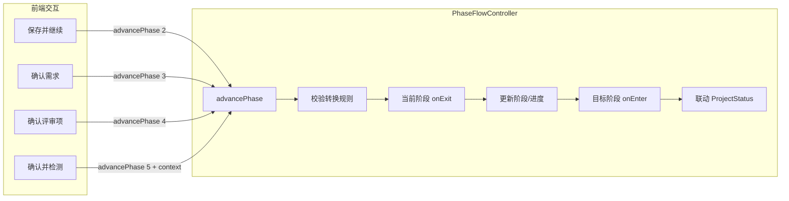
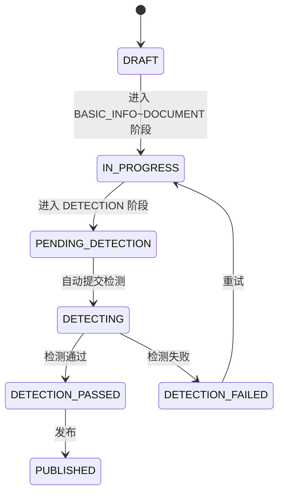

# 阶段流程控制器规范

## 1. 定位

本文档描述项目编制阶段流转的架构设计、触发器机制和前后端集成规范。

## 2. 架构概览



## 3. 阶段定义与触发器

| 阶段 | code | 进入时 onEnter | 完成校验 canComplete |
|------|------|---------------|---------------------|
| BASIC_INFO | 1 | 无（手动录入） | projectName / projectCategory / projectType 非空 |
| REQUIREMENT | 2 | 自动创建需求 + 触发AI需求生成 | requirementId 或 requirementContent 非空 |
| REVIEW_ITEM | 3 | 触发AI评审项生成 | 项目下存在评审项记录 |
| DOCUMENT | 4 | 自动执行文档集成 | generatedFileId 非空 |
| DETECTION | 5 | 自动提交智能检测（携带policyFileIds） | 状态为 DETECTION_PASSED 或 DETECTION_SKIPPED |

## 4. Phase-Status 联动规则



关键联动逻辑：
- 进入 BASIC_INFO ~ DOCUMENT 阶段 → Status 应为 IN_PROGRESS
- 进入 DETECTION 阶段 → onEnter 提交检测，Status 已被设为 DETECTING（由 DetectionService.submit 处理）
- PhaseFlowController.syncProjectStatus 中对 DETECTION 阶段特殊处理：若 Status 已是 DETECTING 则跳过

## 5. 关键类与文件

| 类 | 路径 | 职责 |
|-----|------|------|
| `PhaseTrigger` | `core/statemachine/PhaseTrigger.java` | 阶段触发器接口（onEnter/onExit/canComplete） |
| `PhaseFlowController` | `core/statemachine/PhaseFlowController.java` | 流程控制器（注册触发器 + 校验 + 推进 + Status联动） |
| `ProjectStateMachine` | `core/statemachine/ProjectStateMachine.java` | 状态机（定义合法 Status 转换规则） |
| `BasicInfoTrigger` | `core/statemachine/trigger/BasicInfoTrigger.java` | 基础信息阶段触发器 |
| `RequirementTrigger` | `core/statemachine/trigger/RequirementTrigger.java` | 需求生成阶段触发器 |
| `ReviewItemTrigger` | `core/statemachine/trigger/ReviewItemTrigger.java` | 评审项设置阶段触发器 |
| `DocumentTrigger` | `core/statemachine/trigger/DocumentTrigger.java` | 文档集成阶段触发器 |
| `DetectionPhaseTrigger` | `core/statemachine/trigger/DetectionPhaseTrigger.java` | 智能检测阶段触发器 |
| `AdvancePhaseRequest` | `core/dto/request/AdvancePhaseRequest.java` | 阶段推进请求DTO（targetPhase + context） |

## 6. 推进流程详解

```
advancePhase(projectId, targetPhase, context)
  → ProjectServiceImpl.getById(projectId)
  → PhaseFlowController.advancePhase(project, target, context)
    → 1. validateTransition(current, target)  // 只能推进到下一阶段
    → 2. currentTrigger.canComplete(project)   // 校验当前阶段是否可完成
    → 3. currentTrigger.onExit(project)        // 离开当前阶段
    → 4. project.currentPhase = target.code    // 更新阶段
    → 5. targetTrigger.onEnter(project, context) // 进入目标阶段（自动触发AI任务）
    → 6. syncProjectStatus(project, target)    // 联动Status
  → projectMapper.updateById(project)
```

## 7. 前端集成

### 7.1 API 调用

```typescript
// src/api/project.ts
advancePhase(id: number, targetPhase: number, context?: Record<string, any>) {
  return request.put(`/core-api/v1/projects/${id}/phase`, { targetPhase, context })
}
```

### 7.2 各阶段组件调用时机

| 前端组件 | 按钮 | 调用 |
|---------|------|------|
| PhaseBasicInfo | 保存并继续 | `advancePhase(projectId, 2)` |
| PhaseRequirement | 确认需求 | `advancePhase(projectId, 3)` |
| PhaseReviewItem | 确认评审项 | `advancePhase(projectId, 4)` |
| PhaseDocument | 确认并检测 | `advancePhase(projectId, 5, { policyFileIds })` |

### 7.3 上下文传递

`context` 参数用于向触发器传递运行时数据，当前仅 DETECTION 阶段使用：
- `policyFileIds: number[]` — 用户选择的政策文件ID列表

## 8. 设计约束

### 8.1 阶段转换规则

- 只能顺序推进到下一阶段，不能跳跃、不能倒退
- `isValidTransition(current, target)` = `target.code == current.code + 1`

### 8.2 循环依赖处理

PhaseTrigger 注入的业务 Service 可能依赖 IProjectService，形成循环：
```
ProjectServiceImpl → @Lazy PhaseTrigger → Service → IProjectService → ProjectServiceImpl
```
**解决方案**：ProjectServiceImpl 中所有触发器注入使用 `@Lazy` 注解。

### 8.3 AI任务容错

触发器 onEnter 中调用 Service 提交 AI 任务时，使用 try-catch 包裹：
- 失败时仅 warn 日志，不阻塞阶段推进
- 前端可通过 useLatestTask 组合式函数轮询任务状态

### 8.4 DetectionService.submit() 职责边界

- DetectionService.submit() 负责：创建检测记录 + 提交AI任务 + 更新Status为DETECTING
- DetectionPhaseTrigger.onEnter() 负责：从context提取policyFileIds + 调用submit()
- **submit() 不再自行推进阶段**，阶段推进由 PhaseFlowController 统一管理

### 8.5 retry() 流程

检测失败后的重试必须走状态机：
```
DETECTION_FAILED → IN_PROGRESS → PENDING_DETECTION → DETECTING
```
不能直接设置状态。

## 9. 排障指南

| 问题 | 排查方向 |
|------|---------|
| 阶段推进失败 "不允许跳转" | 检查 currentPhase 和 targetPhase，是否跳过中间阶段 |
| 阶段推进失败 "当前阶段尚未完成" | 检查对应触发器 canComplete 逻辑 |
| AI任务未自动触发 | 查看触发器 onEnter 日志，检查 Service 是否异常 |
| Status 与 Phase 不一致 | 查 PhaseFlowController.syncProjectStatus 日志 |
| 循环依赖报错 | 检查 @Lazy 注解是否遗漏 |
| 检测重试后状态不对 | 检查 retry() 是否走了状态机而非直接设值 |
