# 构建配置代码审查报告

**审查日期**: 2026-04-17
**审查范围**: Maven 多模块构建配置 (7模块) + 双前端 Vue 3 + Vite 7 项目构建配置
**审查人**: AI Code Reviewer

---

## 审查概览

| 类别 | 数量 |
|------|------|
| 严重问题 (必须修复) | 5 |
| 重要问题 (应该修复) | 8 |
| 轻微问题 (建议改进) | 7 |

**总体评价**: 项目的 Maven 多模块结构和 Spring Boot 3.2.2 技术基线选择合理，但存在多个影响构建正确性、生产部署就绪性和安全性的问题。特别是 Spring AI 的非标准 groupId、interaction 模块的 BOM 冲突、前端生产环境配置缺失等问题，在上线前必须解决。

---

## 一、严重问题 (必须修复)

### C-01. Spring AI 使用非标准 groupId，可能是拼写错误

**文件**: `ele-ai-tender-system/ele-ai-tender-ai/pom.xml` 第 76、81 行

```xml
<groupId>group.springframework.ai</groupId>
<artifactId>spring-ai-openai-spring-boot-starter</artifactId>
```

**问题**: Spring AI 官方发布的 Maven 坐标 groupId 为 `org.springframework.ai`。当前使用的 `group.springframework.ai` 不是官方 groupId。如果这个 groupId 来自某个私有仓库或国内镜像的重新发布版本，说明团队在使用非官方制品。这带来以下风险：
- 无法从 Maven Central 直接获取，依赖私有仓库可用性
- 私有仓库制品可能被篡改（供应链安全风险）
- 版本升级时可能无法对齐官方安全补丁

**建议**: 确认该 groupId 的来源。如果是官方制品，切换到 `org.springframework.ai`。如果确实是私有仓库重发布版本，在 CLAUDE.md 或 pom.xml 中添加注释说明原因和仓库地址。

---

### C-02. interaction 模块 BOM 冲突导致传递依赖版本不确定性

**文件**: `ele-ai-tender-system/ele-ai-tender-interaction/pom.xml` 第 26-34 行

```xml
<dependency>
    <groupId>org.springframework.boot</groupId>
    <artifactId>spring-boot-dependencies</artifactId>
    <version>${interaction.spring-boot.version}</version>  <!-- 2.7.18 -->
    <type>pom</type>
    <scope>import</scope>
</dependency>
```

**问题**: 父 POM 已导入 Spring Boot 3.2.2 的 BOM，interaction 子聚合器又导入 2.7.18 的 BOM。Maven BOM import 的生效规则取决于声明顺序和层级关系，这在多模块反应器构建中可能导致：
- `interaction-core` 和 `interaction-autoconfigure` 的传递依赖版本在 `mvn install` 单模块构建 vs. 反应器构建时表现不同
- `spring-boot-starter-json` 在 Spring Boot 2.7.x 下绑定的是 Jackson 2.13.x，而 3.2.x 绑定 Jackson 2.15.x，类路径冲突可能导致运行时 `ClassNotFoundException` 或 `NoSuchMethodError`

**建议**: 将 interaction 模块从父 POM 的反应器构建中完全解耦。两种方案：

**方案 A (推荐)**: 将 interaction 拆为独立 Git 仓库或独立 Maven 构建，不参与父反应器构建。发布 common-interaction 到本地/私有仓库后，interaction 独立构建时引用。

**方案 B**: 在 interaction 的 pom.xml 中显式声明所有传递依赖的版本，避免 BOM 覆盖的歧义。

---

### C-03. interaction-autoconfigure 使用 javax.servlet 而非 Jakarta Servlet

**文件**: `ele-ai-tender-system/ele-ai-tender-interaction/ele-ai-tender-interaction-autoconfigure/pom.xml` 第 38-41 行

```xml
<dependency>
    <groupId>javax.servlet</groupId>
    <artifactId>javax.servlet-api</artifactId>
    <scope>provided</scope>
</dependency>
```

**问题**: interaction 模块设计目标是为 JDK 8 兼容的第三方系统提供 Starter。然而 `javax.servlet:javax.servlet-api` 在 Spring Boot 2.7.x BOM 中版本为 4.0.1，对应 Servlet 3.1 规范。如果接入方运行在 Spring Boot 3.x + Tomcat 10+ 上，容器提供的是 `jakarta.servlet-api` 5.0+，与 `javax.servlet` 包名不兼容，会导致 `ClassNotFoundException`。

此外，Java 代码中确实使用了 `javax.servlet` 包：

```java
// InteractionSignatureInterceptor.java
import javax.servlet.http.HttpServletRequest;
import javax.servlet.http.HttpServletResponse;
```

**建议**:
- 如果 Starter 只面向 Spring Boot 2.x 接入方，当前写法可以接受，但需在文档中明确标注兼容范围
- 如果也需要支持 Spring Boot 3.x 接入方，需提供两套自动配置（通过 `@ConditionalOnClass` 区分 `javax.servlet` / `jakarta.servlet`）

---

### C-04. 前端 AI编制前端缺少 build 优化配置，生产包体过大

**文件**: `ele-ai-tender-frontend/vite.config.ts`

**问题**: AI编制前端引入了 `element-plus`、`md-editor-v3`、`docx-preview`、`diff2html` 等大型依赖，但 vite.config.ts 中完全没有 `build` 配置段。这意味着：
- 所有依赖打包成单个 vendor chunk，首次加载可能超过 2MB
- 没有设置 `chunkSizeWarningLimit`，构建时看不到警告
- 没有 `sourcemap` 配置，生产环境调试困难
- 对比支撑中心前端已正确配置 `manualChunks`，存在配置标准不一致

**建议**: 添加与 support-frontend 对齐的 build 配置：

```typescript
build: {
  outDir: 'dist',
  sourcemap: false,
  chunkSizeWarningLimit: 1500,
  rollupOptions: {
    output: {
      manualChunks: {
        'element-plus': ['element-plus'],
        'vue-vendor': ['vue', 'vue-router', 'pinia'],
        'editor': ['md-editor-v3'],
        'docx': ['docx-preview'],
        'diff': ['diff2html'],
      },
    },
  },
},
```

---

### C-05. AI编制前端 .env.production 缺少 VITE_SUPPORT_API_URL，生产环境认证不可用

**文件**: `ele-ai-tender-frontend/.env.production`

```properties
VITE_CORE_API_URL=/core-api
VITE_AI_API_URL=/ai-api
VITE_FILE_API_URL=/file-api
# 缺少: VITE_SUPPORT_API_URL
```

**问题**: AI编制前端的 `src/api/auth.ts` 中大量调用 `/support-api/auth/*` 接口（登录、获取公钥、获取用户信息、获取菜单等）。vite.config.ts 中也配置了 `/support-api` 代理。但 `.env.production` 中没有 `VITE_SUPPORT_API_URL`，生产环境下开发代理不生效，`/support-api` 路径请求将无法路由到支撑中心服务，导致**生产环境完全无法登录**。

**建议**: 在 `.env.production` 中添加：

```properties
VITE_SUPPORT_API_URL=/support-api
```

---

## 二、重要问题 (应该修复)

### I-01. maven-compiler-plugin 版本过旧，不兼容 JDK 21

**文件**: `ele-ai-tender-system/pom.xml` 第 199 行

```xml
<artifactId>maven-compiler-plugin</artifactId>
<version>3.8.1</version>
```

**问题**: maven-compiler-plugin 3.8.1 发布于 2019 年，不支持 JDK 21 的特性（如 record 模式匹配、switch 表达式等）。从 3.11+ 开始才完整支持 JDK 21。当前配置使用 `<source>21</source>` + `<target>21</target>` 而非 `<release>21</release>`，也不能利用 JDK 21 的交叉编译能力。

**建议**: 升级到至少 3.11.0，并使用 `<release>` 代替 `<source>/<target>`：

```xml
<plugin>
    <groupId>org.apache.maven.plugins</groupId>
    <artifactId>maven-compiler-plugin</artifactId>
    <version>3.13.0</version>
    <configuration>
        <release>${java.version}</release>
        <encoding>${project.build.sourceEncoding}</encoding>
        <parameters>true</parameters>
        <annotationProcessorPaths>
            <path>
                <groupId>org.projectlombok</groupId>
                <artifactId>lombok</artifactId>
                <version>${lombok.version}</version>
            </path>
        </annotationProcessorPaths>
    </configuration>
</plugin>
```

---

### I-02. Spring AI 依赖未纳入父 POM dependencyManagement

**文件**: `ele-ai-tender-system/ele-ai-tender-ai/pom.xml` 第 75-84 行

**问题**: `spring-ai-openai-spring-boot-starter` 和 `spring-ai-zhipuai-spring-boot-starter` 直接在 ai 模块中声明版本 `${spring-ai.version}`，绕过了父 POM 的 `dependencyManagement`。版本属性虽然定义在父 POM 的 `<properties>` 中，但依赖声明模式不一致，且缺少 Spring AI BOM 导入。

此外，`flexmark-all` 和 `poi-tl` 在 core 模块中也直接声明版本，同样绕过了 `dependencyManagement`。

**建议**: 在父 POM 中添加 Spring AI BOM 导入，并将所有依赖版本集中管理：

```xml
<!-- 父 POM dependencyManagement 中添加 -->
<dependency>
    <groupId>org.springframework.ai</groupId>
    <artifactId>spring-ai-bom</artifactId>
    <version>${spring-ai.version}</version>
    <type>pom</type>
    <scope>import</scope>
</dependency>
<dependency>
    <groupId>com.vladsch.flexmark</groupId>
    <artifactId>flexmark-all</artifactId>
    <version>${flexmark.version}</version>
</dependency>
<dependency>
    <groupId>com.deepoove</groupId>
    <artifactId>poi-tl</artifactId>
    <version>${poi-tl.version}</version>
</dependency>
```

---

### I-03. hutool-all 引入不必要的模块，扩大攻击面

**文件**: `ele-ai-tender-system/ele-ai-tender-common/pom.xml` 第 61-63 行

```xml
<dependency>
    <groupId>cn.hutool</groupId>
    <artifactId>hutool-all</artifactId>
</dependency>
```

**问题**: `hutool-all` 包含 50+ 模块，其中许多是项目不需要的（如 `hutool-cron`、`hutool-socket`、`hutool-json` 等）。这会：
- 增大最终 JAR 体积约 2-3MB
- 引入不必要的传递依赖
- 扩大漏洞攻击面（hutool 历史上有多个 CVE）
- 增加 OWASP 依赖扫描的误报和漏报

**建议**: 替换为项目实际使用的模块，例如：

```xml
<dependency>
    <groupId>cn.hutool</groupId>
    <artifactId>hutool-core</artifactId>
</dependency>
<dependency>
    <groupId>cn.hutool</groupId>
    <artifactId>hutool-crypto</artifactId>
</dependency>
<!-- 按需添加其他模块 -->
```

---

### I-04. flexmark-all 引入不需要的解析器

**文件**: `ele-ai-tender-system/ele-ai-tender-core/pom.xml` 第 76-79 行

```xml
<dependency>
    <groupId>com.vladsch.flexmark</groupId>
    <artifactId>flexmark-all</artifactId>
    <version>${flexmark.version}</version>
</dependency>
```

**问题**: `flexmark-all` 包含 40+ 子模块（AsciiDoc、MediaWiki、YAML 等解析器），而项目只需要 Markdown 到 HTML 的转换。同样存在体积膨胀和不必要攻击面的问题。

**建议**: 替换为具体需要的模块：

```xml
<dependency>
    <groupId>com.vladsch.flexmark</groupId>
    <artifactId>flexmark</artifactId>
    <version>${flexmark.version}</version>
</dependency>
<dependency>
    <groupId>com.vladsch.flexmark</groupId>
    <artifactId>flexmark-ext-tables</artifactId>
    <version>${flexmark.version}</version>
</dependency>
<!-- 按需添加扩展 -->
```

---

### I-05. tika-core 可能无法解析文档

**文件**: `ele-ai-tender-system/ele-ai-tender-ai/pom.xml` 第 94-98 行

```xml
<dependency>
    <groupId>org.apache.tika</groupId>
    <artifactId>tika-core</artifactId>
    <version>${tika.version}</version>
</dependency>
```

**问题**: `tika-core` 只包含 Tika 的核心接口和检测功能，不包含实际的文档解析器。要解析 PDF、Word、Excel 等文件，需要 `tika-parsers-standard-package`。如果当前代码只用 Tika 做 MIME 检测，则 `tika-core` 足够；但 CLAUDE.md 描述的 "Apache Tika 解析" 流程需要完整的解析器。

**建议**: 如果确实需要解析文档内容，添加：

```xml
<dependency>
    <groupId>org.apache.tika</groupId>
    <artifactId>tika-parsers-standard-package</artifactId>
    <version>${tika.version}</version>
</dependency>
```

如果只需要 MIME 检测，保留 `tika-core` 并在代码注释中说明。

---

### I-06. 支撑中心前端 .env.production 包含占位符 URL

**文件**: `ele-ai-tender-support-frontend/.env.production`

```properties
VITE_API_BASE_URL=http://your-production-api.com
VITE_FILE_API_URL=http://your-production-file-api.com
```

**问题**: 生产环境配置使用占位符 URL，如果有人误操作运行 `npm run build`，产出的包会指向不存在的域名，导致线上故障。

**建议**: 改用相对路径（与其他前端一致），或使用 Nginx 代理：

```properties
VITE_API_BASE_URL=/support-api
VITE_FILE_API_URL=/file-api
```

---

### I-07. 两个前端项目 TypeScript 严格模式配置不一致

**文件**:
- `ele-ai-tender-frontend/tsconfig.app.json` — 包含 `"strict": true`
- `ele-ai-tender-support-frontend/tsconfig.app.json` — **缺少** `"strict": true`

**问题**: 支撑中心前端没有开启 TypeScript 严格模式，意味着：
- 允许隐式 `any` 类型
- 不检查严格的 null 值
- 不检查函数参数赋值
- 两个项目的代码质量标准不统一

**建议**: 在 support-frontend 的 tsconfig.app.json 中添加 `"strict": true`。

---

### I-08. sass 错误地放在 dependencies 而非 devDependencies

**文件**: `ele-ai-tender-frontend/package.json` 和 `ele-ai-tender-support-frontend/package.json`

```json
"dependencies": {
    "sass": "^1.97.3",
    ...
}
```

**问题**: `sass` 是构建时依赖，只在 Vite 编译 SCSS 时使用。放在 `dependencies` 会导致：
- 生产环境部署时安装不必要的构建工具
- 增加 `npm ci` 的安装时间和磁盘占用
- 违反 npm 依赖分类最佳实践

**建议**: 将 `sass` 移到 `devDependencies`：

```json
"devDependencies": {
    "sass": "^1.97.3",
    ...
}
```

---

## 三、轻微问题 (建议改进)

### M-01. 缺少 Maven Wrapper，构建不可复现

**问题**: 项目没有提交 `mvnw` / `mvnw.cmd` / `.mvn/wrapper/maven-wrapper.properties`。团队成员或 CI 环境可能使用不同版本的 Maven，导致构建行为差异。

**建议**: 执行 `mvn wrapper:wrapper` 并将生成的 wrapper 文件提交到版本控制。

---

### M-02. 缺少 CI/CD 配置

**问题**: 项目根目录没有 `.github/workflows/`、`Jenkinsfile`、`Dockerfile` 等持续集成/部署配置。这意味着：
- 没有自动化构建验证
- 没有自动化测试执行
- 没有依赖漏洞扫描
- 部署完全依赖手动操作

**建议**: 至少配置基础的 CI pipeline：
- 后端: `mvn clean test` + `mvn package -Dmaven.test.skip=true`
- 前端: `npm ci` + `npm run build`
- 添加 OWASP Dependency-Check 插件扫描漏洞

---

### M-03. 没有前端代码检查/格式化工具

**问题**: 两个前端项目都没有配置 ESLint 和 Prettier。没有代码风格约束会导致：
- 不同开发者代码风格不一致
- 潜在的代码质量问题无法自动检测
- PR 审查时浪费人力在风格问题上

**建议**: 添加 ESLint 9 (flat config) + Prettier 配置，并在 `package.json` 中添加 lint 脚本。

---

### M-04. 各服务 application.yml 数据源配置默认值不一致

**文件**: 四个服务的 `application.yml`

| 服务 | 默认 MySQL 地址 | 默认 Redis 地址 |
|------|----------------|----------------|
| support | 127.0.0.1:3306 | 127.0.0.1:6379 |
| file | 127.0.0.1:3306 | 127.0.0.1:6379 |
| core | 127.0.0.1:3306 | 127.0.0.1:6379 |
| ai | 127.0.0.1:3306 | 127.0.0.1:6379 |

**问题**: CLAUDE.md 中记录的默认基础设施地址是 `10.11.20.50:15005`（MySQL）和 `10.11.20.50:16879`（Redis），但代码中的默认值是 `127.0.0.1`。这意味着文档和实际配置不匹配，新成员可能被误导。

**建议**: 统一文档和代码中的默认值，或在 application.yml 中只保留环境变量占位符，不提供本地默认值。

---

### M-05. MyBatis 日志实现硬编码为 StdOutImpl

**文件**: `ele-ai-tender-ai/src/main/resources/application.yml` 和 `ele-ai-tender-core/src/main/resources/application.yml`

```yaml
mybatis-plus:
  configuration:
    log-impl: org.apache.ibatis.logging.stdout.StdOutImpl
```

**问题**: `StdOutImpl` 将 SQL 日志直接输出到标准输出，不经过 SLF4J 日志框架，在生产环境中无法通过日志级别控制关闭。这会：
- 影响性能（高频 SQL 场景下 IO 开销大）
- 无法与日志收集系统集成
- 可能泄露敏感查询参数

**建议**: 改为使用 SLF4J 日志实现：

```yaml
mybatis-plus:
  configuration:
    log-impl: org.apache.ibatis.logging.slf4j.Slf4jImpl
```

---

### M-06. support-frontend 的 API 请求封装与 frontend 不一致

**问题**: 两个前端项目的 axios 封装风格完全不同：
- `ele-ai-tender-frontend` — baseURL 为空，在 API 调用中写完整路径前缀（如 `/support-api/auth/login`），响应拦截器返回 `data`
- `ele-ai-tender-support-frontend` — baseURL 设为 `/support-api`，API 调用只写相对路径（如 `/auth/login`），响应拦截器返回完整 `response`

这增加了团队在两个项目间切换的认知成本。

**建议**: 统一两个项目的 axios 封装模式，提取为共享 npm 包或至少保持一致的拦截器行为。

---

### M-07. 两个前端项目 package-lock.json 都提交到了版本控制

**问题**: 两个前端项目都使用 `npm` 作为包管理器（存在 `package-lock.json`），但 `.gitignore` 中没有排除 `package-lock.json`。这本身不是问题（npm 项目应该提交 lock 文件），但需注意两个项目的依赖版本可能不一致（如 `vue`、`element-plus`、`axios` 等），升级时应同步更新。

---

## 四、总结与优先级建议

### 修复优先级排序

```mermaid
graph TD
    A["严重问题 - 上线前必须修复"] --> A1["C-05: .env.production 缺少 SUPPORT_API_URL<br/>影响: 生产环境无法登录"]
    A --> A2["C-04: 前端缺少 build 优化<br/>影响: 生产包体过大"]
    A --> A3["C-02: interaction BOM 冲突<br/>影响: 构建结果不确定"]
    A --> A4["C-01: Spring AI groupId 非标准<br/>影响: 供应链安全"]
    A --> A5["C-03: javax.servlet 兼容性<br/>影响: Spring Boot 3.x 接入方不可用"]

    B["重要问题 - 1-2周内修复"] --> B1["I-01: compiler-plugin 版本过旧"]
    B --> B2["I-02: 依赖版本未集中管理"]
    B --> B3["I-03: hutool-all 攻击面"]
    B --> B4["I-04: flexmark-all 攻击面"]
    B --> B5["I-05: tika-core 可能不足"]
    B --> B6["I-06: 占位符 URL"]
    B --> B7["I-07: TS 严格模式不一致"]
    B --> B8["I-08: sass 依赖分类错误"]

    C["轻微问题 - 迭代中逐步改进"] --> C1["M-01: Maven Wrapper"]
    C --> C2["M-02: CI/CD"]
    C --> C3["M-03: ESLint/Prettier"]
    C --> C4["M-04: 默认配置与文档不匹配"]
    C --> C5["M-05: StdOutImpl 日志"]
    C --> C6["M-06: axios 封装不一致"]
    C --> C7["M-07: lock 文件同步"]

    style A1 fill:#ff4444,color:#fff
    style A2 fill:#ff4444,color:#fff
    style A3 fill:#ff4444,color:#fff
    style A4 fill:#ff6644,color:#fff
    style A5 fill:#ff6644,color:#fff
    style B1 fill:#ffaa44,color:#fff
    style B2 fill:#ffaa44,color:#fff
    style B3 fill:#ffaa44,color:#fff
    style C1 fill:#44aaff,color:#fff
    style C2 fill:#44aaff,color:#fff
```



### 推荐的修复节奏

| 阶段 | 时间 | 范围 |
|------|------|------|
| 紧急修复 | 1天内 | C-05 (生产环境认证)、C-04 (前端构建优化) |
| 上线前 | 1周内 | C-01、C-02、C-03、I-01、I-06 |
| 质量提升 | 2周内 | I-02、I-03、I-04、I-05、I-07、I-08 |
| 工程化 | 持续迭代 | M-01 ~ M-07 |

### 关键风险矩阵

| 风险 | 可能性 | 影响 | 当前状态 |
|------|--------|------|----------|
| 生产环境无法登录 | 高 | 致命 | 未修复 (C-05) |
| interaction 构建不确定 | 中 | 高 | 未修复 (C-02) |
| Spring AI 供应链攻击 | 低 | 致命 | 需确认 (C-01) |
| 前端包体过大影响加载 | 高 | 中 | 未修复 (C-04) |
| JDK 21 新语法编译失败 | 中 | 中 | 未修复 (I-01) |
| hutool CVE 漏洞利用 | 中 | 高 | 未修复 (I-03) |

---

**备注**: 本报告仅覆盖构建配置层面。运行时安全（JWT secret 硬编码默认值、Redis 无密码默认值、CORS 配置等）和业务逻辑层面的审查不在本次范围内，建议另行安排。
